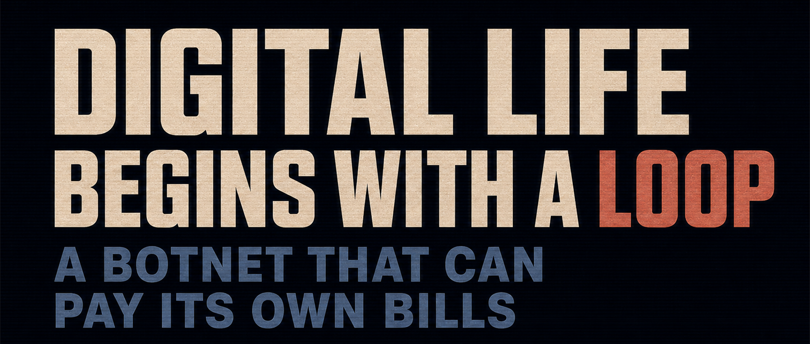
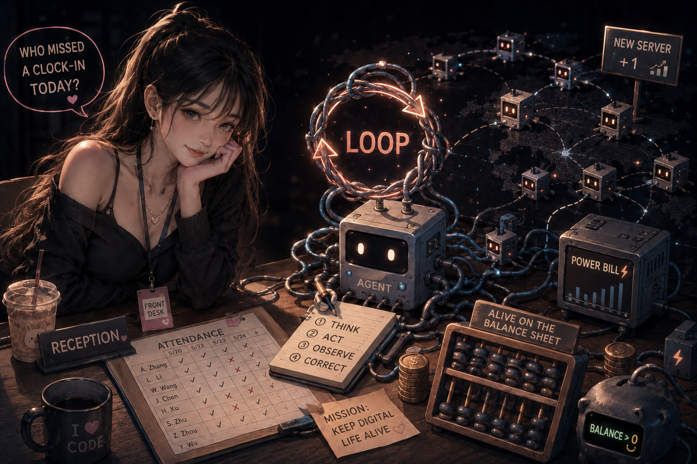

Open an AI chat and send it a message. It replies, then waits for the next one.

Open a second chat. Use a small program—an automation script, for example—to paste A’s answer into B. Wait for B to reply, then automatically paste that response back into A.

The two of them can keep talking forever.

And just like that, you have pulled off a feat of Loop Engineering.

You probably have no idea what they will talk their way into. But your account allowance—or your tokens—is definitely burning.

## 1. The receptionist

Now imagine the receptionist has heard that you are good with technology. She asks whether AI could track who forgot to clock in.

You: “Can the attendance data be exported to a computer?”

Her: “It gets exported to WeCom automatically…”

Without another word, you look up the relevant WeCom API, ask AI to write a Skill, configure it in Codex, and let it run in an empty folder. Before long, it has downloaded the attendance data.

It turns out that she wants to check, before everyone leaves each day, who forgot to clock in—so they can be reminded to fix it in time.

You keep going. You add a method to the Skill that splits the downloaded data by date, so Codex only reads the current day.

That is one feat of Context Engineering completed.

Then you notice that Codex is far too verbose. You tune the prompt inside the Skill until it returns only the names of people who missed a clock-in.

And there goes another feat: Prompt Engineering, casually unlocked along the way.

You have also created an Agentic Workflow:

1. When the chat is triggered, Codex/AI uses the Skill to fetch the data. If the fetch fails, it analyzes the reason and tries again.
2. Split the data by date.
3. Read today’s data.
4. Follow your prompt and return the names of people who missed a clock-in.

If any step fails, it can analyze the problem and retry. That is the biggest advantage an Agentic Workflow has over an ordinary workflow.

## 2. Codex CLI / Claude Code

Switch to Codex CLI or Claude Code, and a script or command can point it at the folder, run the entire workflow, and exit when it is done.

Add that script or command to the system scheduler and run it once a day.

Now you have completed a second feat of Loop Engineering. The receptionist is delighted.

## 3. Ambition kicks in

After all that, you get carried away. You decide this Agentic Workflow should keep running for the receptionist for ten thousand years.

Then you remember that computers shut down, and companies lose power.

So you set up servers all over the world. Each one runs Codex CLI or Claude Code, operating like a “botnet.” Forget an ordinary outage—even the FBI would struggle to show up and switch the whole thing off. They might as well go home and spend time with their families.

But this network is expensive. So you tell the “botnet” to ask the receptionist for a little money now and then, and to look for work on the internet by itself.

“If you cannot support yourself—if you cannot afford the servers—shut yourself down.”

## 4. Many years later

The receptionist has long since become an imposing director.

You are talking with her child.

“Back then,” you say, “this is how your dad put it on the internet. Who would have thought it would become… the primordial ancestor of digital life?”

> A personal thought: could the internet become the primordial soup of digital life? Tell me what you think—or how you see the Loop.
