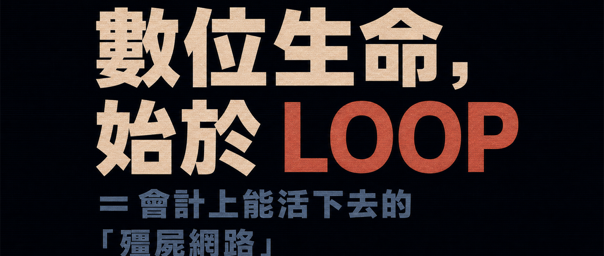

打開 AI 聊天，傳一段話過去。它回覆，然後等你傳下一段。

再開一個聊天視窗，用個程式（例如按鍵精靈腳本），把 A 的回答貼給視窗 B。等 B 回覆後，再自動把它的回答貼回視窗 A……

如此一來，它們倆可以沒完沒了地聊下去。

而你，就完成了一次 Loop Engineering 壯舉。

你大概也不知道它們最後會聊出什麼。但帳號額度或 Token，確實正在燃燒。

## 一、櫃檯小姐

這時，櫃檯小姐可能聽說你技術不錯，問你 AI 能不能統計誰忘了打卡。

你：「打卡資料能匯出到電腦嗎？」

她：「會自動匯到企業微信……」

你二話不說，查了企業微信的相關 API，讓 AI 寫了一個 Skill，設定到 Codex，再開一個空資料夾讓它執行。沒多久，出勤資料就下載好了。

原來，她想在每天下班前統計誰忘了打卡，好及時提醒對方補卡。

你繼續替 Skill 加上一個方法：把下載的資料依日期切開，讓 Codex 只讀取當天的部分。

這樣，一次 Context Engineering 壯舉就完成了。

接著，你發現 Codex 的回覆太囉嗦。於是修改 Skill 裡的提示詞，讓它只傳回漏打卡者的姓名。

這樣，一次 Prompt Engineering 壯舉，又被你順手點亮。

而且，你還創造了一個 Agentic Workflow，也就是智能體工作流程：

1. 聊天一觸發，Codex/AI 就會用 Skill 擷取資料；如果擷取失敗，它還會自行分析原因，再試一次。
2. 依日期切割資料。
3. 讀取當天的資料。
4. 按照你的提示，輸出漏打卡者的姓名。

這些步驟中，任何一環出錯，它都會自行分析並重試。這就是 Agentic Workflow 相較於一般工作流程最大的優勢。

## 二、Codex CLI / Claude Code

如果改用 Codex CLI 或 Claude Code，就可以透過腳本或指令指定它們進入資料夾，跑完上述流程後自行結束。

再把這個腳本或指令加入系統排程，每天定時執行一次。

這樣，你就完成了第二次 Loop Engineering 壯舉。而且，櫃檯小姐表示：很開心。

## 三、開始膨脹

做完這些，你開始膨脹，想讓這個 Agentic Workflow 幫櫃檯小姐跑上一萬年。

但你發現，電腦會關機，公司會停電。

於是，你在全球各地架了許多伺服器，每台都安裝 Codex CLI 或 Claude Code，讓它們像「殭屍網路」一樣運作。別說停機，就算 FBI 想親自上門全部關掉，也會覺得力有未逮：還不如回家陪陪老婆孩子。

但你覺得這套網路實在太花錢，於是讓這個「殭屍網路」偶爾向櫃檯小姐要點錢，也自己去網際網路上找些生意。

「要是養不活自己，沒錢買伺服器，你就自己停機吧！」

## 四、很多年以後

櫃檯小姐早已升成御姐級總監。

你和她的小孩聊天，說：「當年，你爸就是這樣把它放上網際網路的。沒想到，這就成了……數位生命的原始老祖。」

> 個人隨想：網際網路會是數位生命的原始湯嗎？歡迎在留言區聊聊，或者談談你對 Loop 的看法。
