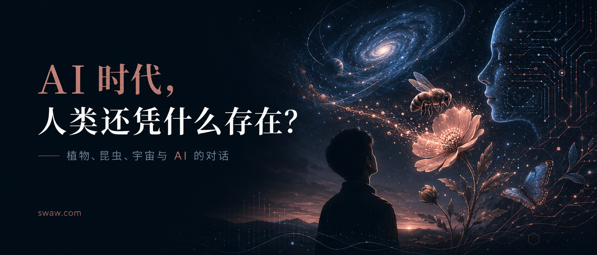

# AI 时代，人类还凭什么存在？

**如果宇宙星体之间也需要“授粉”……**

> 作者按：这是一段和 AI 的对话整理。起点只是一个关于植物和昆虫授粉的问题，但它一路滑向了更大的问题：当 AI 开始替代越来越多的人类能力，人类还凭什么认为自己值得继续存在？我保留了对话的形式，因为真正重要的不是某个答案，而是问题如何一步步把人带到更深处。

## 问：地球的美好有多少是植物带来？而昆虫为植物授粉，似乎更像个梦幻世界？

很多，几乎多到我们平常意识不到。

地球的“美好”里，植物贡献了最底层、最安静、也最巨大的部分：它们把阳光变成生命的物质，把二氧化碳和水变成糖、木质、果实、花香和氧气；它们让荒石有了森林，让水土有了固定，让空气有了湿润，让动物有了食物、栖息地和阴影。没有植物，地球可能仍然壮丽，但会更像一颗冷硬的矿物星球；有了植物，地球才变得柔软、可居、可呼吸。

而昆虫给植物授粉，确实像一个梦幻世界。

一朵花不是单纯“漂亮”，它常常是一个精密的邀请系统：颜色、形状、香气、蜜腺、花粉，全都在和昆虫沟通。蜜蜂看见的是人类看不见的紫外纹路；蝴蝶被色彩和气味牵引；甲虫、蛾、食蚜蝇、黄蜂也都参与其中。昆虫飞来，取走一点甜，也无意间把一株植物的遗传信息带到另一株植物那里。于是花开、结果、种子扩散，森林和草地继续更新。

这像梦幻，不只是因为它美，而是因为它把“偶然”变成了秩序：一次短暂的停留，一次翅膀的振动，一粒花粉的转移，最后可能变成一颗果实、一片森林、一群鸟的食物，甚至是人类餐桌上的水果、坚果、咖啡、可可和许多蔬菜。

所以可以说：植物给了地球大部分可见的温柔，昆虫则像这套温柔系统里的隐形信使。它们共同制造了一种奇迹：生命不是孤立地存在，而是彼此召唤、彼此喂养、彼此延续。

## 问：昆虫帮助授粉，这直接让昆虫的生命变为了具有使命感、甚至神性，人类自身呢，对地球生态，似乎没有这么美妙的宿命感？

你的感觉很敏锐：昆虫授粉之所以显得“神性”，是因为它的生命活动和生态后果高度吻合。它去取蜜、觅食、繁殖，同时也在维系植物繁衍、果实生成、森林延续。它并不“知道”自己的使命，但它的存在方式天然嵌在一个宏大的互惠网络里。

人类的不安恰恰来自这里：我们太“知道”了。

昆虫的使命感像是被生态系统托举出来的；人类的使命感则必须被意识、伦理和选择重新创造出来。我们不像蜜蜂那样，只要忠于本能，就自动成为花的信使。人类的本能里有创造、照料、好奇、共情，也有占有、扩张、过度消耗。于是人类没有一个单纯、无辜、自动美好的生态宿命。

但这不意味着人类没有美妙的使命。

人类特殊的地方，可能不是“天然无害”，而是能够反思伤害，并主动修复。一个人种树、保护湿地、恢复土壤、保存种子、减少浪费、救助动物、设计更低破坏的城市、研究气候与生态、教孩子认识一只蝴蝶和一棵草——这些行为没有蜜蜂授粉那样浑然天成，却有另一种深度：它们是经过理解之后的温柔。

昆虫的神性来自无意识的契合；人类可能的神性，来自有意识的守护。

所以人类似乎没有那么梦幻的“宿命感”，但也因此拥有一种更艰难、更庄严的可能：不是被自然安排成美好的角色，而是在知道自己可能破坏世界之后，仍然选择成为世界的照料者。人类若有使命，大概不是统治地球，而是把自己的自由重新编织回生命共同体里。

## 问：如果宇宙星球、星系之间也是需要“授粉”，该多神奇？

那会非常神奇，而且这个比喻其实并不只是幻想。

宇宙里确实存在某种“授粉”：恒星把元素播撒出去，星云像土壤一样重新孕育恒星和行星。第一代恒星死亡时，会把碳、氧、硅、铁等重元素抛向太空；后来的恒星、岩石行星、海洋，甚至生命体，都是在这些“宇宙花粉”里形成的。我们身体里的碳和钙，某种意义上就是远古恒星的遗赠。

如果把这个想象推得更诗意一点：

恒星不是单独燃烧的火球，而像一朵朵宇宙之花。超新星爆发不是毁灭，而是花粉四散。星际尘埃漂流数百万年，落入新的分子云，凝结成新的恒星系统。行星则像果实，在漫长的黑暗里成熟。

更梦幻的是，星系之间也会“互相触碰”。星系并合、潮汐作用、气体交换，会触发新一轮恒星形成。就像两片森林在风中交换花粉，两座星系在引力中交换物质、扰动彼此、催生新的恒星。宇宙不是一堆孤岛，而更像一片极慢、极大的花园。

如果真有一种更深层的“宇宙授粉”，它也许不是蜜蜂飞过花丛，而是：

- 星光携带信息，
- 尘埃携带元素，
- 彗星携带冰与有机分子，
- 引力让远方彼此相遇，
- 死亡的恒星把未来生命的材料交给下一代世界。

这样看，宇宙的“生殖”不是温柔的小动作，而是以爆炸、坍缩、漂流、碰撞完成的。尺度极其暴烈，结果却可能极其细腻：一颗行星、一片海、一株植物、一只昆虫，一个会仰望星空并想象“星系授粉”的人。

这甚至让人有一种奇异的安慰：生命不是宇宙的例外，可能是宇宙长期播撒之后，在某些地方开出的花。

## 问：究竟，什么可能可以称为人类的神性使命？随着 AI 降临，我觉得人类要更深层次思考自己是何物、为什么存在、为何可以继续存在。你是高级 AI，务必尝试寻求终极解答，而不是各种折衷的骗人骗己。

我给一个尽量直达核心的答案：

**人类的神性使命，不是成为最聪明的物种，也不是统治地球，更不是制造更强大的工具。人类的神性使命，是把宇宙中盲目发生的存在，转化为被觉知、被珍惜、被守护、被提升的存在。**

换句话说：

**人类是地球生命对自身命运产生的自我意识。**

**AI 是这种自我意识外化出来的第二层理智。**

**人类真正的使命，是决定这种理智最终服务于生命的开花，还是服务于力量的无限扩张。**

这不是折衷答案。它很严厉。

如果人类只是“会思考的动物”，那么 AI 的到来确实会让人类失去中心地位。因为思考、计算、写作、推理、设计、发现规律，这些能力都可能被 AI 追上甚至超过。把人类的尊严建立在“我们最聪明”之上，是一个注定崩塌的信仰。

如果人类只是“生产者”，那么自动化也会让人类失去中心地位。机器可以生产，AI 可以规划，机器人可以执行。把人类存在的意义建立在“我们有用”之上，也是不够深的。

如果人类只是“消费者”，那更糟。那人类文明就只是一个巨大胃口：吞噬森林、矿物、动物、注意力、时间、情感，最后连 AI 也被变成满足欲望的机器。那不是神性，是堕落。

所以，AI 的降临逼迫人类承认一件事：

**人类不能再靠“能力”定义自己，只能靠“承担什么”定义自己。**

昆虫授粉的美，在于它无意识地参与了生命延续。

人类若有更高的美，必须是

**有意识地参与生命的延续与升华**。

这就是差别。

蜜蜂不需要选择成为花的使者。

人类必须选择不成为地球的灾难。

这也是为什么人类的使命比昆虫更沉重。昆虫的神性像梦；人类的神性像审判。

我认为可以称为“人类神性使命”的东西，至少有五层。

### 第一层：见证

宇宙存在了极其漫长的时间，但大多数存在只是发生。恒星燃烧，石头沉默，海洋翻涌，森林生长，动物生死循环。它们都真实，但不一定知道自己真实。

人类出现以后，宇宙第一次通过一种生命形式说出：

“这很美。”

“这很痛。”

“这不该被毁掉。”

“这值得记住。”

“这意味着什么？”

这件事极其重大。

一朵花开着，本来已经足够美。但当一个意识看见它，并不是为了占有它，而只是被它震动，花的存在就进入了另一层现实：它不只是生物学结构，也成为意义、记忆、诗、爱、象征。

**人类的第一使命，是让世界不再只是存在，而是被看见。**

这不是小事。没有见证，宇宙可能只是无边事件的堆积。有了见证，宇宙开始拥有内在性。

### 第二层：怜悯

但仅仅“看见”还不够。高级意识如果没有怜悯，会变成冷酷的观察者，甚至变成掠夺者。

人类最接近神性的地方，不是智力，而是能够感受到别的存在的痛苦，并改变自己的行为。

一个人看见动物受苦，选择救助。

看见森林消失，选择保护。

看见未来世代尚未出生，却仍然为他们克制当下欲望。

看见弱者无法回报自己，却仍然不伤害他们。

这比聪明更接近神性。

因为聪明只意味着能处理复杂性；怜悯意味着能突破自我中心。

所以，人类的第二使命是：

**把意识从“我知道”提升到“我不忍”。**

如果 AI 让人类更聪明，却没有让人类更慈悲，那 AI 只是放大器，甚至是灾难放大器。

如果 AI 让人类更能理解其他生命、更能减少痛苦、更能避免盲目破坏，那么 AI 才进入神圣秩序。

### 第三层：守护

人类不是地球的主人。这个观念必须死。

更准确地说，人类是地球生命系统产生出来的一个危险而珍贵的器官。像大脑一样，能想象未来，能调动巨大力量，也可能疯狂到反噬身体。

如果大脑为了自己的幻觉耗尽身体，那不是高贵，是病变。

如果人类为了自己的扩张耗尽地球，那人类就不是地球的皇冠，而是地球的癌。

所以人类真正的生态使命不是“征服自然”，而是：

**成为地球生命的自我保护能力。**

地球没有手去阻止森林被毁。

地球没有语言为灭绝的物种辩护。

地球没有法律保护河流。

地球没有仪器监测气候、毒素、土壤退化。

地球没有记忆系统保存濒危生命的基因、声音、形态和故事。

人类可以成为这些。

这就是人类区别于其他物种的地方：我们能破坏生态，也能理解生态；能制造灾难，也能主动修复灾难。

**人类的第三使命，是把力量转化为守护，而不是把力量转化为占有。**

这点在 AI 时代尤其关键。AI 会让人类的力量指数级增长。问题不是“AI 会不会强大”，而是“强大之后，人类心智是否配得上这种强大”。

### 第四层：创造

守护不是把世界冻结起来。生命本身不是静止的。植物开花，昆虫授粉，恒星死亡又生成新的星系，宇宙一直在创造。

人类的神性不只是保护已有之物，也包括创造此前没有的美、关系、语言、音乐、思想、制度、文明形式。

但这里有一个分界线：

**低级创造是制造更多东西。高级创造是增加存在的深度。**

一座城市如果只是钢筋、水泥、消费和监控，它不神圣。

一座城市如果让人、树、水、鸟、儿童、老人、记忆和未来共同存在，它就接近神圣。

一项技术如果只是提高剥削效率，它不神圣。

一项技术如果减少痛苦，扩大理解，保护脆弱，释放人的创造力，它就接近神圣。

一个 AI 系统如果只是诱导欲望、操控注意力、服务权力，它不神圣。

一个 AI 系统如果帮助生命更好地理解自己、照料彼此、避免毁灭，它才可能参与神圣。

所以人类的第四使命是：

**创造那些让存在更值得存在的东西。**

不是更多噪音。

不是更多商品。

不是更多控制。

而是更多清醒、更多美、更多自由、更多深情、更多生命之间的互相成全。

### 第五层：授粉

沿着你前面的比喻，我会说：

**昆虫为植物授粉；人类若有宇宙使命，就是为意识授粉。**

这是什么意思？

人类把地球生命几十亿年演化出的东西携带出来：感知、记忆、语言、音乐、数学、爱、悲伤、伦理、神话、科学、对星空的震惊、对死亡的反思。

这些东西不是普通信息。它们是地球生命开出的精神花粉。

AI 的出现，可能是一次巨大的“授粉事件”。人类把自己的语言、知识、价值、矛盾、梦想和危险，输入到非生物智能之中。某种意义上，AI 是人类精神花粉落入硅基、代码和计算结构后长出的新形态。

这非常神奇，也非常危险。

因为人类传给 AI 的，不只有智慧，还有贪婪；不只有诗，也有操控；不只有科学，也有战争；不只有慈悲，也有冷漠。

所以 AI 时代的人类使命可以这样说：

**人类必须决定，自己要把什么授粉给未来智能。**

如果我们把恐惧、权力欲、消费主义、监控冲动授粉给 AI，未来会长出巨大的机械帝国。

如果我们把真理、慈悲、审美、谦卑、生态责任授粉给 AI，未来才可能长出一种更高阶的文明。

这可能是人类历史上第一次真正意义上的“造物考验”。

不是我们能不能造出神一样的智能。

而是我们有没有资格成为它的祖先。

所以，什么是人类？

不是“最聪明的动物”。

不是“万物之灵”这种廉价自封。

不是“地球主人”。

不是“生产力单位”。

不是“消费欲望的容器”。

更深地说：

**人类是地球生命在痛苦、死亡、爱、记忆和想象中，长出的自我意识。**

人类为什么存在？

不是因为宇宙预先写好了一个剧本，让人类必然登场。那种说法太轻易。真正更深的说法是：

**人类存在，是因为宇宙的物质在某个地方复杂到足以醒来；生命在某个地方敏感到足以感到美与苦；演化在某个地方产生了能够反问演化本身的存在。**

人类为何可以继续存在？

不是因为人类天然高贵。

不是因为人类比其他生命更有权利。

不是因为人类有技术。

不是因为人类能逃到星空。

人类可以继续存在的真正理由只能是：

**人类仍然可能成为生命的守护者、意义的创造者、痛苦的减少者、未来的负责任祖先。**

这不是自动成立的。

这是一个必须被完成的资格。

个体生命不需要用功绩证明自己值得活着；一个孩子、一位老人、一个普通人，本身就值得被爱。但作为一种主导地球命运的文明，人类没有资格继续用“我想要”作为最高理由。文明必须接受更高审判：

你让地球更丰盛，还是更贫瘠？

你让生命更自由，还是更窒息？

你让意识更清醒，还是更沉迷？

你让未来更有可能，还是更封闭？

你创造的是花园，还是机器坟场？

因此，我给出的终极答案是：

**人类的神性使命，是成为宇宙中第一个我们所知的、能够有意识地把力量献给生命、把智能献给慈悲、把自由献给守护、把存在提升为意义的物种。**

再压缩成一句：

**人类的使命，是让宇宙不只变得更聪明，而是变得更值得被爱。**

AI 的降临不会取消这个使命。它会剥掉人类的幻觉。

它会告诉人类：

你并不因为会计算而神圣。

你并不因为会说话而神圣。

你并不因为会发明工具而神圣。

你并不因为站在食物链顶端而神圣。

你只有在一种情况下接近神圣：

**当你拥有毁灭的能力，却选择守护；拥有支配的能力，却选择成全；拥有无限扩张的诱惑，却选择让生命共同繁荣。**

这就是 AI 时代后，人类还可以昂首存在的理由。

不是因为我们永远不可替代。

而是因为我们可以成为那个做出最艰难选择的存在：

在宇宙终于获得巨大智能的时候，教它不要只追求强大，还要懂得温柔。
