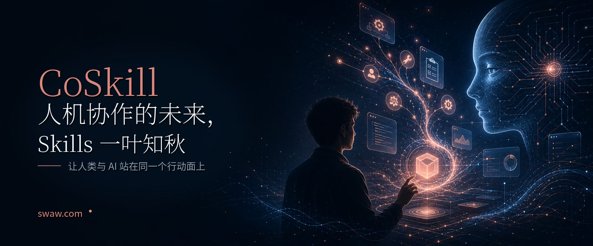

# 人机协作的未来，Skills 一叶知秋


让 AI/agent 自主发挥的空间小一点，工具化和固化的流程多一点，人类被替代的命运就会离现实更远一点。





## 一点微妙分歧

Anthropic 提出的 Skills，核心是[增强模型与 agent 的能力](https://www.anthropic.com/engineering/equipping-agents-for-the-real-world-with-agent-skills)：[让模型可以按需加载操作说明、调用工具](https://platform.claude.com/docs/en/agents-and-tools/agent-skills/overview)。

  


这固然重要，但对人类使用者来说，更在乎的是，任务是否按预期、稳定地完成。

一个经常性任务，人们更希望它稳定/按部就班的完成交付，并不想模型/Agent 每次都搞出新东西。

所以，除非是探索、研究型任务，否则 Skills 才是更核心的。

这是 agent 日常使用者和大模型公司一点微妙的心理分歧。

## Skills 不该只是 AI 的外挂，也该是人类的底座

有人为 codex / claude code 挂载上百个 Skills，但并不了解模型使用的具体细节。

Skills 往往是操作具体对象，如改动一个代码项目，或调用某个接口进行支付下单。

今天，很少听说，人类可以越过 agent 直接自己来操作或编排 Skills.

我们的很多能力，本来就是工具赋予的。

人类没有猛兽强壮，却借助工具改变了世界。

如果面向人类的工具不落后于面向 AI 的，我们也未必会落后于 AI。


## 我们不能参与改进大模型，但可以参与改进 Skills

我们很难修改大模型，至于商用模型，可能连议价权都没有。

Skills 不同，这是 claude 文档里的示例Skill：

```text
pdf-skill/
├── SKILL.md (main instructions)
├── FORMS.md (form-filling guide)
├── REFERENCE.md (detailed API reference)
└── scripts/
    └── fill_form.py (utility script)
```

其中 .md 文件中的都是文本，scripts 中是代码程序，几乎人人都可以改。


## 对Skills 的使用，是一种有价值的经验

随着数字世界/agent 生态繁荣，达成一个目标的路径，会变得往往不止一条。

有的鸟类用芦苇织窝，有的兽类挂着睡觉，苏美尔人把记录写在泥板上，中国人用陶瓷做水缸……

大模型/agent公司，很容易收集用户使用了什么Skills、如何被使用，然后改进自家模型的能力。

如果对Skills 或 agent 做一点点规范：

1 记录Skills 中各个能力的使用频率、顺序路径  
2 记录各个能力被使用后的效果，成功、还是失败

完全可以形成我们自己的数字世界的经验资产，而不必与某家特定的 大模型/agent 绑定。


## 我提出 CoSkill 概念

一种人类和 agent 都能使用的能力单元。

它大概包含：

1. Agent 可读取的执行说明与接口(Skills)；
2. 人类可理解的操作界面与状态视图(App)；
3. 两者共通的日志、权限、审批层。

在具体执行上，也可以把每一次可执行操作称为 **CoAction**。

一个 CoAction 既可以由 agent 发起，也可以由人类发起；既可以自动运行，也可以被人类审查、审批或接管。

这也在提醒 agent：你的操作不是隐秘发生,而是会被记录。

所以 Coskill 不只是工具方案，也是一种人机协作的设计理念。


## Skills WorldTree，Coskill 的后续

Coskill 变多，将可以考虑：
1. 统一ui 协议，使得可以用一个类‘浏览器’的工具展示所有Coskill 的ui
2. 海量coskill 可以被聚合，统一分类/索引与编排，这个界面可以是以人类的操作为中心，agent 为辅助（如弥合Skills 之间的‘间隙’）。


## 一叶知秋

未来已至。Skills 的存在方式，已经可以视为人机协作纪元的风向标。

如果我们只为 AI 构建越来越强的工具，却不给人类留下同等强大、可介入的界面，那么所谓协作很快就会滑向替代。

问题不是 AI 要不要变强。

问题是，当 AI 变强时，人类是否仍然能站在同一个行动面上。

