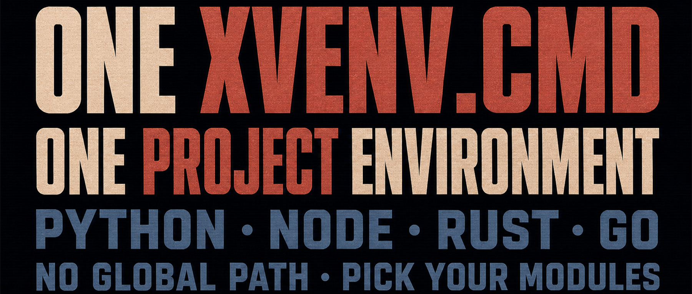

Maintaining several development environments on Windows can consume more time than the projects themselves:

- Different projects need different versions of Python, Node, or Go, and the global PATH becomes increasingly fragile.
- Rust, Tauri, and native extensions need a C++ toolchain, but installing the full Visual Studio stack is expensive.
- Company and open-source projects use different Git identities and SSH keys, making it easy to commit with the wrong identity.
- New team members follow the setup guide and still encounter “it works on my machine” differences.

Xvenv is the open-source tool I built for these problems. A single `xvenv.cmd` file declares the modules a project needs, then prepares and loads those toolchains without a conventional installation.

Its goal is not to create another global environment manager. It is to make the environment travel with the project.

## What is Xvenv?

Xvenv is a single-file Windows script that combines BAT and PowerShell. You do not need to install Python, Node, Rust, or Go first. Put `xvenv.cmd` in a project, select the modules, and run it; the script downloads and extracts the required components.

Toolchains live in the project's `.xvenv/` directory by default, while download and extraction caches can be shared across projects. Environment variables are injected only into processes launched by Xvenv, so the script does not permanently rewrite the system PATH. Each project can therefore choose its own tools and versions without sharing one global configuration.

One boundary is worth making explicit: Xvenv does not install these tools globally, but some modules intentionally modify project files. For example, `vscode_config` creates or merges `.vscode/settings.json`; `git_config` maintains the project's `.gitignore` and initializes a Git repository when needed. Xvenv isolates system-level toolchains—it does not pretend the project directory is read-only.

## Assemble Only the Modules You Need

List the modules in the `$_xvenv_modules` array near the top of the script. Xvenv prepares the environment in order, then can launch a terminal or editor.

### `msvc`: A Portable C++ Toolchain

`msvc` parses Microsoft's official channel manifests and downloads the required C++ headers, libraries, and build tools without installing the full Visual Studio IDE.

It is useful for Rust, Tauri, and Python projects with native extensions. The first download can still be substantial, and its duration depends on your network and disk. Later runs reuse the cache and prepared environment.

### `rust`: Project-Local Rustup and Cargo

`rust` points `CARGO_HOME` and `RUSTUP_HOME` into the project's `.xvenv/` directory, preventing them from mixing with system-wide `.cargo` data, toolchains, and components. On Windows, combine it with `msvc` when native compilation is required.

### `uv`, `uv_python`, and `uv_sync`: A Python Environment

`uv` provides the package manager, `uv_python` prepares the project's Python runtime and virtual environment, and `uv_sync` synchronizes dependencies from `pyproject.toml`. Add only the layers your project needs.

### `bun`, `node`, and `hugo`: Front-End and Static-Site Toolchains

`bun` and `node` are independent choices: use Bun or the standard Node.js runtime. `hugo` provides a portable Hugo Extended binary for static-site projects. Each module adds its executable to the current Xvenv process's PATH, not the system PATH.

### `go`: A Project-Scoped Go Environment

`go` downloads the official portable archive and points `GOROOT` and `GOPATH` to directories under `.xvenv/`, keeping the project's Go toolchain and workspace isolated.

### `git` and `git_config`: Isolated Git Identities

`git` provides a portable MinGit distribution. `git_config` uses `.xvenv/.gitconfig` as the project's `GIT_CONFIG_GLOBAL`, then injects the author name, email, and an optional SSH command. This reduces the risk of mixing company and open-source identities.

When enabled, `git_config` also adds `.xvenv/` and `.env` to the project's `.gitignore`. If the current directory is not yet a Git repository, it runs `git init`.

### `pwsh`, `vscode_config`, and Launch Modules

`pwsh` prepares PowerShell 7 for the project. `vscode_config` creates or merges `.vscode/settings.json` so VS Code can discover Xvenv's Python, Go, and terminal settings.

After setup, select an explicit launch module such as `run_vscode`, `run_pwsh`, or `run_cmd`. Xvenv also includes launch modules for Cursor, Windsurf, Antigravity, and Zed.

### `env_load`: Load Project Environment Variables

`env_load` reads `.env` from the project root and injects its variables into the dedicated process. You do not have to run a sequence of `set` commands, and the project configuration is not written permanently into the system environment.

## Three Project Configuration Examples

The workflow has three steps: place `xvenv.cmd` in the project, edit `$_xvenv_modules` near the top of the script, and run it.

### Python Project

This configuration prepares a Python virtual environment, synchronizes dependencies from `pyproject.toml`, writes VS Code settings, and launches VS Code:

```powershell
$_xvenv_modules = @(
    "uv",
    "uv_python",
    "uv_sync",
    "vscode_config",
    "env_load",
    "run_vscode"
)
```

### Bun Project with an Isolated Git Identity

First, set the identity near the top of the script:

```powershell
$GIT_AUTHOR_NAME  = "MyOpenSourceAlias"
$GIT_AUTHOR_EMAIL = "alias@github.com"

$_xvenv_modules = @(
    "bun",
    "git",
    "git_config",
    "vscode_config",
    "run_vscode"
)
```

### Rust + Tauri Project

On Windows, Tauri projects usually need a front-end runtime, Rust, and a C++ build toolchain:

```powershell
$_xvenv_modules = @(
    "bun",
    "msvc",
    "rust",
    "pwsh",
    "vscode_config",
    "run_vscode"
)
```

## Conclusion

Xvenv's core value is not “install everything.” It is keeping a project's required toolchains in one copyable, reviewable entry point: no permanent changes to the system PATH, no competition between projects for global versions, and reusable download caches after the first setup.

It cannot eliminate the size of the toolchains, and it does not make project configuration read-only. What it can do is keep those changes within a clear, inspectable boundary. For someone maintaining several Windows development stacks alone, that is more dependable than a vague promise of “zero pollution.”

[View and download xvenv.cmd](https://github.com/swawai/swaw.com/blob/main/xvenv.cmd)
