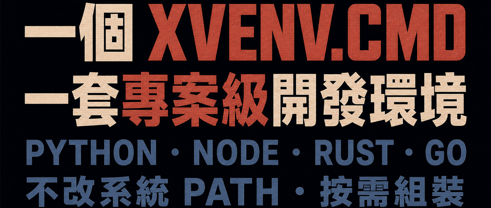

在 Windows 上維護多套開發環境，很容易把時間耗在專案之外：

- 不同專案需要不同版本的 Python、Node 或 Go，全域 PATH 越改越亂；
- Rust、Tauri 或原生擴充功能需要 C++ 工具鏈，但安裝完整 Visual Studio 的成本很高；
- 公司與開源專案使用不同的 Git 身分和 SSH 金鑰，切換時容易用錯身分提交；
- 新成員照著文件安裝環境，仍可能因為本機差異遇到「在我電腦上能跑」的問題。

Xvenv 是我為這些問題寫的開源工具。它以一個 `xvenv.cmd` 檔案為入口，依專案宣告需要的模組，再以免安裝方式準備並載入工具鏈。

它的目標不是製造另一套全域環境管理器，而是讓環境設定跟著專案走。

## 什麼是 Xvenv？

Xvenv 是一個 BAT 與 PowerShell 混編的 Windows 單檔腳本。你不必預先安裝 Python、Node、Rust 或 Go；把 `xvenv.cmd` 放進專案，選擇模組並執行，腳本就會下載並解壓縮所需元件。

工具鏈預設放在專案的 `.xvenv/` 目錄中，下載與解壓縮快取則可跨專案共用。環境變數只會注入由 Xvenv 啟動的處理程序，不會永久改寫系統 PATH。因此，不同專案可以各自選擇工具和版本，不必共用一套全域設定。

這裡也有一個需要說清楚的邊界：Xvenv 不會在全域安裝這些工具，但部分模組會依其職責修改專案檔案。例如，`vscode_config` 會建立或合併 `.vscode/settings.json`；`git_config` 會維護專案的 `.gitignore`，並在需要時初始化 Git 儲存庫。它隔離的是系統級工具鏈，不是假裝專案目錄完全唯讀。

## 按需組裝的模組

你只需要在腳本頂端的 `$_xvenv_modules` 陣列中列出模組。Xvenv 會依序準備環境，並可在最後啟動終端機或編輯器。

### `msvc`：免安裝的 C++ 編譯工具鏈

`msvc` 會解析微軟官方通道資訊清單，下載並組裝所需的 C++ 標頭檔、程式庫和建置工具，無須安裝完整 Visual Studio。

它適合 Rust、Tauri 和含原生擴充功能的 Python 專案。首次下載仍可能很大，耗時取決於網路與磁碟；後續執行會重用快取與已準備好的環境。

### `rust`：專案內的 Rustup 與 Cargo

`rust` 會把 `CARGO_HOME` 和 `RUSTUP_HOME` 指向專案的 `.xvenv/`，避免與系統全域的 `.cargo`、工具鏈和元件混用。在 Windows 上需要原生編譯時，可以搭配 `msvc`。

### `uv`、`uv_python` 與 `uv_sync`：Python 環境

`uv` 提供套件管理器，`uv_python` 準備專案使用的 Python 與虛擬環境，`uv_sync` 則依 `pyproject.toml` 同步相依套件。三者可以依專案需求逐層組合。

### `bun`、`node` 與 `hugo`：前端和靜態網站工具鏈

`bun` 與 `node` 是兩個獨立選項：可以選擇 Bun，也可以使用標準 Node.js。`hugo` 則提供免安裝的 Hugo Extended，適合靜態網站專案。它們都會加入目前 Xvenv 處理程序的 PATH，而不是系統 PATH。

### `go`：專案級 Go 環境

`go` 會下載官方免安裝壓縮檔，並把 `GOROOT` 與 `GOPATH` 指向 `.xvenv/` 下的目錄，讓專案的 Go 工具鏈和工作區保持獨立。

### `git` 與 `git_config`：隔離 Git 身分

`git` 提供可攜版 MinGit。`git_config` 使用專案內的 `.xvenv/.gitconfig` 作為 `GIT_CONFIG_GLOBAL`，並注入作者、電子郵件與選用的 SSH 指令，降低公司與開源身分混用的風險。

啟用 `git_config` 時，腳本也會把 `.xvenv/` 與 `.env` 加入專案 `.gitignore`；如果目前目錄還不是 Git 儲存庫，則會執行 `git init`。

### `pwsh`、`vscode_config` 與啟動模組

`pwsh` 準備專案使用的 PowerShell 7。`vscode_config` 會建立或合併 `.vscode/settings.json`，讓 VS Code 辨識 Xvenv 中的 Python、Go 與終端機設定。

環境準備完成後，可以明確選擇一個啟動模組，例如 `run_vscode`、`run_pwsh` 或 `run_cmd`。Xvenv 也支援 Cursor、Windsurf、Antigravity 和 Zed 對應的啟動模組。

### `env_load`：載入專案環境變數

`env_load` 會讀取專案根目錄的 `.env`，並把變數注入目前的專用處理程序。如此既不用手動執行一串 `set`，也不會把專案設定永久寫進系統環境。

## 三種專案設定範例

使用步驟只有三步：把 `xvenv.cmd` 放進專案、編輯腳本頂端的 `$_xvenv_modules`，然後執行它。

### Python 專案

以下設定會準備 Python 虛擬環境、依 `pyproject.toml` 同步相依套件、寫入 VS Code 設定，並啟動 VS Code：

```powershell
$_xvenv_modules = @(
    "uv",
    "uv_python",
    "uv_sync",
    "vscode_config",
    "env_load",
    "run_vscode"
)
```

### Bun 專案與獨立 Git 身分

先在腳本頂端填入專案使用的身分：

```powershell
$GIT_AUTHOR_NAME  = "MyOpenSourceAlias"
$GIT_AUTHOR_EMAIL = "alias@github.com"

$_xvenv_modules = @(
    "bun",
    "git",
    "git_config",
    "vscode_config",
    "run_vscode"
)
```

### Rust + Tauri 專案

Tauri 在 Windows 上通常同時需要前端執行環境、Rust 與 C++ 編譯工具鏈：

```powershell
$_xvenv_modules = @(
    "bun",
    "msvc",
    "rust",
    "pwsh",
    "vscode_config",
    "run_vscode"
)
```

## 結語

Xvenv 的核心價值不是「把所有東西都裝一遍」，而是把專案需要的工具鏈宣告在一個可複製、可審閱的入口裡：不用永久修改系統 PATH，不同專案不必爭用全域版本，首次準備後的下載快取還能繼續重用。

它無法消除工具鏈本身的下載大小，也不會把專案設定變成唯讀；但它能把這些變更限制在清楚、可定位的範圍內。對需要獨自維護多種 Windows 開發技術棧的人而言，這比一句「零污染」更可靠。

[檢視並下載 xvenv.cmd](https://github.com/swawai/swaw.com/blob/main/xvenv.cmd)
