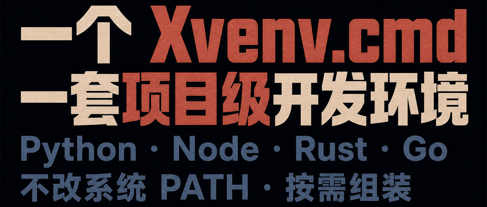

在 Windows 上维护多套开发环境，很容易把时间耗在项目之外：

- 不同项目需要不同版本的 Python、Node 或 Go，全局 PATH 越改越乱；
- Rust、Tauri 或原生扩展需要 C++ 工具链，但安装完整 Visual Studio 成本很高；
- 公司与开源项目使用不同的 Git 身份和 SSH Key，切换时容易提交错身份；
- 新成员照着文档装环境，仍可能因为本机差异遇到“在我电脑上能跑”的问题。

Xvenv 是我为这些问题写的开源工具。它以一个 `xvenv.cmd` 文件为入口，按项目声明需要的模块，再以免安装方式准备并加载工具链。

它的目标不是制造另一套全局环境管理器，而是让环境配置跟着项目走。

## 什么是 Xvenv？

Xvenv 是一个 BAT 与 PowerShell 混编的 Windows 单文件脚本。你不必预先安装 Python、Node、Rust 或 Go；把 `xvenv.cmd` 放进项目，选择模块并运行，脚本会下载和解压所需组件。

工具链默认放在项目的 `.xvenv/` 目录中，下载与解压缓存可以跨项目复用。环境变量只注入由 Xvenv 启动的进程，不会永久改写系统 PATH。因此，不同项目可以各自选择工具和版本，彼此不必共享一套全局配置。

这里也有一个需要说清的边界：Xvenv 不会全局安装这些工具，但部分模块会按其职责修改项目文件。例如，`vscode_config` 会生成或合并 `.vscode/settings.json`；`git_config` 会维护项目的 `.gitignore`，并在需要时初始化 Git 仓库。它隔离的是系统级工具链，不是假装项目目录完全只读。

## 按需组装的模块

你只需要在脚本顶部的 `$_xvenv_modules` 数组中列出模块。Xvenv 会按顺序准备环境，并可在最后启动终端或编辑器。

### `msvc`：免安装的 C++ 编译工具链

`msvc` 会解析微软官方渠道清单，下载并组装所需的 C++ 头文件、库和构建工具，无需安装完整 Visual Studio。

它适合 Rust、Tauri 和带原生扩展的 Python 项目。首次下载仍可能较大，耗时取决于网络和磁盘；后续运行会复用缓存与已准备好的环境。

### `rust`：项目内的 Rustup 与 Cargo

`rust` 将 `CARGO_HOME` 和 `RUSTUP_HOME` 指向项目的 `.xvenv/`，避免与系统全局的 `.cargo`、工具链和组件混用。Windows 下需要原生编译时，可以与 `msvc` 组合。

### `uv`、`uv_python` 与 `uv_sync`：Python 环境

`uv` 提供包管理器，`uv_python` 准备项目使用的 Python 与虚拟环境，`uv_sync` 则根据 `pyproject.toml` 同步依赖。三者可以按项目需要逐层组合。

### `bun`、`node` 与 `hugo`：前端和静态站工具链

`bun` 与 `node` 是两个独立选项：可以选择 Bun，也可以使用标准 Node.js。`hugo` 则提供免安装的 Hugo Extended，适合静态站项目。它们都会被加入当前 Xvenv 进程的 PATH，而不是系统 PATH。

### `go`：项目级 Go 环境

`go` 会下载官方免安装压缩包，并把 `GOROOT` 与 `GOPATH` 指向 `.xvenv/` 下的目录，让项目的 Go 工具链和工作区保持独立。

### `git` 与 `git_config`：隔离 Git 身份

`git` 提供便携版 MinGit。`git_config` 使用项目内的 `.xvenv/.gitconfig` 作为 `GIT_CONFIG_GLOBAL`，并注入作者、邮箱和可选的 SSH 命令，减少公司与开源身份串用的风险。

启用 `git_config` 时，脚本还会把 `.xvenv/` 与 `.env` 加入项目 `.gitignore`；如果当前目录还不是 Git 仓库，则会执行 `git init`。

### `pwsh`、`vscode_config` 与启动模块

`pwsh` 准备项目使用的 PowerShell 7。`vscode_config` 生成或合并 `.vscode/settings.json`，让 VS Code 识别 Xvenv 中的 Python、Go 和终端配置。

准备完成后，可以显式选择一个启动模块，例如 `run_vscode`、`run_pwsh` 或 `run_cmd`。Xvenv 还支持 Cursor、Windsurf、Antigravity 和 Zed 对应的启动模块。

### `env_load`：加载项目环境变量

`env_load` 会读取项目根目录的 `.env`，并把变量注入当前专用进程。这样既不用手动执行一串 `set`，也不会把项目配置永久写进系统环境。

## 三种项目配置示例

使用步骤只有三步：把 `xvenv.cmd` 放进项目，编辑脚本顶部的 `$_xvenv_modules`，然后运行它。

### Python 项目

下面的配置会准备 Python 虚拟环境、按 `pyproject.toml` 同步依赖、写入 VS Code 配置，并启动 VS Code：

```powershell
$_xvenv_modules = @(
    "uv",
    "uv_python",
    "uv_sync",
    "vscode_config",
    "env_load",
    "run_vscode"
)
```

### Bun 项目与独立 Git 身份

先在脚本顶部填写项目使用的身份：

```powershell
$GIT_AUTHOR_NAME  = "MyOpenSourceAlias"
$GIT_AUTHOR_EMAIL = "alias@github.com"

$_xvenv_modules = @(
    "bun",
    "git",
    "git_config",
    "vscode_config",
    "run_vscode"
)
```

### Rust + Tauri 项目

Tauri 在 Windows 上通常同时需要前端运行时、Rust 与 C++ 编译工具链：

```powershell
$_xvenv_modules = @(
    "bun",
    "msvc",
    "rust",
    "pwsh",
    "vscode_config",
    "run_vscode"
)
```

## 结语

Xvenv 的核心价值不是“把所有东西都装一遍”，而是把项目需要的工具链声明在一个可复制、可审阅的入口里：不用永久修改系统 PATH，不同项目互不争抢全局版本，首次准备后的下载缓存还能继续复用。

它不能消除工具链本身的下载体积，也不会把项目配置变成只读；但它能把这些变化限制在清晰、可定位的范围内。这对需要独自维护多种 Windows 开发栈的人，比一句“零污染”更可靠。

[查看并下载 xvenv.cmd](https://github.com/swawai/swaw.com/blob/main/xvenv.cmd)
