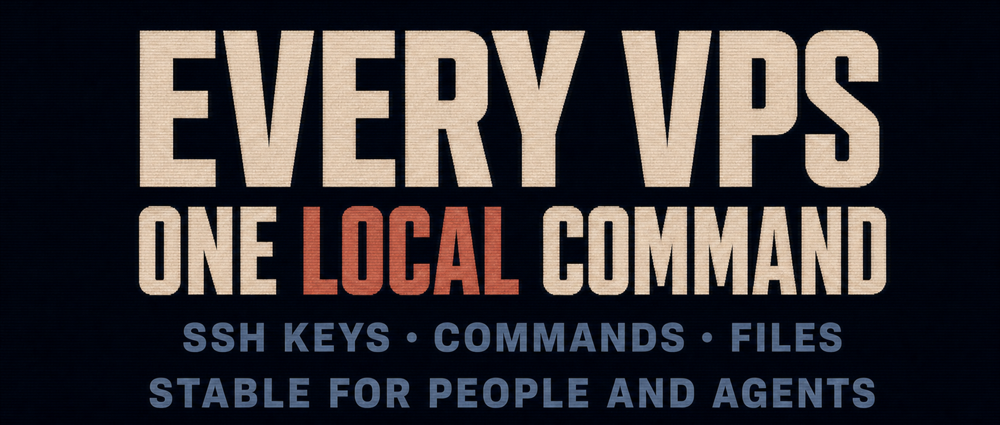

Running `ssh` directly on Windows 10 or 11 is no longer a problem, but Windows still has no `ssh-copy-id` command.

Adding an SSH public key to a remote machine for passwordless login is therefore more awkward than it should be. I used to switch into WSL whenever I needed to do it.

Once or twice is fine. Repeating the process gets old fast.

I eventually wrote a set of scripts for this and have used them for years, expanding the feature set along the way. The scripts are on GitHub. Clone the repository to your machine:

```powershell
git clone https://github.com/swawai/swaw-kit
cd swaw-kit
copy .\Favorites\template.vps1.cmd .\vps2.cmd
```

Edit the host settings in `vps2.cmd`—address, port, username, and private key path—then run:

```powershell
.\vps2.cmd --help
```

You can now see every command available for your `vps2` entry:

```
C:\swaw-kit>vps2 --help

# Basic usage:
  vps2    Open SSH using the host settings in this entry file.


# Remote commands:
  vps2  -- ls -la /tmp             # Run a normal non-interactive command.
  vps2  tty -- top                 # Run an interactive command with TTY.
  vps2  script local.sh arg1 arg2  # Upload local.sh to a remote temp dir, run it, then clean up.


# SCP transfer, a leading colon means a remote path:
  vps2  copy :/remote/src D:\local
  vps2  copy D:\local     :/remote/dst
  vps2  copy :/remote/src :/remote/dst   # Remote-to-remote copy via scp -3.


# SFTP workspace setup, requires the SFTP by Natizyskunk editor extension (a leading colon means a remote path):
  vps2  code :/var/www D:\work\workspace
  vps2  code D:\work\workspace :app/      # Local/remote argument order does not matter.
  vps2  cursor :app/   D:\work\workspace


# Remote editing (the editor installs its Remote-SSH server on the remote host):
  vps2  code /var/www     # Open a remote absolute path with VS Code.
  vps2  code app/         # Open remote $HOME/app/ with VS Code.
  vps2  cursor /var/www   # Open a remote absolute path with Cursor.
  vps2  cursor app/       # Open remote $HOME/app/ with Cursor.


# SSH config:
  vps2  config.install  Install this entry's Host config into the current user's ~/.ssh/config for direct ssh/Remote-SSH use.
  vps2  config.remove   Remove the managed Include from the current user's ~/.ssh/config and delete the generated data/ssh_config file.


# Key management (modifies remote ~/.ssh/authorized_keys; key.fix/key.add.fix may also modify sshd config):
  vps2  key.add       Add the configured .pub key to remote ~/.ssh/authorized_keys (idempotent; no duplicate entries).
  vps2  key.remove    Remove that public key from remote ~/.ssh/authorized_keys (idempotent; duplicate entries are removed together).
  vps2  key.fix       Check/fix remote sshd PubkeyAuthentication yes (otherwise key login may be refused).
  vps2  key.add.fix   Add the public key and check/fix PubkeyAuthentication.
  # If the configured private key and same-name .pub are both missing, key.add/key.fix generates a key pair in place with ssh-keygen defaults.
  # If remote /etc/ssh/sshd_config.d/*.conf is empty, key.fix updates /etc/ssh/sshd_config first; existing files are backed up before editing.
```


## 1. Are these commands safe and cautious?

Take `key.fix`. It sounds simple: change the effective `PubkeyAuthentication` option in the remote `sshd` configuration so key-based login is allowed. In practice, it follows this process:

```text
1. Test OpenSSH login with the currently configured key. Only when key login fails does it fall back to PuTTY and prompt for a password.
2. Upload a one-time helper script to a temporary directory on the remote host, run it, and clean the directory afterward.
3. Run sshd -T -C user=...,host=...,addr=... remotely to inspect the effective sshd configuration.
4. If sshd is missing or sshd -T cannot read a valid configuration, emit a warning and do not guess at a change.
5. Enter the repair path only when the effective PubkeyAuthentication value is no; leave yes unchanged.
6. Before changing sshd configuration, require either root or working sudo -n access; otherwise fail immediately.
7. If /etc/ssh/sshd_config includes sshd_config.d/*.conf and the remote host already has drop-in files, write /etc/ssh/sshd_config.d/00-remote-kit-pubkey-auth.conf.
8. Otherwise edit /etc/ssh/sshd_config instead of introducing an empty drop-in directory without context.
9. Back up an existing file in place with cp -p before editing; after success, retain only the three newest remote_kit backups to prevent unbounded buildup.
10. Refuse complex main-config cases: do not auto-edit when PubkeyAuthentication appears inside or after a Match block, or when it has multiple global matches.
11. Run sshd -t to validate syntax after writing. If validation fails, restore the backup or remove the newly created drop-in.
12. Run sshd -T again and confirm that the effective PubkeyAuthentication value is now yes. Roll back if it still is not effective.
13. Finally, try to reload the sshd or ssh service. If automatic reload fails, tell the user to reload it manually.
14. Also verify that AuthorizedKeysFile includes .ssh/authorized_keys. If sshd does not read that file, emit an explicit warning.
```


## 2. Add it to PATH to make it truly convenient

To run these commands directly from `Win + R` or any terminal:

```powershell
vps2
vps2 -- uptime
vps2 key.add.fix
```

Double-click this file in the repository:

```text
PathHereAdd.cmd
```

It adds the `swaw-kit` directory containing the script to the current user's `PATH`.


If you change your mind, there is no need to edit environment variables by hand. Run:

```text
PathHereRemove.cmd
```

That safely removes the entry.

I explain this mechanism in [Run Custom Commands from Win + R](/p/win-run-custom-command-path/).


## 3. Before AI arrived, I used this to manage hundreds of machines

The method is simple: give each machine its own script and use partitioned names:

```text
zone1.vps1.cmd
z1.v2.cmd
z1.v3.cmd
...
z10.v10.cmd
```

You can also group them in subdirectories, changing into the appropriate group before use:

```
group1/zone1.vps1.cmd
g2/z1.v1.cmd
g2/z1.v2.cmd
...
```

If you manage machines across a company, name entries after the responsible colleague or department:

```
zhangshan.cmd
LiSi.cmd
dev.vm1.LiSi.cmd
ops.vm2.WangWu.cmd
```

Once passwordless login is configured, these entries also become excellent operational context for an AI agent. The script name turns each machine into a stable command, which is equally comfortable for people and agents.

You can then tell Codex: "Hi, check LiSi's memory usage and the free disk space on ops.vm2.WangWu."

An agent could even write an orchestration script on the spot and operate these machines in batches.

Managing a large fleet through the native Windows Terminal is also entirely possible.


> I have used these scripts for years and will continue maintaining them. Even if you do not adopt them directly, the practical handling of SSH arguments is worth studying—for example, when a remote command hangs or produces no output. Stars and pull requests are welcome.


> Related repository: [https://github.com/swawai/swaw-kit](https://github.com/swawai/swaw-kit)
