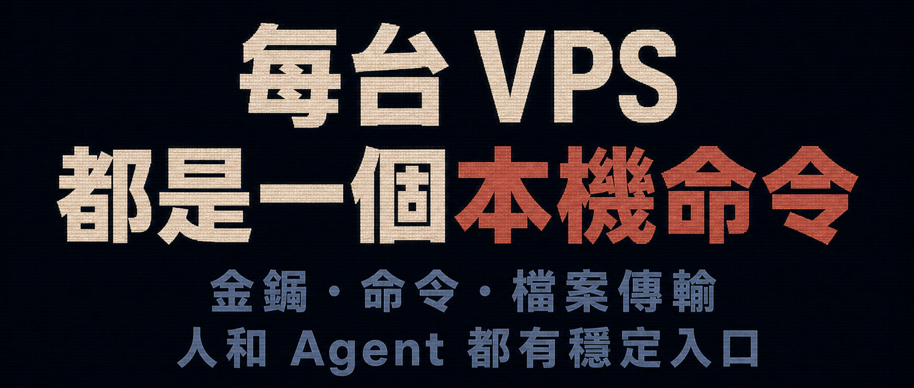

現在的 Windows 10/11，直接執行 `ssh` 已經不是問題，但仍然沒有 `ssh-copy-id` 命令。

要為遠端主機加入 SSH 公開金鑰以免密碼登入，還是有點麻煩。以前每次遇到這件事，我都得切換到 WSL。

一兩次還好，次數多了就讓人不勝其煩。

後來我為此寫了一套指令碼，自己已經用了好幾年，功能也一路擴充。指令碼已上傳到 GitHub，只要把這個儲存庫複製到本機：

```powershell
git clone https://github.com/swawai/swaw-kit
cd swaw-kit
copy .\Favorites\template.vps1.cmd .\vps2.cmd
```

接著修改 `vps2.cmd` 裡的主機資訊，包括位址、連接埠、使用者名稱與私密金鑰路徑，再執行：

```powershell
.\vps2.cmd --help
```

就能看到這個 `vps2` 入口提供的所有命令：

```
C:\swaw-kit>vps2 --help

# 基本用法:
  vps2    執行 vps2（遠端登入這個檔案中設定的 SSH 主機）


# 遠端命令:
  vps2  -- ls -la /tmp             # 執行 ls，一般非互動式命令
  vps2  tty -- top                 # 執行 top，互動式命令（分配 TTY）
  vps2  script local.sh arg1 arg2  # 將本機 local.sh 指令碼上傳到遠端暫存目錄，執行後清理


# SCP 傳輸，以冒號開頭表示遠端路徑:
  vps2  copy :/remote/src D:\local
  vps2  copy D:\local     :/remote/dst
  vps2  copy :/remote/src :/remote/dst   # 遠端目錄互相複製，使用 scp -3


# SFTP 同步開發，需在編輯器中安裝 SFTP by Natizyskunk 擴充套件（以冒號開頭表示遠端路徑）:
  vps2  code :/var/www D:\work\workspace  # 目錄的先後順序不影響
  vps2  code D:\work\workspace :app/
  vps2  cursor :app/   D:\work\workspace


# 遠端編輯（編輯器會透過 Remote-SSH 在遠端伺服器安裝對應的 server）:
  vps2  code /var/www     # 用 VS Code 開啟遠端絕對路徑
  vps2  code app/         # 用 VS Code 開啟遠端 $HOME/app/
  vps2  cursor /var/www   # 用 Cursor 開啟遠端絕對路徑
  vps2  cursor app/       # 用 Cursor 開啟遠端 $HOME/app/


# SSH config:
  vps2  config.install  將這個入口的 Host 設定安裝到目前使用者的 ~/.ssh/config，供 ssh/Remote-SSH 直接使用
  vps2  config.remove   移除這個入口安裝到目前使用者 ~/.ssh/config 的受管理 Include，並刪除產生的 data/ssh_config 檔案


# 金鑰管理（會修改遠端 ~/.ssh/authorized_keys；key.fix/key.add.fix 也可能修改 sshd 設定）:
  vps2  key.add       將設定的私密金鑰所對應的 .pub 公開金鑰加入遠端 ~/.ssh/authorized_keys（冪等，不會重複加入）
  vps2  key.remove    從遠端 ~/.ssh/authorized_keys 移除該公開金鑰（冪等；重複項目會一併移除）
  vps2  key.fix       檢查／修復遠端 sshd 設定中的 PubkeyAuthentication 為 yes（否則可能拒絕金鑰登入）
  vps2  key.add.fix   加入公開金鑰，並檢查／修復 PubkeyAuthentication
  # 若設定的私密金鑰與同名 .pub 都不存在，key.add/key.fix 會使用 ssh-keygen 預設參數就地產生一組金鑰
  # 若遠端 /etc/ssh/sshd_config.d/*.conf 為空，key.fix 會優先修改 /etc/ssh/sshd_config；修改既有檔案前會先就地備份
```


## 一、這些命令是否安全、謹慎？

以 `key.fix` 為例。它看起來只是修改遠端 `sshd` 設定裡的 `PubkeyAuthentication` 選項，允許使用金鑰登入；實際上會依序執行以下步驟：

```text
1. 先用目前設定的金鑰測試 OpenSSH 登入；只有在金鑰登入不可用時，才退回 PuTTY 並提示輸入密碼。
2. 將一次性輔助指令碼上傳到遠端暫存目錄執行，完成後清理該目錄。
3. 在遠端執行 sshd -T -C user=...,host=...,addr=...，讀取「實際生效」的 sshd 設定。
4. 若找不到 sshd，或 sshd -T 無法讀取有效設定，只顯示 warning，不憑猜測修改設定。
5. 只有在 PubkeyAuthentication 的有效值為 no 時才進入修復流程；已經是 yes 就不修改。
6. 真正修改 sshd 設定前，要求目前使用者是 root，或可使用 sudo -n；否則立即失敗並結束。
7. 若 /etc/ssh/sshd_config 已 include sshd_config.d/*.conf，且遠端確實有 drop-in 設定檔，就寫入 /etc/ssh/sshd_config.d/00-remote-kit-pubkey-auth.conf。
8. 否則修改主設定檔 /etc/ssh/sshd_config，不會無端引入一個空的 drop-in 目錄。
9. 修改既有檔案前使用 cp -p 就地備份；成功後只保留最新三份 remote_kit 備份，避免無限累積。
10. 修改主設定檔前會拒絕複雜情況：若 PubkeyAuthentication 出現在 Match 區塊內／之後，或全域比對到多次，都不會自動修改。
11. 寫入後先執行 sshd -t 檢查語法；失敗時會還原備份，或刪除剛建立的 drop-in。
12. 語法通過後，再用 sshd -T 確認 PubkeyAuthentication 的有效值確實變成 yes；若仍未生效，也會回復原狀。
13. 最後嘗試 reload sshd/ssh 服務；自動 reload 失敗時，提示使用者手動 reload。
14. 同時檢查 AuthorizedKeysFile 是否包含 .ssh/authorized_keys；若 sshd 不會讀取這個檔案，會明確顯示 warning。
```


## 二、放進 PATH，才真的順手

如果希望在 `Win + R` 或任意終端機視窗裡直接執行上述命令：

```powershell
vps2
vps2 -- uptime
vps2 key.add.fix
```

只要按兩下儲存庫裡的：

```text
PathHereAdd.cmd
```

它會把自身所在的 `swaw-kit` 目錄加入目前使用者的 `PATH`。


如果後悔了，也不必手動修改環境變數，只要執行：

```text
PathHereRemove.cmd
```

即可反向移除。

這套機制我在另一篇文章裡寫過：[讓 Win + R 執行自訂命令](/zh-tw/p/win-run-custom-command-path/)。


## 三、AI 到來前，我用這個方法日常管理上百台機器

方法很簡單：為每台機器準備對應的指令碼，使用分區式命名即可：

```text
zone1.vps1.cmd
z1.v2.cmd
z1.v3.cmd
...
z10.v10.cmd
```

也可以用子目錄分組，使用前先 `cd` 到對應的群組目錄：

```
group1/zone1.vps1.cmd
g2/z1.v1.cmd
g2/z1.v2.cmd
...
```

如果管理的是整間公司的機器，也可以用負責同事或部門名稱來命名：

```
zhangshan.cmd
LiSi.cmd
dev.vm1.LiSi.cmd
ops.vm2.WangWu.cmd
```

設定好免密碼登入後，這些入口也會成為 Agent 執行維運工作的絕佳上下文。指令碼名稱把每台「機器」固定成一個對應命令，對人和 Agent 都同樣直覺。

之後，你只要對 Codex 說：「Hi，幫我看看 LiSi 的記憶體使用量，以及 ops.vm2.WangWu 還剩多少磁碟空間。」

讓 Agent 現場撰寫指令碼，批次編排與操作這些機器，也不是不可能。

此外，使用系統原生的 Windows Terminal 管理大量機器，同樣可行。


> 這套指令碼我已經長期使用，也會持續維護。即使你不直接採用，其中對 SSH 參數與實務細節的處理仍值得參考，例如遠端命令可能卡住或沒有輸出。總之，歡迎 Star、PR。


> 相關儲存庫：[https://github.com/swawai/swaw-kit](https://github.com/swawai/swaw-kit)
