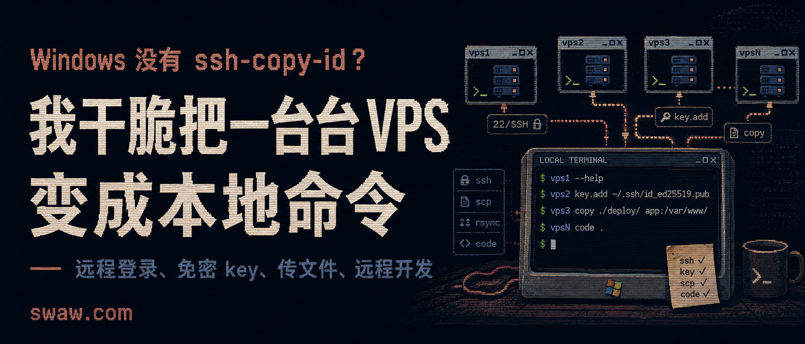
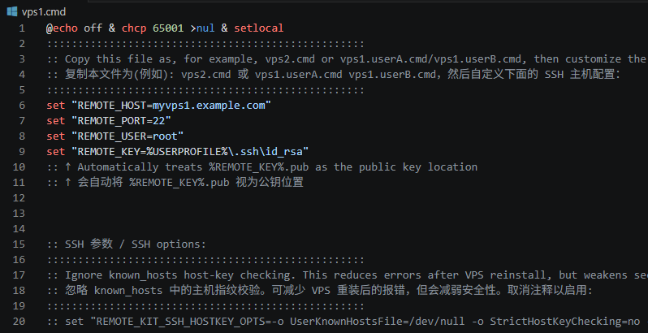
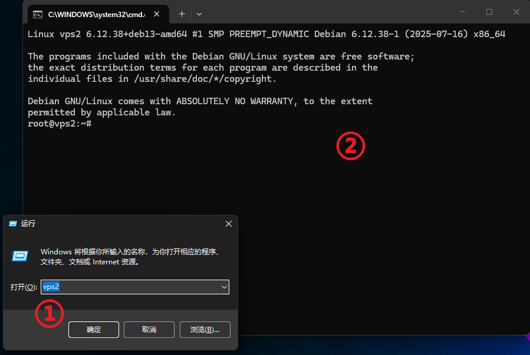
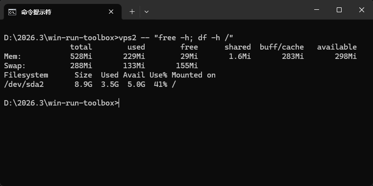

现在的 Windows 10/11，直接执行 `ssh` 已经不是问题，但没有 `ssh-copy-id` 命令。

要为远程机添加 SSH 公钥，以免密登录，有点麻烦，我为此经常切换到 WSL 中...

一两次还好，次数多了会不胜其烦。

后面为此写了一套脚本，我自己已用了好几年，功能不断扩充。脚本已上传到 GitHub，只需克隆此仓库到你本机：

```powershell
git clone https://github.com/swawai/win-run-toolbox
cd win-run-toolbox
copy .\vps1.cmd .\vps2.cmd
```


然后修改 `vps2.cmd` 里定义的主机信息（地址、端口、用户名、私钥路径），执行：
```powershell
.\vps2.cmd --help
```

就可以看到，针对你的 vps2 已有的所有可用命令：
```
D:\2026.3\win-run-toolbox>vps2 --help

# 基本用法:
  vps2    运行 vps2 (远程登录其文件中配置的 SSH 主机)


# 远程命令:
  vps2  -- ls -la /tmp             # 执行ls，普通非交互式命令
  vps2  tty -- top                 # 执行top，交互式命令(分配TTY)
  vps2  script local.sh arg1 arg2  # 上传本机的local.sh脚本到远端机临时目录, 执行，然后清理


# SCP 传输, 冒号开头表示远程路径:
  vps2  copy :/remote/src D:\local
  vps2  copy D:\local     :/remote/dst
  vps2  copy :/remote/src :/remote/dst   # 远程目录互拷, 使用 scp -3.


# SFTP 同步开发, 需编辑器中安装 SFTP by Natizyskunk 插件(冒号开头表示远程路径):
  vps2  code :/var/www D:\work\workspace  # 目录的先后顺序没有影响
  vps2  code D:\work\workspace :app/
  vps2  cursor :app/   D:\work\workspace


# 远程编辑（编辑器会通过 Remote-SSH 在远程服务器上安装对应 server）:
  vps2  code /var/www     # 用 VS Code 打开远程绝对路径.
  vps2  code app/         # 用 VS Code 打开远程 $HOME/app/.
  vps2  cursor /var/www   # 用 Cursor 打开远程绝对路径.
  vps2  cursor app/       # 用 Cursor 打开远程 $HOME/app/.


# 密钥管理（会修改远端 ~/.ssh/authorized_keys, key.fix/key.add.fix 还可能修改 sshd 配置）:
  vps2  key.add       将配置的私钥对应的 .pub 公钥添加到远端的 ~/.ssh/authorized_keys（幂等，不会重复添加）
  vps2  key.remove    从远端的 ~/.ssh/authorized_keys 移除该公钥（幂等,若有重复项会一并移除）。
  vps2  key.fix       检查/修复远端 sshd 配置中的 PubkeyAuthentication 为 yes (否则会拒绝key方式登录)
  vps2  key.add.fix   添加公钥，并检查/修复 PubkeyAuthentication
  # 若配置的私钥和同名 .pub 都不存在，key.add/key.add.fix/key.fix 会用 ssh-keygen 默认参数就地生成一对 key
  # 若远端机 /etc/ssh/sshd_config.d/*.conf 为空, key.fix 会优先改 /etc/ssh/sshd_config；改前会先就地备份既有文件.

```


## 一、这些命令是否安全、谨慎？

以 key.fix 这个命令为例，看似只修改远端 sshd 配置中的 PubkeyAuthentication 选项(是否允许key方式登录)，很简单？但实际会这样做：

```text
1. 先用当前配置的 key 测试 OpenSSH 登录；若 key 登录不可用，才回退走 PuTTY + 提示输入密码的路径。
2. 上传一次性辅助脚本到远端临时目录执行，执行结束后清理临时目录。
3. 在远端用 sshd -T -C user=...,host=...,addr=... 读取“实际生效”的 sshd 配置。
4. 如果找不到 sshd，或 sshd -T 无法读取有效配置，只给出 warning，不凭猜测修改配置。
5. 只有当 PubkeyAuthentication 的有效值为 no 时，才进入修复；已经是 yes 就不动。
6. 真正修改 sshd 配置前，要求当前用户是 root，或可以 sudo -n；否则直接失败退出。
7. 若 /etc/ssh/sshd_config 已 include sshd_config.d/*.conf，且远端确实已有 drop-in 配置文件，则写入 /etc/ssh/sshd_config.d/00-remote-kit-pubkey-auth.conf。
8. 否则修改主配置 /etc/ssh/sshd_config，而不是凭空引入一个空的 drop-in 目录。
9. 修改既有文件前使用 cp -p 就地备份；成功后只保留最近三份 remote_kit 备份，避免无限堆积。
10. 修改主配置前会拒绝复杂情况：PubkeyAuthentication 出现在 Match 块内/之后，或全局匹配到多次时，都不自动改。
11. 写入后先执行 sshd -t 做语法检查；失败则恢复备份，或删除刚新建的 drop-in。
12. 语法通过后，再次用 sshd -T 确认 PubkeyAuthentication 的有效值确实变成 yes；若仍未生效，也回滚。
13. 最后尝试 reload sshd/ssh 服务；自动 reload 失败时提示用户手动 reload。
14. 同时检查 AuthorizedKeysFile 是否包含 .ssh/authorized_keys；若 sshd 不读这个文件，会明确 warning。
```


## 二、放进 PATH，才真的顺手


上述命令，如果希望在 `Win + R` 或任意终端窗口里直接执行：
```powershell
vps2
vps2 -- uptime
vps2 key.add.fix
```

只需要双击仓库里的：

```text
pathhereadd.cmd
```

它会把当前自身所在的 `win-run-toolbox` 目录加入当前用户的 `PATH`。




如果你后悔了，也不用手动改环境变量，执行：

```text
pathhereremove.cmd
```

即可反向移除。

这个机制我在另一篇文章里写过：[让 Win + R 运行自定义命令](/zh/p/win-run-custom-command-path/)。


## 三、AI 来临前，我用此方法日常管理上百台机器

方法很简单，给每台机器对应的脚本，使用分区式的命名就行了：

```text
zone1.vps1.cmd
z1.v2.cmd
z1.v3.cmd
...
z10.v10.cmd
```

也可以用子目录，给它们做分组，以后使用先 cd 到具体的组目录：
```
group1/zone1.vps1.cmd
g2/z1.v1.cmd
g2/z1.v2.cmd
...
```

如果你管理整个公司的机器，也可以用机器所属同事的名字/部门命名：
```
zhangshan.cmd
LiSi.cmd
dev.vm1.LiSi.cmd
ops.vm2.WangWu.cmd
```

设置好免密后，它们也会是 Agent 充当运维的绝佳上下文空间，脚本名既把“机器”固化成了对应的命令，这对 人类 和 Agent 都同样舒服。

后面，你只需和 Codex 说 “Hi，帮我看看 LiSi 的内存使用量，ops.vm2.WangWu 的磁盘剩余”


此外，让 Agent 现场写脚本来批量编排、操作这些机器，也不是不可能。

以及，基于系统原生的 Windows Terminal 管理海量机器，也不是不可以。





> 此套脚本我自己长期使用，会持续维护，即便你不直接使用，其中关于 ssh 参数等实战中的细节处理，也值得借鉴(比如你的 ssh 远程命令可能遇到卡死/不回显)……总之欢迎 Star、PR.


> 关联仓库：[https://github.com/swawai/win-run-toolbox](https://github.com/swawai/win-run-toolbox)
