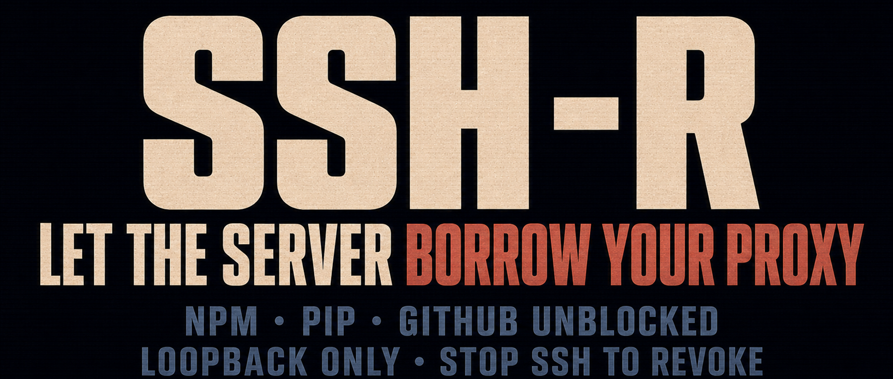

**Contents**

1. Verify that your workstation's HTTP proxy is running
2. Create the reverse proxy mapping with `ssh -R`
3. Set `http_proxy` to use the proxy
4. Stop and clean up
5. When to use this method
6. Security boundaries
7. FAQ
8. Summary



On servers in mainland China, repository clones and service deployments can suddenly go sideways: network timeouts, TLS handshake failures, or a dependency download that never finishes.

You may have switched npm, PyPI, Go, apt/dnf, and other tools to domestic mirrors, only to find that mirrors do not solve every case:

```text
- npm may fetch a GitHub Release
- a pip package may download an external binary
- a Docker image may come from Docker Hub, GHCR, or Quay
- the Go, Rust, Node, and Python ecosystems regularly span multiple sources
- a domestic mirror may lag behind, omit a package, go offline, or rate-limit requests
```

Another intuitive answer is to install a VPN or proxy directly on the server. That takes more work, may require cleanup afterward, and a mistake can even disrupt the server's connectivity.

Yet even when the server cannot reach the resource, your workstation often can. You may already be running a network proxy such as Clash locally.

The following method lets the server **temporarily use the proxy on your workstation**. Its core is one SSH feature:

```bash
ssh -R  # remote port forwarding
```

End the current `ssh -R` connection and the forwarding disappears. It does not modify the server's routes, default gateway, or firewall, so under normal conditions it does not affect anyone else's login session.


> Follow the laws in your location, your service provider's terms, and your organization's network-security policy. Enterprises may also obtain the necessary connectivity through compliant dedicated lines or SD-WAN. This article covers only the SSH port-forwarding technique.


## 1. Verify that your workstation's HTTP proxy is running

Assume your workstation already runs a proxy that can reach the target resource. It probably exposes an endpoint similar to:

```text
Local proxy: 127.0.0.1:7890
```

**Port 7890 is common for this kind of software and usually accepts HTTP proxy traffic. If you changed the port or the following check gives the wrong result, confirm the actual setting first.**

Test the proxy:

```sh
# macOS / Linux
curl -s -x http://127.0.0.1:7890 http://ip-api.com/json
# Windows
curl.exe -s -x http://127.0.0.1:7890 http://ip-api.com/json
```

Check whether the returned IP location matches your proxy exit. If it does not, confirm that the proxy application is running, that its rule or global mode is correct, and that its HTTP or mixed-proxy listener is enabled. Enabling the system proxy is not required, but it can help with diagnosis. When it is enabled, you can inspect it from the command line:

```bash
# Windows
reg query "HKCU\Software\Microsoft\Windows\CurrentVersion\Internet Settings"|findstr ProxyServer
```

## 2. Create the reverse proxy mapping with ssh -R

Choose an unused port on the server, for example:

```text
Server: 127.0.0.1:17890
```

Use SSH remote port forwarding to map that endpoint to the proxy port on your workstation:

```text
Server-local 127.0.0.1:17890
        ↓
ssh -R reverse tunnel
        ↓
SSH client / workstation 127.0.0.1:7890 (proxy service)
        ↓
Overseas dependency source
```

The result is simple:

> `127.0.0.1:17890` on the server becomes an HTTP proxy endpoint.


Run this command on your workstation:

```bash
ssh -N -R 127.0.0.1:17890:127.0.0.1:7890 user@your-server
```

**Replace 17890, 7890, and `user@your-server` with your actual values. If SSH does not use port 22, add `-p`, for example `-p 2222`.**

The forwarded traffic travels through the SSH tunnel, so neither the server's firewall/security group nor your workstation needs an extra inbound rule or a public IP. To exit immediately if port forwarding cannot be established, use:

```bash
ssh -N -o ExitOnForwardFailure=yes -o ServerAliveInterval=30 -o ServerAliveCountMax=3 -R 127.0.0.1:17890:127.0.0.1:7890 user@your-server
```


**Keep the `ssh -R` command running while the proxy is in use.**


## 3. Set http_proxy to use the proxy

Open **another terminal window** and log in to the server. First check whether port 17890 is listening:

```bash
ss -ntl | grep ':17890'
```

The output should show `127.0.0.1:17890`. If it shows `0.0.0.0:17890` or `[::]:17890`, the proxy may be reachable from other hosts. Stop the tunnel, inspect the server's `GatewayPorts` setting, and do not continue until the binding is safe.

Once the listener is correct, set the proxy for the current shell session:

```bash
export http_proxy=http://127.0.0.1:17890
export https_proxy=http://127.0.0.1:17890
```

Then test it:

```bash
# linux
curl -s ip-api.com
```

Confirm that the returned IP location matches the proxy exit on your workstation.


That is it.

The complete path is:

```text
npm / pip / git / curl on the server
        ↓
reads http_proxy=http://127.0.0.1:17890
        ↓
server-local 127.0.0.1:17890
        ↓
ssh -R reverse tunnel
        ↓
SSH client / workstation 127.0.0.1:7890 (proxy service)
        ↓
overseas dependency source
```

For a rough speed check, download a file from GitHub:

```bash
curl --proxy http://127.0.0.1:17890 -fL -o /dev/null -sS -w "%{speed_download}\n" "https://github.com/denoland/deno/releases/latest/download/deno-x86_64-unknown-linux-gnu.zip" | awk '{printf "%.2f Mbps\n", $1*8/1024/1024}'
```

**Replace port 17890 if needed. Treat this measurement as a rough reference only.**


## 4. Stop and clean up

There are two normal steps.

### 4.1 Close the shell session where you set the proxy variables, or unset them

```bash
# Run this in the affected shell to clean up
unset http_proxy https_proxy HTTP_PROXY HTTPS_PROXY all_proxy ALL_PROXY
```


### 4.2 Press `Ctrl+C` on your workstation to stop the ssh -R command


In the rare case that the client-side `ssh -R` process exits abnormally, the server-side listener may linger briefly. Check whether the target port still exists:

```bash
ss -ntl | grep ':17890'
```

If it does, first confirm that the listener really belongs to the SSH tunnel you just created:

```bash
# Displaying the listening process usually requires root
sudo ss -ntlp 'sport = :17890'
```

Only after confirming the process should you clean it up manually:

```bash
sudo fuser -k 17890/tcp
```

**Port 17890 is the server-side listener from this example. Verify your actual port and process so you do not terminate an unrelated service.**


## 5. When to use this method

The essence of `ssh -R` here is a temporary remote port forward that lives inside the current SSH connection:

```text
ssh -R is running: server 127.0.0.1:17890 is available
ssh -R disconnects: server 127.0.0.1:17890 disappears
```


It does not change the server's routes, iptables rules, VPN, or default gateway.

That makes it useful for:

```text
- one-off server or environment deployments
- fetching dependencies
- cloning a GitHub repository
- downloading a Release artifact
- emergency access when a mirror fails
```

Because your workstation must remain in the path, this is not a good foundation for production systems that need long-term access to external resources.


## 6. Security boundaries

Request a loopback-only listener:

```bash
# Available only to the server itself
-R 127.0.0.1:17890:127.0.0.1:7890
```


If you instead use:

```bash
# Listen on every server interface
-R 0.0.0.0:17890:127.0.0.1:7890
# Listen on a particular server-side interface
-R 192.168.1.123:17890:127.0.0.1:7890
```

the scope can expand from “this server only” to “reachable from the private network.” If the firewall or security group is also open, it may even become a **public proxy endpoint**, and proxy applications of this kind often have no password on their listener.

The final listening address also depends on the server's `sshd` `GatewayPorts` setting:

```text
GatewayPorts no               force loopback-only listeners (the default)
GatewayPorts yes              force a wildcard listener, such as 0.0.0.0 or [::]
GatewayPorts clientspecified  let the client select the address with -R
```

Do not trust the `127.0.0.1` written in the command alone. After establishing the tunnel, verify the actual listener with `ss -ntl | grep ':17890'`.


## 7. FAQ


### 7.1 What if I do not want to set http_proxy?

You can configure npm, pip, and other tools individually:

```bash
# npm
npm --proxy=http://127.0.0.1:17890 --https-proxy=http://127.0.0.1:17890 install
# pip
pip install -r requirements.txt --proxy http://127.0.0.1:17890
# git
git -c http.proxy=http://127.0.0.1:17890 -c https.proxy=http://127.0.0.1:17890 clone https://github.com/user/repo.git
```

**`github.com/user/repo` is only a placeholder. Replace it with the actual repository.**

### 7.2 Git over SSH does not necessarily use an HTTP proxy

Use an SSH `ProxyCommand`, for example:

```bash
# Bash / Linux
GIT_SSH_COMMAND='ssh -o ProxyCommand="nc -X connect -x 127.0.0.1:17890 %h %p"' git clone git@github.com:user/repo.git
# Git Bash / Windows (requires connect.exe bundled with Git for Windows)
GIT_SSH_COMMAND='ssh -o ProxyCommand="connect.exe -H 127.0.0.1:17890 %h %p"' git clone git@github.com:user/repo.git
```

**Replace 17890, `git@github.com:user/repo.git`, and the Git command as needed. This must use an SSH URL: if you keep an `https://...` URL, `GIT_SSH_COMMAND` does not participate in the connection.**

### 7.3 ping, traceroute, and nslookup do not use this HTTP proxy

`ping`, `tracert` / `traceroute`, and `nslookup` use ICMP, route probing, or UDP/DNS queries. They do not read `http_proxy` or `https_proxy`.

### 7.4 Docker has a trap

```bash
export https_proxy=http://127.0.0.1:17890
docker pull nginx
```

This may not work. `docker pull` is usually performed by the `dockerd` daemon, not by the Docker CLI process in your current shell. To route Docker through this `ssh -R` tunnel, the daemon itself must be able to reach the proxy. The details depend on the Linux distribution, Docker installation method, and systemd configuration, so this article only flags the issue rather than expanding into daemon proxy setup.


### 7.5 SSH reports remote port forwarding failed

Port 17890 may already be in use on the server; choose another unused port. If the server disables forwarding, inspect its `sshd` configuration:

```text
AllowTcpForwarding yes
```


## 8. Summary

The traditional proxy direction is:

```text
I use a server to reach the network
```

With `ssh -R`, the direction is reversed:

```text
The server uses the proxy on my workstation
```

When a server deployment stalls on npm, PyPI, GitHub, Docker, or another overseas dependency:

```bash
ssh -N -R 127.0.0.1:17890:127.0.0.1:7890 user@server
```


Open the path with one command.


> WeChat technical group:
> 
