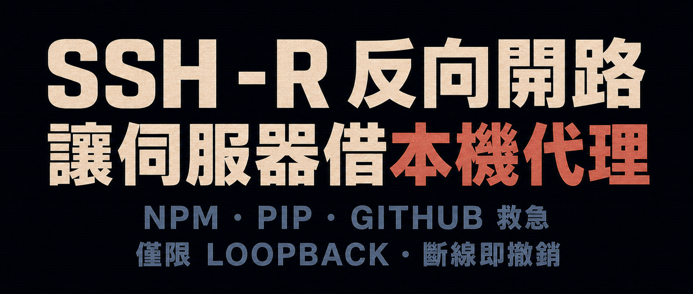

**目錄**

1. 確認本機／工作電腦的 HTTP 代理已開啟
2. 執行 `ssh -R` 反向轉送代理服務
3. 設定環境變數 `http_proxy` 使用代理
4. 停止與清理
5. 適用情境
6. 安全邊界
7. FAQ
8. 總結



中國境內的伺服器一到複製儲存庫或部署服務時，就可能突然出狀況：網路逾時、TLS 交握失敗，或某個相依套件下載到一半卡住。

你可能辛苦地把 npm、PyPI、Go、apt/dnf 等工具改用境內鏡像站，卻仍然無法解決所有問題，因為：

```text
- npm 可能需要下載 GitHub Release
- pip 套件可能需要下載外部二進位檔
- Docker 映像檔可能來自 Docker Hub、GHCR 或 Quay
- Go、Rust、Node、Python 生態系經常橫跨多個來源
- 境內鏡像站可能尚未同步、缺少套件、失效或限制流量
```

另一個直覺方案，是直接在伺服器上安裝 VPN 或網路代理。但這類變更步驟繁瑣，使用後可能還要清理，一不小心甚至會影響伺服器連線。

其實，即使伺服器無法連上目標資源，多數技術人員的本機或工作電腦仍然可以。例如，本機可能已經執行 Clash 一類的網路代理軟體。

以下方法可以**讓伺服器暫時使用本機／工作電腦上的網路代理**。核心只用到一個 SSH 功能：

```bash
ssh -R  # 反向連接埠轉送
```

終止目前的 `ssh -R` 連線，轉送就會撤銷。它不會修改伺服器路由、預設閘道或防火牆，正常情況下也不會影響其他人的登入工作階段。


> 請遵守所在地法律、服務商條款與組織的網路安全政策。企業也可能透過合規的外部網路專線或 SD-WAN 取得所需連線能力；本文只討論 SSH 連接埠轉送技術。


## 一、確認本機／工作電腦的 HTTP 代理已開啟

假設本機已執行能連上目標資源的網路代理，大多會開啟類似以下的端點：

```text
本機代理：127.0.0.1:7890
```

**7890 是這類軟體常見的代理連接埠，通常支援 HTTP 代理協定。如果你改過連接埠，或後續測試結果不正確，請先依實際設定確認。**

測試代理是否可用：

```sh
# macOS / Linux
curl -s -x http://127.0.0.1:7890 http://ip-api.com/json
# Windows
curl.exe -s -x http://127.0.0.1:7890 http://ip-api.com/json
```

確認回傳的 IP 所在地是否符合代理出口。如果不符合，請檢查代理軟體是否已啟動、規則或全域模式是否正確，以及 HTTP／Mixed 代理服務是否開啟。系統代理不是必要條件，但開啟後有助於疑難排解。若已開啟，可以從命令列查詢：

```bash
# Windows
reg query "HKCU\Software\Microsoft\Windows\CurrentVersion\Internet Settings"|findstr ProxyServer
```

## 二、執行 ssh -R 反向轉送代理服務

先在伺服器上選一個**尚未使用的連接埠**，例如：

```text
伺服器：127.0.0.1:17890
```

透過 SSH 反向連接埠轉送，把它對應到本機／工作電腦上的代理連接埠：

```text
伺服器本機的 127.0.0.1:17890
        ↓
ssh -R 反向通道
        ↓
SSH 用戶端／工作電腦的 127.0.0.1:7890（代理服務）
        ↓
海外相依套件來源
```

結果就是：

> 伺服器上的 `127.0.0.1:17890` 會成為一個 HTTP 代理端點。


在本機／工作電腦執行：

```bash
ssh -N -R 127.0.0.1:17890:127.0.0.1:7890 user@your-server
```

**請依實際情況修改 17890、7890 與 `user@your-server`。如果 SSH 不是使用連接埠 22，請加入 `-p`，例如 `-p 2222`。**

轉送流量實際會通過 SSH 通道，因此伺服器防火牆／安全群組不需要另外開放 17890，本機／工作電腦也不需要公用 IP。若希望連接埠轉送建立失敗時立即結束，可以使用：

```bash
ssh -N -o ExitOnForwardFailure=yes -o ServerAliveInterval=30 -o ServerAliveCountMax=3 -R 127.0.0.1:17890:127.0.0.1:7890 user@your-server
```


**使用期間必須讓 `ssh -R` 命令持續執行。**


## 三、設定環境變數 http_proxy 使用代理

**另開一個終端機視窗**登入伺服器，先檢查 17890 是否正在監聽：

```bash
ss -ntl | grep ':17890'
```

輸出應顯示 `127.0.0.1:17890`。如果顯示 `0.0.0.0:17890` 或 `[::]:17890`，代表代理可能已對其他主機開放。請先停止通道並檢查伺服器的 `GatewayPorts` 設定，不要繼續使用。

確認監聽安全後，為目前的 shell 工作階段設定網路代理：

```bash
export http_proxy=http://127.0.0.1:17890
export https_proxy=http://127.0.0.1:17890
```

接著測試：

```bash
# linux
curl -s ip-api.com
```

確認回傳的 IP 所在地符合本機／工作電腦上的代理出口。


完成了。

整體路徑如下：

```text
伺服器上的 npm / pip / git / curl
        ↓
讀取環境變數 http_proxy=http://127.0.0.1:17890
        ↓
伺服器本機的 127.0.0.1:17890
        ↓
ssh -R 反向通道
        ↓
SSH 用戶端／工作電腦的 127.0.0.1:7890（代理服務）
        ↓
海外相依套件來源
```

若要粗略測速，可以從 GitHub 下載一個檔案：

```bash
curl --proxy http://127.0.0.1:17890 -fL -o /dev/null -sS -w "%{speed_download}\n" "https://github.com/denoland/deno/releases/latest/download/deno-x86_64-unknown-linux-gnu.zip" | awk '{printf "%.2f Mbps\n", $1*8/1024/1024}'
```

**請依需求修改 17890；這項測速只供粗略參考。**


## 四、停止與清理

正常情況下有兩個步驟。

### 4.1 關閉設定過代理環境變數的 shell 工作階段，或清除變數

```bash
# 清理時只要在對應 shell 執行
unset http_proxy https_proxy HTTP_PROXY HTTPS_PROXY all_proxy ALL_PROXY
```


### 4.2 在本機／工作電腦按下 `Ctrl+C`，終止 ssh -R 命令


極少數情況下，用戶端的 `ssh -R` 程序異常結束，伺服器端的監聽可能短暫殘留。請檢查目標連接埠是否仍然存在：

```bash
ss -ntl | grep ':17890'
```

如果仍然存在，先確認監聽程序確實屬於剛才建立的 SSH 通道：

```bash
# 顯示監聽程序通常需要 root 權限
sudo ss -ntlp 'sport = :17890'
```

確認無誤後，才在伺服器上手動清理：

```bash
sudo fuser -k 17890/tcp
```

**這裡的 17890 是範例中 `ssh -R` 在伺服器端監聽的連接埠；務必依實際情況確認，避免終止無關程序。**


## 五、適用情境

這裡的 `ssh -R` 本質上是在目前 SSH 連線內建立一條暫時的反向連接埠轉送：

```text
ssh -R 命令執行中：伺服器 127.0.0.1:17890 可用
ssh -R 命令中斷：伺服器 127.0.0.1:17890 消失
```


它不修改伺服器路由、iptables、VPN 或預設閘道。

因此很適合：

```text
- 一次性的伺服器／環境部署
- 下載相依套件
- 複製 GitHub 儲存庫
- 下載 Release 套件
- 鏡像站失效時救急
```

因為必須由本機／工作電腦中轉，自然不適合需要長期存取外部網路的正式環境。


## 六、安全邊界

建議要求只監聽伺服器的 loopback 位址：

```bash
# 僅限伺服器本機使用
-R 127.0.0.1:17890:127.0.0.1:7890
```


如果改成：

```bash
# 監聽伺服器所有網路介面
-R 0.0.0.0:17890:127.0.0.1:7890
# 監聽伺服器端的特定網路介面位址
-R 192.168.1.123:17890:127.0.0.1:7890
```

存取範圍可能從「僅限伺服器本機」擴大成「內部網路可存取」。若安全群組或防火牆也已開放，甚至可能成為**公用網路代理入口**，而這類代理軟體的監聽端點通常沒有密碼驗證。

最終監聽位址還會受伺服器 `sshd` 的 `GatewayPorts` 設定影響：

```text
GatewayPorts no               強制只監聽 loopback 位址（預設值）
GatewayPorts yes              強制監聽萬用位址，可能顯示為 0.0.0.0 或 [::]
GatewayPorts clientspecified  允許用戶端透過 -R 指定監聽位址
```

因此，不能只相信命令列中寫了 `127.0.0.1`。建立通道後，仍應使用 `ss -ntl | grep ':17890'` 檢查實際監聽結果。


## 七、FAQ


### 7.1 如果不使用 http_proxy 環境變數

也可以個別為 npm、pip 等工具設定代理參數：

```bash
# npm
npm --proxy=http://127.0.0.1:17890 --https-proxy=http://127.0.0.1:17890 install
# pip
pip install -r requirements.txt --proxy http://127.0.0.1:17890
# git
git -c http.proxy=http://127.0.0.1:17890 -c https.proxy=http://127.0.0.1:17890 clone https://github.com/user/repo.git
```

**`github.com/user/repo` 只是預留位置，請換成實際儲存庫。**

### 7.2 Git 使用 SSH 協定時，不一定會通過 HTTP 代理

可以使用 SSH `ProxyCommand`，例如：

```bash
# Bash / Linux
GIT_SSH_COMMAND='ssh -o ProxyCommand="nc -X connect -x 127.0.0.1:17890 %h %p"' git clone git@github.com:user/repo.git
# Git Bash / Windows（需要 Git for Windows 內附的 connect.exe）
GIT_SSH_COMMAND='ssh -o ProxyCommand="connect.exe -H 127.0.0.1:17890 %h %p"' git clone git@github.com:user/repo.git
```

**請依實際情況替換 17890、`git@github.com:user/repo.git` 與所需的 Git 命令。這裡必須使用 SSH URL；若仍使用 `https://...`，`GIT_SSH_COMMAND` 不會參與連線。**

### 7.3 ping、traceroute、nslookup 不會通過這個 HTTP 代理

`ping`、`tracert`／`traceroute`、`nslookup` 使用的是 ICMP、路由探測或 UDP／DNS 查詢，不會讀取 `http_proxy`／`https_proxy` 這類環境變數。

### 7.4 Docker 有陷阱

```bash
export https_proxy=http://127.0.0.1:17890
docker pull nginx
```

這不一定會生效，因為真正下載映像檔的通常是 `dockerd` 背景服務，而不是目前 shell 裡的 Docker CLI。若要讓伺服器上的 Docker 透過 `ssh -R` 連線，必須讓 Docker daemon 本身可以存取這個代理，而不是只為目前 shell 設定 `https_proxy`。相關做法取決於 Linux 發行版、Docker 安裝方式與 systemd 設定，本文只提醒這個陷阱，不展開 daemon 代理設定。


### 7.5 SSH 顯示 remote port forwarding failed

伺服器上的 17890 可能已被占用，改用另一個尚未使用的連接埠即可。如果伺服器停用了轉送，請檢查 `sshd` 設定：

```text
AllowTcpForwarding yes
```


## 八、總結

傳統代理方向是：

```text
我借用伺服器連上外部網路
```

`ssh -R` 則把方向反過來：

```text
伺服器借用我本機／工作電腦上的代理
```

當伺服器部署卡在 npm、PyPI、GitHub、Docker 等海外相依套件下載時：

```bash
ssh -N -R 127.0.0.1:17890:127.0.0.1:7890 user@server
```


一劍開天門。


> 微信技術交流群：
> 
