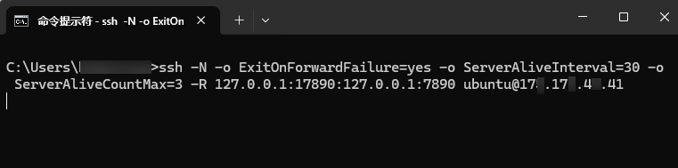
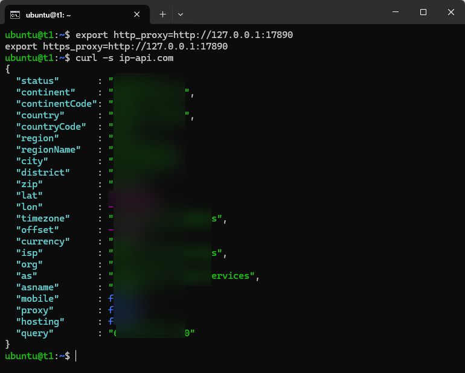
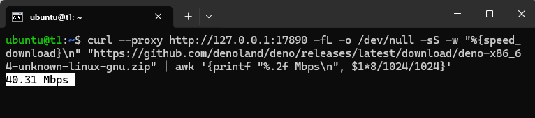

**目录**

一、确定本机/工作电脑的 HTTP 代理已打开  
二、执行 ssh -R 反向映射代理服务  
三、设置环境变量 http_proxy 来使用代理  
四、停止与清理  
五、适用场景  
六、安全边界  
七、FAQ  
八、总结  


国内服务器，一到拉取仓库、部署服务，就会抽风：网络超时、TLS 握手失败，或某个依赖包下载卡死……

你可能辛辛苦苦，试过把 npm、PyPI、Go、apt/dnf 等更换国内镜像源，但仍然未能 100% 解决。因为：

```text
- npm 可能拉 GitHub Release
- pip 包可能下载外部二进制
- Docker 镜像可能来自 Docker Hub/GHCR/Quay
- Go/Rust/Node/Python 生态经常跨多个源
- 国内镜像站可能不同步、缺包、失效、限流
```

另一个直觉方案，是在服务器上安装 VPN 或网络代理。但这类改动步骤繁琐，使用后或要清理，一不小心还可能导致服务器失联。

其实，服务器虽不能上外网，但绝大多数技术从业者的本机/工作电脑是可以的。比如本机已经运行了某类网络代理软件，如 Clash。

这里给出一个方案：**让服务器临时使用你本机/工作电脑上的网络代理**。核心命令只有：

```bash
ssh -R  # 反向端口转发
```

终止当前的 ssh -R 连接，转发就会撤销。它不修改服务器路由、默认网关或防火墙，正常情况下不会影响服务器上的其他登录会话。


> 请遵守所在地法律、服务商条款和组织的网络安全政策。企业也可能通过合规的外网专线或 SD-WAN 获得所需访问能力；本文只讨论 SSH 端口转发技术。


## 一、确定本机/工作电脑的 HTTP 代理已打开

假设你本机已运行这类网络代理软件，能访问目标资源，那么大概率已经打开了：

```text
本机代理：127.0.0.1:7890
```

**7890 是这类软件常见的代理端口，通常支持 HTTP 代理协议。如果你改过端口，或测试结果不对，需要按实际情况确认。**

验证代理是否已经可用：

```sh
# macOS / Linux
curl -s -x http://127.0.0.1:7890 http://ip-api.com/json
# Windows
curl.exe -s -x http://127.0.0.1:7890 http://ip-api.com/json
```

看看返回的 IP 归属地区，是否对上了你的代理网络。如果不是，检查你的代理软件是否已经打开并开启运行，是否是规则或全局模式，是否打开了 HTTP/Mixed 代理服务，或是否开启了系统代理（非必须，但开启有助于排查）。若开启了系统代理，可以命令行查询：
```bash
# Windows
reg query "HKCU\Software\Microsoft\Windows\CurrentVersion\Internet Settings"|findstr ProxyServer
```

## 二、执行 ssh -R 反向映射代理服务

我们让服务器上的一个**空闲端口**，例如：

```text
服务器：127.0.0.1:17890
```

通过 SSH 反向端口映射，到你本机/工作电脑上的代理端口：

```text
服务器本地的 127.0.0.1:17890
        ↓
ssh -R 反向隧道
        ↓
ssh 客户端/你工作电脑的 127.0.0.1:7890 (代理服务)
        ↓
海外依赖源
```

效果就是：

> 服务器上的 `127.0.0.1:17890`，变成了一个 HTTP 代理服务。


具体命令（在你本机/工作电脑上执行）：

```bash
ssh -N -R 127.0.0.1:17890:127.0.0.1:7890 user@your-server
```

**注意按实际情况修改 17890、7890 和 user@your-server；如果 SSH 不是 22 端口，需加 `-p` 参数，如：`-p 2222`**

转发流量实际是走 ssh 隧道，所以服务器防火墙/安全组不需要额外设置（例如放行 17890 端口），本机/工作电脑也不需要公网 IP。如果希望端口转发失败时立即退出，可以使用：

```bash
ssh -N -o ExitOnForwardFailure=yes -o ServerAliveInterval=30 -o ServerAliveCountMax=3 -R 127.0.0.1:17890:127.0.0.1:7890 user@your-server
```



**使用期间需保持 ssh -R 命令运行**


## 三、设置环境变量 http_proxy 来使用代理

**另开一个窗口**，登录服务器。先检查 17890 是否已侦听：

```bash
ss -ntl | grep ':17890'
```

输出应显示 `127.0.0.1:17890`。如果显示 `0.0.0.0:17890` 或 `[::]:17890`，说明代理可能已对其他主机开放，请先停止隧道并检查服务器的 `GatewayPorts` 配置，不要继续使用。

确认后继续执行（对当前 shell 会话设置网络代理）：

```bash
export http_proxy=http://127.0.0.1:17890
export https_proxy=http://127.0.0.1:17890
```

然后测试：

```bash
# linux
curl -s ip-api.com
```

确认返回的 IP 归属地区，是你本机/工作电脑的代理网络。



大功告成！

整体的逻辑：

```text
服务器上的 npm / pip / git / curl
        ↓
读取环境变量 http_proxy=http://127.0.0.1:17890
        ↓
服务器本地的 127.0.0.1:17890
        ↓
ssh -R 反向隧道
        ↓
ssh 客户端/你工作电脑的 127.0.0.1:7890 (代理服务)
        ↓
海外依赖源
```

测速（从 GitHub 下载一个文件）：

```bash
curl --proxy http://127.0.0.1:17890 -fL -o /dev/null -sS -w "%{speed_download}\n" "https://github.com/denoland/deno/releases/latest/download/deno-x86_64-unknown-linux-gnu.zip" | awk '{printf "%.2f Mbps\n", $1*8/1024/1024}'
```

**注意 17890 端口号按需修改；此测速只作粗略参考。**




## 四、停止与清理

两个步骤：

### 4.1 关闭设置过代理环境变量的 shell 会话，或清理相关变量

```bash
# 对于清理，只需在对应 shell 中执行
unset http_proxy https_proxy HTTP_PROXY HTTPS_PROXY all_proxy ALL_PROXY
```


### 4.2 本机/工作电脑按下 `Ctrl+C` 终止 ssh -R 命令。


极少情况，客户端 ssh -R 命令异常关闭，服务器的端口侦听可能不会自动终止。建议在服务器多做一步检查，看目标端口是否仍然存在：

```bash
ss -ntl | grep ':17890'
```

如仍存在，先确认监听进程确实属于刚才的 SSH 隧道：

```bash
# 显示监听进程通常需要 root 权限
sudo ss -ntlp 'sport = :17890'
```

确认无误后，才在服务器上手动清理：

```bash
sudo fuser -k 17890/tcp
```

**这里的 17890 对应示例中 `ssh -R` 在服务器侧监听的端口；必须按实际情况确认，避免终止无关进程。**


## 五、适用场景

`ssh -R` 这个方法的本质，是在当前 SSH 会话里临时开一条反向端口转发。

```text
ssh -R 命令运行：服务器 127.0.0.1:17890 可用
ssh -R 命令断开：服务器 127.0.0.1:17890 消失
```


它不改服务器路由，不改 iptables，不开 VPN，不动系统默认网关。

所以它非常适合：

```text
- 一次性的服务器/环境部署
- 拉依赖
- 克隆 GitHub 仓库
- 下载 release 包
- 镜像源失效时救急
```

因为需要本机/工作电脑做中转，自然不宜用于长期依赖外网的生产环境。


## 六、安全边界

推荐请求仅监听服务器回环地址：

```bash
# 仅限服务器本机使用
-R 127.0.0.1:17890:127.0.0.1:7890
```


若写为：

```bash
# 监听服务器所有网卡
-R 0.0.0.0:17890:127.0.0.1:7890
# 监听服务器侧某个网卡地址
-R 192.168.1.123:17890:127.0.0.1:7890
```

访问范围会从“仅服务器本机”扩大到“内网可访问”，在安全组/防火墙也放开时，甚至会变成**公网代理入口**，且这类软件的代理入口通常没设置密码认证！

但最终监听地址还受服务器 `sshd` 的 `GatewayPorts` 配置影响：

```text
GatewayPorts no               强制只监听回环地址（默认值）
GatewayPorts yes              强制监听通配地址，可能显示为 0.0.0.0 或 [::]
GatewayPorts clientspecified  允许客户端通过 -R 指定监听地址
```

所以不要只相信命令行里写了 `127.0.0.1`；建立隧道后仍应使用 `ss -ntl | grep ':17890'` 检查实际监听结果。


## 七、FAQ


### 7.1 如果不使用 http_proxy 环境变量

你也可以为 npm、pip 等单独设置代理参数：

```bash
# npm
npm --proxy=http://127.0.0.1:17890 --https-proxy=http://127.0.0.1:17890 install
# pip
pip install -r requirements.txt --proxy http://127.0.0.1:17890
# git
git -c http.proxy=http://127.0.0.1:17890 -c https.proxy=http://127.0.0.1:17890 clone https://github.com/user/repo.git
```
**github.com/user/repo 非真实存在，注意替换**

### 7.2 Git 使用 SSH 协议时，不一定会走代理

正确方法(示例克隆):

```bash
# Bash / Linux
GIT_SSH_COMMAND='ssh -o ProxyCommand="nc -X connect -x 127.0.0.1:17890 %h %p"' git clone git@github.com:user/repo.git
# Git Bash / Windows（需要 Git for Windows 自带的 connect.exe）
GIT_SSH_COMMAND='ssh -o ProxyCommand="connect.exe -H 127.0.0.1:17890 %h %p"' git clone git@github.com:user/repo.git
```
**注意按实际情况替换 17890、`git@github.com:user/repo.git` 和所需的 Git 命令。这里必须使用 SSH URL；若仍使用 `https://...`，`GIT_SSH_COMMAND` 不会参与连接。**

### 7.3 ping、traceroute、nslookup 不会走这个 HTTP 代理

`ping`、`tracert` / `traceroute`、`nslookup` 走的是 ICMP、路由探测或 UDP/DNS 查询，不读取 `http_proxy` / `https_proxy` 这类环境变量。

### 7.4 Docker 有坑

```bash
export https_proxy=http://127.0.0.1:17890
docker pull nginx
```

不一定生效。因为 `docker pull` 真正拉镜像的往往是 `dockerd` 守护进程，不是你当前 shell 里的 Docker CLI。如果你确实要让服务器上的 Docker 通过 `ssh -R` 出去，需要让 Docker daemon 自己能访问这个代理，而不是只给当前 shell 设置 `https_proxy`。这块和系统发行版、Docker 安装方式、systemd 配置有关，细节较多。本文只提醒这个坑，不展开 Docker daemon 代理配置。


### 7.5 SSH 提示 remote port forwarding failed

可能是服务器上的 17890 端口已经被占用，换一个空闲端口即可。如果服务器禁用了转发，需要检查服务器 sshd 配置：

```text
AllowTcpForwarding yes
```


## 八、总结

传统代理思路是：

```text
我借服务器出网
```

`ssh -R` 的思路是反过来：

```text
服务器借我本机/工作电脑出网
```

当国内云服务器部署卡在 npm、PyPI、GitHub、Docker 等海外依赖下载上时：

```bash
ssh -N -R 127.0.0.1:17890:127.0.0.1:7890 user@server
```


一剑开天门。


> 微信交流群：
> 
