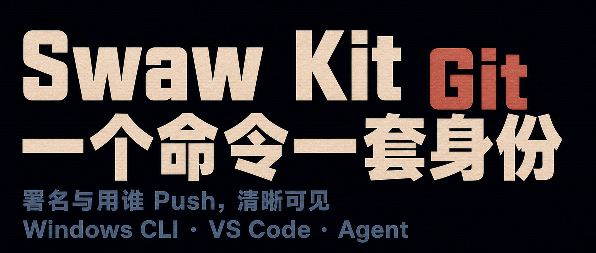
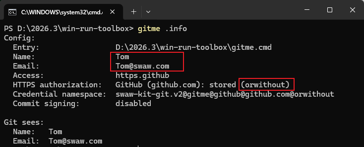
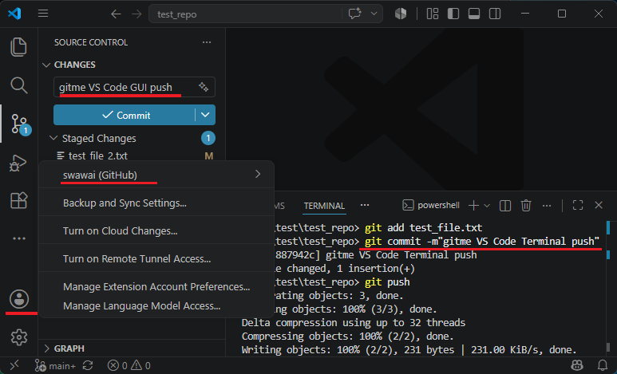
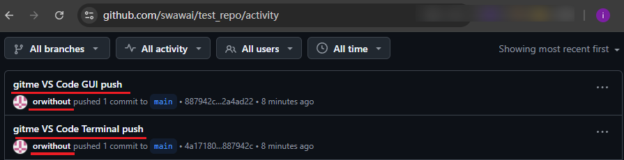
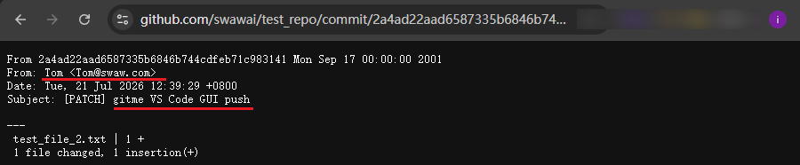

AI Coding 越来越强，维护的代码仓库，也容易变多。仓库还可能，会属于不同的 GitHub 账户，例如公司的、个人的；甚至属于某个 GitLab。

## 一、有什么问题？

若你有两个仓库：

```text
仓库A → https://github.com/userA/repoA.git → 属于个人账户 userA
仓库B → https://github.com/company/repoB.git → 需用公司账户 userB
```

将很容易遇到，刚 push 仓库A，接着 push 仓库B时，被提示：“没有权限”；   
删除 userA 的凭据，登录 userB，push 仓库B正常了，push 仓库A又报错。  
更糟的是，push 成功，但发现把用于个人的署名/邮箱，提交到了公司仓库！

> user.email 署名邮箱和 push 使用的远端访问身份，是不相干的两套机制（后面还会说到）。

## 二、这种情况，你会频繁切换，来应对吗？

那太痛苦了。熟练的人，会借助 Git 配置文件，有两处：

```text
全局配置：
~/.gitconfig

仓库内配置：
仓库A/.git/config
仓库B/.git/config
```


## 三、Git 配置文件怎么解决：不同仓库需要不同的远端访问身份，和署名信息的？


只需修改仓库内配置文件（推荐用命令配置）：

```cmd
cd D:\code\repoA
git config user.name "Personal Name"
git config user.email "personal@example.com"
git config credential.https://github.com.username userA
```

```cmd
cd D:\code\repoB
git config user.name "Company Name"
git config user.email "name@company.com"
git config credential.https://github.com.username userB
```

配置后，这些信息会分别写入两个仓库的.git/config，互不干扰。

后面，在仓库A/ 中运行的 Git 命令，会自动应用仓库A/.git/config；  
在仓库B/ 中运行的 Git 命令，会自动应用仓库B/.git/config。  
VS Code 的源码管理也会调用 Git，所以同样会读取这些配置。  
这就达到，不同仓库，底层逻辑上，可以自动应用不同的署名、指明不同的远端访问身份。

> 仓库内的 .git/config 优先于全局的 ~/.gitconfig  


## 四、三条配置命令详解

### 1. 前两条

作用是，配置作者的署名和署名邮箱，当你执行 git commit 时，会自动附加：

```cmd
git config user.name "Personal Name"
git config user.email "personal@example.com"
```


### 2. 第三条

是为 HTTPS 凭据助手指明远端访问账户。

`仓库A`指明的是访问 github.com 的远端时，使用账户 userA：

```cmd
git config credential.https://github.com.username userA
```

`仓库B`指明的是访问 github.com 远端时，使用账户 userB：

```cmd
git config credential.https://github.com.username userB
```

这里假设了仓库的 origin URL 是 HTTPS 链接，配置的是 HTTPS 远端访问账户。  
它只是指明访问账户，Windows 上(Git for Windows)，第一次 push 时通常会请求启动浏览器登录授权；成功后，凭据会由系统`凭据管理器`保存。  
**origin URL 若没改过，那就是你克隆仓库时给的 URL。**  


## 五、若仓库的 origin URL 是 SSH 链接的，怎么办？

### 1. 可以把 SSH 链接转换为 HTTPS

```cmd
cd D:\code\repoA
:: 查看当前 origin URL:
git remote get-url origin
:: 假设 SSH 链接是 git@github.com:path/repoA.git，则执行：
git remote set-url origin https://github.com/path/repoA.git
```

### 2. 若不转换，可以为不同仓库，配置不同的 SSH 远端访问私钥


```cmd
cd D:\code\repoA
:: 假定私钥在 %USERPROFILE%/.ssh/id_ed25519_userA：
git config core.sshCommand "ssh -o IdentitiesOnly=yes -i ~/.ssh/id_ed25519_userA"

cd D:\code\repoB
:: 从略
```

> GitHub/GitLab 对 SSH 链接是基于私钥来识别身份，而不是账户名。

### 3. 若 origin URL 有多个，每个的远端访问身份也是不同的，怎么办？

origin 是 HTTPS URL 的，可以把账户名直接追加进 URL；SSH URL 的，可通过`~/.ssh/config`，把私钥包装为 Host，然后替换 URL 中的原 Host 名。这种情况可以说非常少见，不展开细说。

## 六、作者的署名信息和远端访问身份，为什么要做区分？


创建 GitHub/GitLab 账户时，有被要求填写邮箱，所以很多人会以为：

```cmd
git config user.email "name@example.com"
```

设置的署名邮箱，也指定了 push 使用的远端账户。

这理解是错的，我也困惑过。实际上，它们是完全不搭边的两套机制：

```text
代码是谁写的  （署名和署名邮箱）
谁有权限 push （远端访问身份）
```

例如，用个人的 GitHub 账户同时维护公司的项目、署名要用公司的企业邮箱时，若不区分将无法做到。

## 七、全局配置有啥用？

例如前面的署名配置命令，都是修改仓库内配置 .git/config，但只需加上`--global`，就会写入全局的 ~/.gitconfig：

```cmd
git config --global user.name "Default Name"
git config --global user.email "default@example.com"
```

这样，后面新增一个`仓库C`，无需配置 .git/config，会自动应用全局配置。在多 Git 账户时，也容易导致身份信息错乱。

## 八、还有更方便的方式吗？

上面的方法是为每个仓库单独配置，好处是非常清晰，代价是每次新增一个本地仓库，都要设置一遍。

确实还有一招：`includeIf`大法。

### 1. 得先把需要不同远端访问身份、署名的仓库，做区分，放在不同的父目录下

例如：

```text
D:/github-userA/
  └─仓库A
D:/github-userB/
  └─仓库B
```

### 2. 把配置写到父目录下

例如，对父目录 github-userA：

```cmd
git config --file "D:/github-userA/.gitconfig" user.name "Personal Name"
git config --file "D:/github-userA/.gitconfig" user.email "personal@example.com"
git config --file "D:/github-userA/.gitconfig" credential.https://github.com.username userA
git config --file "D:/github-userA/.gitconfig" core.sshCommand "ssh -o IdentitiesOnly=yes -i ~/.ssh/id_ed25519_personal"
```

对父目录 github-userB：

```cmd
git config --file "D:/github-userB/.gitconfig" user.name "Company Name"
git config --file "D:/github-userB/.gitconfig" user.email "name@company.com"
git config --file "D:/github-userB/.gitconfig" credential.https://github.com.username userB
git config --file "D:/github-userB/.gitconfig" core.sshCommand "ssh -o IdentitiesOnly=yes -i ~/.ssh/id_ed25519_company"
```

上面也给出了指定`sshCommand`和 SSH key 的配置命令，当 origin URL 是 SSH 链接时有用。  
**其中涉及的目录路径、SSH key 路径、user.name、user.email、userA、userB……请按实际情况替换。**

> origin 是 SSH URL 时，会采用 core.sshCommand；是 HTTPS URL 时，会采用 credential.*。  
> origin URL 没改过，那就是你克隆仓库时给的 URL。

### 3. 挂载到全局配置

把上面生成的 D:/github-userA/.gitconfig 和 D:/github-userB/.gitconfig，**按条件挂载**到全局配置 ~/.gitconfig：

```cmd
git config --global "includeIf.gitdir/i:D:/github-userA/.path" "D:/github-userA/.gitconfig"
git config --global "includeIf.gitdir/i:D:/github-userB/.path" "D:/github-userB/.gitconfig"
```

这样，配置就完成了。

今后你用 git 命令操作 D:/github-userA 下的仓库，会自动应用 D:/github-userA/.gitconfig 中的配置。  
操作 D:/github-userB/ 下的，也一样，会自动应用 D:/github-userB/.gitconfig。  
通过 VS Code 操作的也不例外。


## 九、还是觉得麻烦，怎么办？

我的解法是**Swaw Kit Git** (入口模板为`git1.cmd`)  
**把不同身份，包装为不同的 git 入口命令**：

```text
gitme.cmd      个人身份
gitwk.cmd      公司身份
gitme2.cmd     个人身份2
```

用 gitme 身份操作仓库A：

```cmd
cd 仓库A/
gitme commit -m "update"
gitme push
```

用 gitwk 身份操作仓库B：

```cmd
cd 仓库B/
gitwk push
```

基于 gitwk 身份启动 VS Code 或 Cursor：

```cmd
cd 仓库B/
gitwk .code
gitwk .cursor
```

把 gitwk 绑定的身份，持久写入仓库B 的 .git/config：

```cmd
cd 仓库B/
gitwk .sync
:: 写入后也可以清理:
gitwk .sync --clear
```

它使用环境变量注入身份信息，不会影响其他进程/窗口，也不会隐式修改任何 Git 配置文件（除非你显式执行有关命令，如 gitme .sync）

其中有点号开头的，是自定义命令（如 .code | .cursor），无点号开头的（如 commit | push），会在校验并添加身份信息的环境变量后，透传给 git.exe 去执行。

它会像铁一样顽固：  
用 gitme 替代 git 执行的操作，就一定会沿用 gitme.cmd 中绑定的身份。  
用 gitwk 替代 git 执行的操作，就一定会沿用 gitwk.cmd 中绑定的身份。  
除非你用参数显式额外指定，  例如：  
`gitme commit --author=...`

**不能明确控制使用的身份时，它会宁愿报错、而不是继续执行。**

## 十、Swaw Kit Git 使用截图

以我的`gitme.cmd`为例，其中绑定的身份为：

```text
作者署名：Tom
署名邮箱：Tom@swaw.com
远端访问账户：orwithout（HTTPS，github.com）
```

VS Code 界面，显示的登录账号为：

```text
swawai（GitHub）
```

先执行`gitme .info`查看绑定的身份：




用 gitme 身份启动 VS Code 并打开到一个测试仓库：

```cmd
gitme .code D:\test\test_repo
```

用 VS Code 的图形界面和内置终端，分别完成一次提交/push。截图中，VS Code 界面账户仍然是 swawai：




打开 GitHub，查看识别到的推送账号和署名（与 gitme.cmd 中的绑定完全一致，且没受 VS Code 登录账户影响）：







## 十一、工具已开源，免安装，上手使用只需三步

Git 本身（Git for Windows），你仍需自行安装。

### 1. 克隆仓库

```cmd
git clone https://github.com/swawai/win-run-toolbox
cd win-run-toolbox
```

### 2. 创建身份专属入口命令（以 gitme2 为例）

```cmd
copy .\git1.cmd .\gitme2.cmd
```

打开复制得到的 gitme2.cmd，修改三个必填项：

```cmd
:: commit 署名信息:
set "GIT_ID_NAME=Your Name"
set "GIT_ID_EMAIL=you@example.com"

:: 远端访问方式（这里使用 HTTPS GitHub 模式）：
set "GIT_ID_ACCESS=https.github:host=github.com;account=your-account"
```

远端访问支持`https.github:`、`https.gitlab:`、`ssh:`三种模式，实际配时，可查看gitme2.cmd 中注释。对于 https.* 模式的，使用前需执行一次：

```cmd
gitme2 .https login
```

这会打开浏览器交互，请求一次认证授权。


设定部分就这么多。执行：

```cmd
gitme2 --help
```

可查看所有可用命令。

### 3. 加入用户 PATH

要让gitme、gitme2……能在任意终端及`Win + R`中直接运行，双击仓库目录里的：

```cmd
pathhereadd.cmd
```

它会把当前工作目录（即此时打开的仓库目录）加入用户 PATH。要回退，执行：`pathhereremove.cmd`

脚本修改用户 PATH 是否安全可靠？参考：[让 Win + R 运行自定义命令](/zh/p/win-run-custom-command-path/)


## 十二、小结

Git 多账户管理真正麻烦的，不是账户多，而是能重写身份的地方很多：全局配置、仓库配置、凭据管理器、SSH key，乃至VS Code 等编辑器。  
Git 的原生配置完全能解决问题；但仓库和身份继续变多后，你会开始怀疑：这个仓库我配过了吗？现在的身份信息是来自哪？

**Swaw Kit Git** 把这些隐藏状态收束成一个个专用的、可命名的入口命令：  
`gitme`就是个人身份，`gitwk`就是工作身份。命令还没执行，身份已经可见。命令名记不住？你可以按喜好自己重命名。


用 Codex 的话概括：

> 对人，入口命令是可记忆的操作界面；对 Agent，它是参数明确、失败可判断的执行接口。双方走的是同一条主路径，不需要维护两套身份规则。

> 关联仓库：https://github.com/swawai/win-run-toolbox

> 给 AI 阅读：https://swaw.com/zh/p/swaw-kit-git

在调试 **Swaw Kit Git** 过程，发现 VS Code 有泄露环境变量的隐密问题，下一篇文章我打算说一下这个，及其应对方法。
