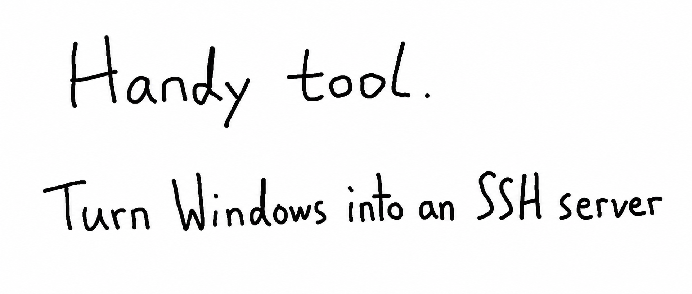

When people talk about connecting to a computer remotely, the usual pairing is probably Remote Desktop for Windows and SSH for Linux.

But Windows can also run as an SSH server and accept SSH connections.

Windows includes OpenSSH. The SSH Client, which connects to other computers, is generally ready to use; the SSH Server, which lets other computers connect to yours, usually has to be enabled manually.

SSH covers a few situations that Remote Desktop cannot:


1. If Remote Desktop freezes or shows a black screen, you can still connect over SSH and restart the Remote Desktop service from the command line
2. Windows can join a cluster as an automation worker—for example, as a Jenkins agent, since building a Unity APK usually requires Windows. SSH is smoother here than WinRM or java-remote
3. When you only need the Windows command line, SSH is much smoother than opening a terminal inside Remote Desktop, and you can connect directly from Linux, macOS, or another device


## 1. Swaw Kit SSH-Access examples

### 1. Enable the local OpenSSH server and allow it through the firewall

```
.\sshaccess.cmd .global server install --uac
```

If your local Windows account already has a password, you can now connect to it from another computer.

### 2. To enable passwordless SSH key access, apply the public key

```
.\sshaccess .public grant --uac
```

You can then connect to this computer from another machine using the private key.

Where does the public key come from? It is defined in advance in `sshaccess.cmd`.


### 3. Check the service status

```
.\sshaccess.cmd .status ssh
```

## 2. Get started in three steps

### 1. Clone the repository

```cmd
git clone https://github.com/swawai/swaw-kit
cd swaw-kit
```

### 2. Create an entry command from the template (using sshaccess as an example)

```cmd
copy Favorites\template.sshaccess1.cmd  sshaccess.cmd
```

After copying the template to `sshaccess.cmd`, edit it and check the public-key path it binds. By default, the path is:

```
~/.ssh/id_{entry-command-name}.pub
```

When a private key is needed, the tool removes the `.pub` suffix and uses the resulting path. For example:

```
~/.ssh/id_sshaccess.pub
~/.ssh/id_sshaccess
```

If the specified key does not exist, run `sshaccess .key gen -N` to generate the key pair immediately. To protect the new key with a passphrase, omit `-N`.

If you need to manage several key authorizations, copy the template into multiple entry commands and bind each one separately:

```
copy Favorites/template.sshaccess1.cmd  sshacc2.cmd
copy Favorites/template.sshaccess1.cmd  sshacc3.cmd
copy Favorites/template.sshaccess1.cmd  sshacc-company.cmd
```


### 3. Use --help to see the available commands

The first two steps have already completed the setup. To see every available command:

```cmd
.\sshaccess --help
```


## 3. How to enable it manually, without my tool

1. Set a password for your Windows account; use a strong one
2. Open Start, right-click, then go to Settings > System > Optional features > View features. Select OpenSSH Server and apply the change
3. Check the firewall and allow the SSH server's default port, 22

Then test it from another computer: `ssh -p 22 [your-Windows-account]@[your-computer-IP-address]`

To go one step further and enable passwordless key-based access, add these steps:

5. Prepare a public key, or generate a key pair
6. For a standard Windows user, add the public key to `%USERPROFILE%\\.ssh\authorized_keys`; for an administrator, add it to `C:\ProgramData\ssh\administrators_authorized_keys`
7. Check the file permissions. Only Administrators and SYSTEM should have read and write access to `administrators_authorized_keys`; for `authorized_keys`, access should be limited to Administrators, SYSTEM, and the account itself

Once that is set up, you can connect from another computer using the private key.


## 4. To connect to another machine over SSH

Run:

```
ssh -p 22 [account-on-target]@[target-IP-address]
```

You will be prompted for a password. To connect with a key:

```
ssh -i [private-key-path] -p 22 [account-on-target]@[target-IP-address]
```

If you encounter an error, append `-vvv` to print detailed information:

```
ssh -vvv -i [private-key-path] -p 22 [account-on-target]@[target-IP-address]
```


**I recommend the SSH Remote tool in the same repository.** It follows the same setup:

```
:: Enter the repository directory
cd swaw-kit

:: Create a dedicated entry command for your remote SSH host from the template
copy Favorites/template.vps1.cmd  vps1.cmd
```

After copying the template to `vps1.cmd`, edit or inspect the host details bound inside it, then run `vps1 --help` to see how to use it. For more, read [Turn each VPS into a local command](/p/ssh-remote-kit-windows/).


## 5. Add the repository to your user PATH

To run an entry command such as `sshaccess` from any terminal or directly from Win + R, double-click this file in the repository root:

```cmd
PathHereAdd.cmd
```

It idempotently adds the script's own directory—the repository root—to your user PATH. To undo the change, run `.\PathHereRemove.cmd`.

Is it safe and reliable for a script to modify the user PATH? See [Run custom commands from Win + R](/p/win-run-custom-command-path/).


## 6. Summary

This tool treats the key as the unit of operation and follows a simple design: one command represents one set of resources. That keeps each operation's boundary clear.

Because the relevant information is bound ahead of time, the commands also work well with agents such as Codex and Claude Code: the agent does not have to ask which key to use.

Whenever a command requires interaction, its `--help` text says so. This prevents an agent from running it and getting stuck.

If you manage several sets of key permissions, the model stays simple: create one entry command for each key you need to manage.

I will keep improving Swaw Kit and gradually add the tools I wrote over ten years of network administration and operations work. If this interests you, would you help test it or submit an issue?

Thanks for reading!

> Repository: https://github.com/swawai/swaw-kit
