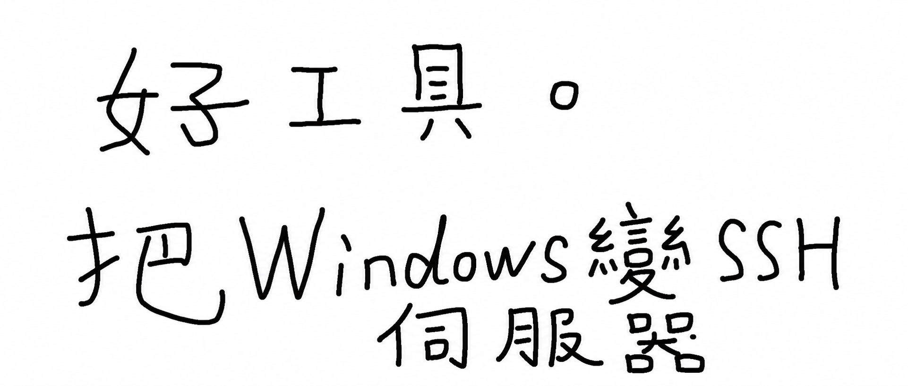

說起電腦的遠端連線，多數人最先想到的，大概是用遠端桌面連接 Windows；用 SSH 連接 Linux。

其實 Windows 也能作為 SSH Server，接受 SSH 連線。

Windows 內建 OpenSSH 套件，SSH Client（連接其他電腦）通常可以直接使用；SSH Server（讓其他電腦連進來）則通常要手動啟用。

SSH 連線可以處理一些遠端桌面解決不了的問題：


1. 遠端桌面卡死或黑畫面時，仍可透過 SSH 連上去，用命令列重新啟動遠端桌面服務
2. Windows 可以作為叢集節點接受自動化排程，例如作為執行節點加入 Jenkins（Unity APK 打包通常需要 Windows）；這種情況下，SSH 比 WinRM、java-remote 更順手
3. 只需要透過命令列操作 Windows 時，SSH 比在遠端桌面裡再開一個終端機順暢得多，而且能直接從 Linux、Mac 等裝置發起連線


## 一、我的工具（Swaw Kit SSH-Access）範例

### 1. 啟用本機的 OpenSSH 伺服器，並開放防火牆

```
.\sshaccess.cmd .global server install --uac
```

如果目前的 Windows 本機帳號已設定密碼，就能從其他電腦連進來。

### 2. 如果要提供 SSH Key 免密碼連線，繼續套用公鑰即可

```
.\sshaccess .public grant --uac
```

這樣就能從其他電腦透過私鑰連接本機。

公鑰從哪裡來？它已經預先定義在 `sshaccess.cmd` 裡。


### 3. 查看服務狀態

```
.\sshaccess.cmd .status ssh
```

## 二、這個工具只需三步就能上手

### 1. 複製儲存庫

```cmd
git clone https://github.com/swawai/swaw-kit
cd swaw-kit
```

### 2. 從範本建立入口指令（以 sshaccess 為例）

```cmd
copy Favorites\template.sshaccess1.cmd  sshaccess.cmd
```

將範本複製成 `sshaccess.cmd` 後，可以編輯它，檢查裡面綁定的公鑰路徑。預設為：

```
~/.ssh/id_{入口指令名稱}.pub
```

需要私鑰時，工具會去掉 `.pub`，把剩下的部分當成私鑰路徑。例如：

```
~/.ssh/id_sshaccess.pub
~/.ssh/id_sshaccess
```

如果指定的金鑰不存在，可以執行 `sshaccess .key gen -N` 立即產生金鑰組（如果要產生受密碼片語保護的金鑰，請拿掉 `-N`）。

如果需要管理多組金鑰授權，可以複製多個入口指令，分別綁定：

```
copy Favorites/template.sshaccess1.cmd  sshacc2.cmd
copy Favorites/template.sshaccess1.cmd  sshacc3.cmd
copy Favorites/template.sshaccess1.cmd  sshacc-company.cmd
```


### 3. 用 --help 查看可用指令

前兩步其實已經完成設定。若要查看所有可用指令：

```cmd
.\sshaccess --help
```


## 三、不用我的工具，要怎麼手動啟用

1. 為 Windows 使用者設定密碼（請使用高強度密碼）
2. 開啟「開始」選單，按一下滑鼠右鍵，進入「設定 > 系統 > 選用功能 > 檢視功能」，勾選 OpenSSH 伺服器並套用
3. 檢查防火牆，開放 SSH 伺服器預設的 22 連接埠

接著可以在另一台電腦測試：`ssh -p 22 [你的電腦帳號]@[你的電腦IP位址]`

如果要進一步設定使用 Key 的免密碼連線，再加上這些步驟：

5. 準備公鑰，或立即產生金鑰組
6. Windows 使用者若是標準使用者，將公鑰加入 `%USERPROFILE%\\.ssh\authorized_keys`；若是系統管理員，則加入 `C:\ProgramData\ssh\administrators_authorized_keys`
7. 檢查檔案權限：`administrators_authorized_keys` 只允許 Administrators、SYSTEM 讀寫；`authorized_keys` 則只允許 Administrators、SYSTEM 與該帳號本身讀寫

設定完成後，就能從其他電腦透過私鑰連接本機。


## 四、如果要透過 SSH 連接其他電腦

執行指令：

```
ssh -p 22 [目標電腦帳號]@[目標電腦IP位址]
```

接著會提示輸入密碼。如果使用金鑰連線：

```
ssh -i [私鑰路徑] -p 22 [目標電腦帳號]@[目標電腦IP位址]
```

如果遇到錯誤，可以加上 `-vvv` 輸出詳細資訊：

```
ssh -vvv -i [私鑰路徑] -p 22 [目標電腦帳號]@[目標電腦IP位址]
```


**推薦使用同一個儲存庫裡的 SSH Remote 工具**，上手方式相同：

```
:: 進入儲存庫目錄
cd swaw-kit

:: 從範本建立遠端 SSH 主機專用的入口指令
copy Favorites/template.vps1.cmd  vps1.cmd
```

將範本複製成 `vps1.cmd` 後，編輯或查看裡面綁定的主機資訊，再執行 `vps1 --help` 查看用法。更多說明請見：[把一台台 VPS 變成本機指令](/zh-tw/p/ssh-remote-kit-windows/)。


## 五、加入使用者 PATH

如果想讓 `sshaccess` 這類入口指令能在任何終端機或 Win + R 中直接執行，請按兩下儲存庫根目錄裡的：

```cmd
PathHereAdd.cmd
```

它會將腳本所在的目錄（也就是儲存庫根目錄）以冪等方式加入使用者 PATH。若要復原，執行 `.\PathHereRemove.cmd` 即可。

讓腳本修改使用者 PATH 是否安全可靠？請參考：[讓 Win + R 執行自訂指令](/zh-tw/p/win-run-custom-command-path/)。


## 六、小結

這個工具以金鑰為操作對象，採用「一個指令就是一組資源」的設計模式，操作邊界很清楚。

它預先綁定了相關資訊，也很適合交給 Codex、Claude Code 之類的 Agent 使用，能少掉 Agent 詢問該用哪一把金鑰的步驟。

需要互動的指令，都已在 `--help` 資訊裡寫明提醒；交給 Agent 使用時，能避免執行後卡住。

如果要管理多組金鑰，做法很直接：要管理多少組金鑰權限，就複製多少個入口指令來一一對應。

最後，我會繼續完善 Swaw Kit 專案，把自己十年網管與維運生涯中寫過的工具逐步收進來。會有感興趣的朋友願意幫忙測試、提交 issue 嗎？

感謝閱讀！

> 相關儲存庫：https://github.com/swawai/swaw-kit
