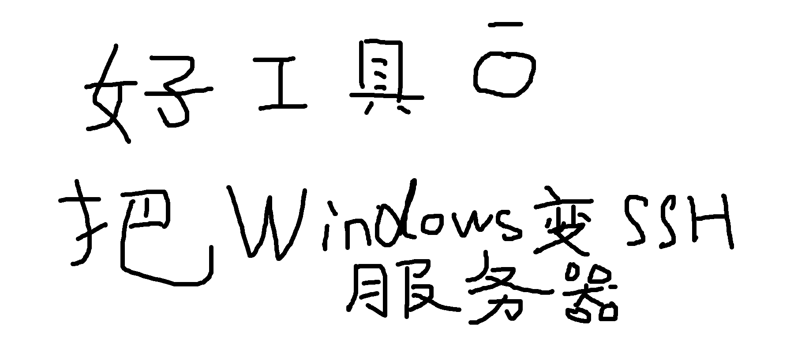

说起电脑远程连接，估计最常想到：用远程桌面连接 Windows；用 SSH 连接 Linux。

其实 Windows 也可以作为 SSH Server，被 SSH 连接。

Windows 有内置 OpenSSH 套件，SSH Client（连接别的电脑）一般直接可用；SSH Server（被别的电脑连接）通常要手动开启。

SSH 连接，可以解决远程桌面连接，无法解决的这些问题：


1. 远程桌面卡死/黑屏时，可 SSH 连上去，用命令行重启远程桌面服务
2. Windows 可以作为集群节点被自动化调度，例如作为执行节点加入 Jenkins（Unity APK 打包通常要 Windows）；这方面 SSH 比 WinRM、java-remote 更丝滑
3. 只需命令行操作 Windows（比在远程桌面里再开命令行终端，要丝滑得多，且可从 Linux、Mac 等设备直接发起）


## 一、我的工具（Swaw Kit SSH-Access）示例

### 1. 启用本机系统的 OpenSSH 服务器，并放行防火墙：
```
.\sshaccess.cmd .global server install --uac
```

如果你当前的 Windows 本机账号已经设置了密码，便可从别的机器连接进来了。

### 2. 如果要提供 SSH Key 免密连接，继续……应用公钥即可：
```
.\sshaccess .public grant --uac
```

这样，你便可以从别的机器，通过私钥连接本机。

公钥从哪来？在 sshaccess.cmd 中提前定义的。


### 3. 查看服务状态：
```
.\sshaccess.cmd .status ssh
```

## 二、此工具上手，只需三步

### 1. 克隆仓库

```cmd
git clone https://github.com/swawai/swaw-kit
cd swaw-kit
```

### 2. 从模板创建入口命令(以 sshaccess 为例)

```cmd
copy Favorites\template.sshaccess1.cmd  sshaccess.cmd
```

复制得到 sshaccess.cmd 后，你可以编辑它，检查其中公钥路径的绑定，默认为：
```
~/.ssh/id_{入口命令名}.pub
```

需要私钥时，会减去.pub的部分作为私钥路径，例如：

```
~/.ssh/id_sshaccess.pub
~/.ssh/id_sshaccess
```

指定的密钥若不存在，可以通过 sshaccess .key gen -N 立即生成密钥对（若要生成带口令保护的密钥，请去掉 -N）。

如果你需要管理多套密钥授权，可以复制多个入口命令来分别绑定：
```
copy Favorites/template.sshaccess1.cmd  sshacc2.cmd
copy Favorites/template.sshaccess1.cmd  sshacc3.cmd
copy Favorites/template.sshaccess1.cmd  sshacc-company.cmd
```


### 3. --help 查看可用命令

上面两步，其实已经设置完成。查看所有可用命令：

```cmd
.\sshaccess --help
```


## 三、不用我的工具，手动怎么开

1. 给你的 Windows 用户设置密码（请设置强密码）
2. 开始菜单 > 右键 > 设置 > 系统 > 可选功能 > 查看功能 > 勾上 OpenSSH 服务器，应用
3. 检查防火墙，放行 SSH 服务器默认的 22 端口

然后可以在另外一台电脑测试：ssh -p 22 [你电脑的账户名]@[你电脑的ip地址]

如果要进一步，设置使用 Key 免密连接，追加这些步骤：

5. 准备公钥，或立即生成密钥对
6. Windows 用户是普通用户的，把公钥加入 %USERPROFILE%\\.ssh\authorized_keys；管理员则加入：C:\ProgramData\ssh\administrators_authorized_keys
7. 检查文件权限，administrators_authorized_keys 限 Administrators、SYSTEM 可读写；authorized_keys 限 Administrators、SYSTEM，和自身账户可读写。

这样设置后，便可以从别的机器，通过私钥连接本机。


## 四、如果要 SSH 连接别的机器

执行命令：

```
ssh -p 22 [目标电脑的账户名]@[目标电脑的ip地址]
```

然后会提示输入密码。如果使用密钥连接：

```
ssh -i [私钥路径] -p 22 [目标电脑的账户名]@[目标电脑的ip地址]
```

如果遇到报错，可以追加 -vvv 打印详细信息：

```
ssh -vvv -i [私钥路径] -p 22 [目标电脑的账户名]@[目标电脑的ip地址]
```


**推荐使用我同仓库的 SSH Remote 工具**，上手方法相同：

```
:: 进入仓库目录
cd swaw-kit

:: 从模板创建你的 SSH 远程机专用入口命令
copy Favorites/template.vps1.cmd  vps1.cmd
```

复制得到 vps1.cmd 后，编辑/查看其中绑定的主机信息，然后执行 `vps1 --help` 查看用法。更多说明，见我的这篇文章：[把一台台 VPS 变成本地命令](/zh/p/ssh-remote-kit-windows)


## 五、加入用户 PATH

想让入口命令，如 sshaccess 能在任意终端或 Win + R 中直接运行，双击仓库根目录里的：

```cmd
PathHereAdd.cmd
```

它会把脚本自身所在目录（即仓库根目录）幂等加入用户 PATH（要回退，执行：`.\PathHereRemove.cmd`即可）

脚本修改用户 PATH 是否安全可靠？参考：[让 Win + R 运行自定义命令](/zh/p/win-run-custom-command-path/)


## 六、小结

本工具的特点是以密钥为操作对象，秉持「一个命令即一套资源」的设计模式，操作边界清晰。

它提前绑定了信息，也非常适合给 Codex、Claude Code 之类 Agent 使用（减少 Agent 问你使用哪个密钥）。

需要交互的命令，`--help`信息都写了提醒，给 Agent 使用时，能避免造成阻塞。

对于要管理多套密钥的，可以：要管理多少套密钥的权限，就复制多少个入口命令来进行对应。

最后，我会持续完善 Swaw Kit 项目，把我十年网管、运维生涯写过的工具，逐步纳入。会有感兴趣的朋友来帮忙测试、提交 issue 吗？

> 关联仓库：https://github.com/swawai/swaw-kit


**如果您觉得还行，请勿忘给一下反应：点赞、转发，或点小星星关注我。若有问题、建议，或是要吐槽……都可以在评论区留言。感谢惠读！**
