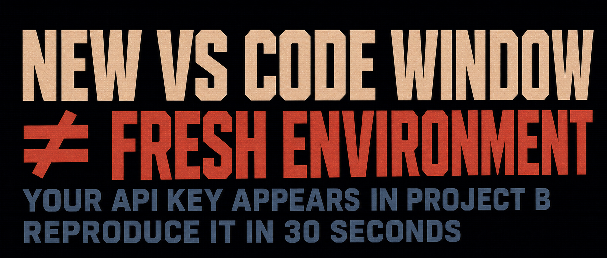

## 1. Test it yourself in 30 seconds

Close every VS Code window, then run these commands in **two separate terminals**, in order:

> Note: I tested this in Windows Command Prompt. Use the equivalent Bash commands on macOS or Linux.

```cmd
:: Terminal 1: set a fake key and open the first VS Code window
set MY_API_KEY=abcdefghijklmn && code C:\

:: Terminal 2: open a second VS Code window
code D:\
```

In the terminal inside the second window, run:

```
cmd /c set MY_API_KEY
```

What do you get? It has no business being there, yet there it is:


**I reproduced the same behavior in Cursor (`--classic` mode). Other VS Code-based IDEs may behave the same way. I will use VS Code as the example from here on.**


## 2. Why this happens

The reason is straightforward:

VS Code can open multiple windows. Those windows look like peers, but they share one main process in the background. New windows are actually created by that main process, so they naturally inherit its environment.

When does the main process start, and when does it stop?

On the Windows system I tested, the main process starts when the first VS Code window opens. It does not exit until the last VS Code window closes.

That makes how the first window is launched extremely important: its environment variables are injected into the VS Code main process.

If the first window is launched from a terminal carrying an API key, that key becomes available to every VS Code window opened afterward.

What if the environment variable has already reached the main process? Close every VS Code window and let the main process exit.


## 3. I filed an issue. Guess how the team replied?

The issue is here: https://github.com/microsoft/vscode/issues/327454

Their reply: See https://code.visualstudio.com/docs/configure/command-line#_isolating-vs-code-instances

I thought it was a bug. Their answer seemed to be: this is a feature🫠?

The behavior is indeed documented. The official recommendation is to specify a separate `--user-data-dir`:

```cmd
code ~/project1 --user-data-dir ~/vscode-data-project1
code ~/project2 --user-data-dir ~/vscode-data-project2
```

Multiple user-data directories, just to isolate environment variables...

That also separates your VS Code settings, extensions, keybindings, history, and more. Every new project means reinstalling extensions, configuring the theme again, and remembering which window belongs to which user-data directory.

**Is this really environment-variable isolation, or a plan to make everyone switch careers to DevOps on the spot?**


## 4. My lightweight workaround

### 1. The simplest way to avoid it

Before running `code .`, check whether another VS Code window is already open. If not, launch one from the Start menu first. This ensures that your `code .` command does not create the main process. Once that process is already running, opening the project will not inject the terminal's environment into it.

### 2. Wrap `code .` in a dedicated script and split the launch into two phases

```text
Before loading environment variables:
    Check whether VS Code is already running
    If not, open a blank window first (this starts the main process)

After the main process starts:
    Load the environment variables
    Reuse the blank window
    Load the project directory (code --reuse-window "project directory")
```

Both approaches rely on the same idea: make sure the main process has already started somewhere else. I use the script in my daily workflow and solve the problem once. If you only encounter this occasionally, opening a blank window first is enough. There is no need to make it more complicated.


Reference implementation: https://github.com/swawai/swaw-kit/tree/main/_lib/editor_kit

> The idea is the same on macOS and Linux; only the script syntax changes. Feel free to share your implementation in the comments.

## 5. What you should do now

1. Spend 30 seconds running the test above.
2. Before using `code .` in daily work, confirm that another VS Code window is already open.
3. If you often export or set secrets in a terminal before launching VS Code, consider wrapping the launch with the two-phase logic above.
4. This is not a catastrophic vulnerability. The leak only occurs between VS Code windows open at the same time. But it is subtle enough to matter: you configure your company's OpenAI API key in project A; you switch to project B, believing it only uses DeepSeek, while some code quietly runs with the leftover key. At the end of the month, the bill arrives: wait, where did those extra few hundred dollars come from?
