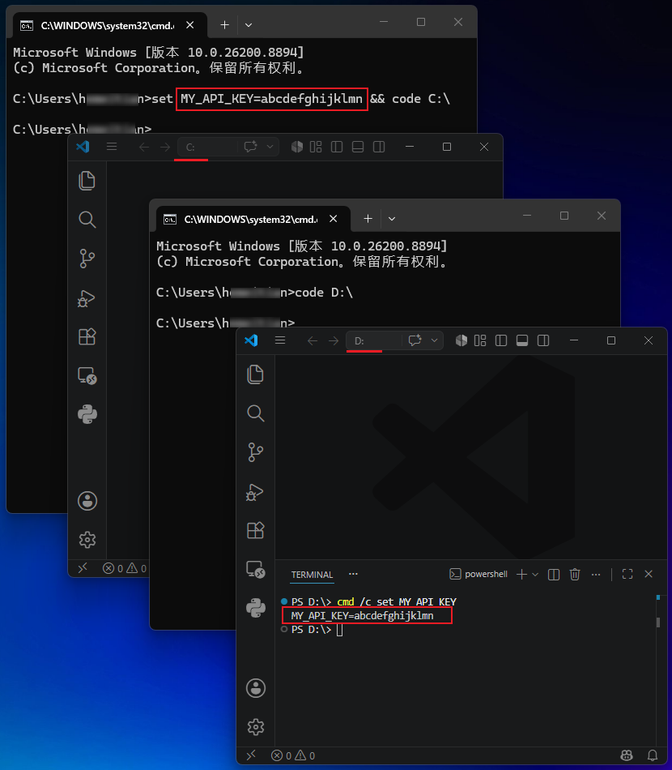

## 一、30 秒自测

关掉所有 VS Code，在**两个终端里**依次执行：

> 注意：我的环境为 Windows CMD 终端，macOS/Linux 下请换成 Bash 命令。

```cmd
:: 终端1：设个假 Key，并打开第一个 VS Code 窗口
set MY_API_KEY=abcdefghijklmn && code C:\

:: 终端2：开第二个 VS Code 窗口
code D:\
```

在第二个窗口的终端里跑：

```
cmd /c set MY_API_KEY
```

你会看到啥？它不该在那，但还就是出现了：




**我测了 Cursor（`--classic`模式），也能复现。VS Code 系 IDE 可能都一样！后文只以 VS Code 为例，不再复述。**


## 二、为什么会这样

原因其实简单：

VS Code 能多开窗口，多个窗口看似平级，但后台共用一个主进程。新窗口，实际都由主进程创建，自然会继承主进程的环境。

那么主进程又是什么时候启动、什么时候退出？

在我测试的 Windows 上，打开第一个 VS Code 窗口时，主进程随之启动；关闭最后一个 VS Code 窗口后，主进程才退出。

所以，第一个窗口是被谁打开的，就非常关键，它携带的环境变量，会被注入到 VS Code 主进程！

所以，你要是用带着 API Key 的终端，来打开的第一个窗口，那不好意思，Key 就会变成后续所有新建窗口的共享资源。

环境变量已经被注入主进程，怎么办？关掉所有 VS Code 窗口，让主进程退出。


## 三、我去提了个 Issue，你猜官方怎么回？

Issue 在这里：https://github.com/microsoft/vscode/issues/327454

对方：See https://code.visualstudio.com/docs/configure/command-line#_isolating-vs-code-instances

我以为是 Bug，对方的意思：这是 Feature🫠？

这个行为确实写在官方文档里了。文中建议，是单独指定 `--user-data-dir`：

```cmd
code ~/project1 --user-data-dir ~/vscode-data-project1
code ~/project2 --user-data-dir ~/vscode-data-project2
```

为了隔离环境变量，搞多个 user-data-dir ……

这意味着 VS Code 设置、扩展插件、快捷键配置、历史记录等也会是单独的；你每开一个新项目，都要重新装插件、配主题、记哪个窗口是哪套 user-data-dir。

**这哪是隔离环境变量？我看是想让人原地转行 DevOps！**


## 四、我的轻量解法

### 1. 最简单的规避方法：

每次 `code .` 之前，若没有其他 VS Code 窗口已开着，从开始菜单先启一个。确保主进程不是由你的 `code .` 拉起的，后面再开多少个窗口都没事。

### 2. 包装一个专用脚本，把启动 `code .` 的流程拆成两段：

```text
环境变量加载前：
    检查 VS Code 是否已经运行
    如果没有，先打开一个空白窗口（会拉起主进程）

主进程启动后：
    加载环境变量
    接管空白窗口
    加载项目目录（code --reuse-window "项目目录"）
```

两套方法，逻辑是一样的：确保主进程已在“别处”启动了。我个人日常用的是脚本方案，一劳永逸；如果你只是偶尔遇到这个问题，记得先开一个空白窗口就够了，不用搞太复杂。


参考代码：https://github.com/swawai/swaw-kit/tree/main/_lib/editor_kit

> macOS/Linux 下的思路一致，区别是脚本的写法，欢迎在评论区交流你的实现。

## 五、所以你现在该做什么

1. 花 30 秒跑一遍上面的自测。
2. 日常使用时，`code .` 之前先确认，有其他 VS Code 窗口已开着。
3. 如果你经常在终端里 export/set 密钥后启动 VS Code，考虑我上面的包装脚本逻辑。
4. 这不是什么惊天漏洞，泄露只在你同时开着的多个 VS Code 窗口之间发生，但它足够隐蔽：你在 A 项目配了公司的 OpenAI API Key；切到 B 项目，以为只在用 DeepSeek，某段代码却拿着残留的 Key 跑了起来……月底账单一看：咦，怎么又多了几百刀。
