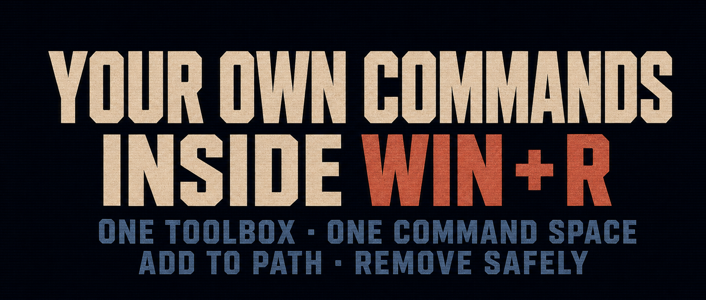

The Windows `Win + R` dialog is useful, but most of us only use it for built-in commands such as `cmd`, `ncpa.cpl`, `mstsc`, and `services.msc`.

Add your own toolbox directory to `PATH`, however, and `Win + R` can launch your commands too.

Here are some of the custom and third-party tools I have used for a long time:

```text
hosts.cmd      Open the hosts file
git1.cmd       Run Git commands with SSH key 1
git2.cmd       Run Git commands with SSH key 2 for multiple upstream Git accounts
vps1.cmd       Log in to VPS 1 over SSH
vps2.cmd       Log in to VPS 2 over SSH
bun            JavaScript runtime
uv             Python package and project manager
…
portrule.cmd   Quickly manage Windows Firewall port rules
porttask.cmd   Find a process by service port
taskport.cmd   Find service ports by process ID
psping.exe     Sysinternals TCP ping tool
tcpview.exe    Sysinternals connection viewer
Autoruns.exe   Sysinternals startup troubleshooter
```

There is no Start menu to open, shortcut to find, or directory to switch into. You only need to remember the command name.

The mechanism behind this is `PATH`.

When you enter a command, Windows searches the directories listed in `PATH` in order for a matching `.exe`, `.cmd`, `.bat`, or other executable file. Once a directory is on `PATH`, its scripts and tools can be called like system commands.

That reduces the problem to one question:

```text
How can I quickly add one directory to PATH?
```

## 1. Two small scripts

```text
PathHereAdd.cmd       Add the directory to the user PATH
PathHereRemove.cmd    Remove the directory from the user PATH
```

Each script operates only on the directory that contains it and explicitly rejects arguments. This avoids any mismatch between the current working directory and the intended target.

> The scripts are on GitHub. The repository link is at the end of this article.

To use them:

1. Clone the `swaw-kit` repository, for example to `C:\swaw-kit`.
2. Double-click `PathHereAdd.cmd`.

The script checks whether that toolbox directory already exists in the current user's `PATH` and appends it only when needed.

Open a new terminal or reopen `Win + R`, and the change takes effect.

To undo it, double-click `PathHereRemove.cmd` in the same directory. It performs the inverse of `PathHereAdd.cmd`.


## 2. Can this break PATH?

`PATH` is an important environment variable, so the scripts apply several safeguards when adding or removing the target entry:

```text
1. Modify only the current user PATH, never the system PATH
2. Check for an existing entry before adding it, preventing duplicates
3. Back up the original user PATH before writing
4. Change only the target entry; preserve every other entry as written
   (for example, `%USERPROFILE%\bin` is not expanded into a fixed path)
5. Support spaces, Chinese characters, &, %, !, parentheses, and other path characters
6. When removing, split PATH into semicolon-delimited entries and compare complete entries;
   removing `C:\Tools` therefore does not affect `C:\ToolsExtra`
7. If the same directory appears more than once, remove every matching entry
8. Save the original user PATH before each operation in `data/PathHere.backup.log`
```

> `PATH` itself uses semicolons to delimit entries, so the toolbox directory name must not contain a semicolon.

## 3. What this really changes is not PATH

The scripts are small. Their real value is the workflow they enable. I maintain one toolbox directory:

```text
C:\swaw-kit
```

I put frequently used commands and my own `.cmd` shortcut scripts there. After pressing `Win + R`, I type a filename, press Enter, and the tool starts.

The same filenames also work directly in a command-line terminal.

## 4. Boundaries and risks

1. Terminals that are already open usually do not refresh automatically after an environment variable changes. Newly opened terminals and newly launched programs read the updated user environment.

2. Avoid adding many directories to `PATH`. A single stable toolbox directory works better as your personal command namespace; extra directories make name collisions more likely.

## Summary

These scripts are not complex tools, but they act like an entry switch.

Turn frequent actions into commands, put those commands in one stable directory, and call them consistently from `Win + R`, a terminal, or another script.

For me, this is not tinkering with `PATH`. It is adding my own operating layer to Windows.

> Script repository: [swawai/swaw-kit](https://github.com/swawai/swaw-kit)
