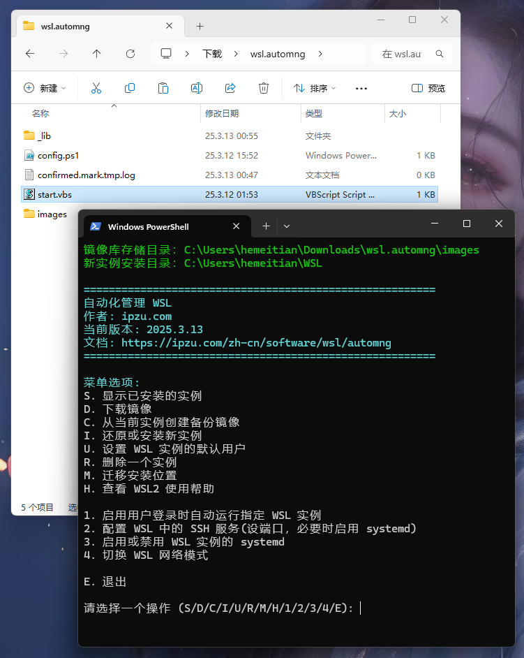

# WSL 自动化管理脚本：安装、备份、还原与迁移

WSL 是 Windows Subsystem for Linux 的简称。
本工具可以显著提高开发者和系统管理员，在维护和使用多个 WSL 实例时的效率。

## 核心功能

**实例安装删除**：一键安装、删除和查看 WSL 实例，避免手动繁琐的操作。

**镜像备份与还原**：从一个实例通过备份创建多个实例，降低数据丢失风险，减少环境配置。

**默认用户设置**：轻松设定和修改 WSL 实例的默认用户，增强环境自定义能力。

**实例迁移**：支持便捷地将 WSL 实例迁移至新的存储位置，轻松管理磁盘空间。

**高级配置支持**：内置 systemd、SSH 服务、开机启动、镜像网络模式等功能的便捷开关，满足复杂环境需求。

---

> 最佳场景是，你已手动安装了一个 WSL，然后使用本工具。如果你是初次使用 WSL，请先尝试手动安装一个 WSL。具体可查看我的 [WSL 实战指南](/zh/p/wsl-guide/#1-准备工作与基本概念)。

## GitHub 仓库
https://github.com/RenBuGong/hapitool  
欢迎提交 PR

## 下载地址
  
下载后，解压，双击目录中的 **start.vbs**  

