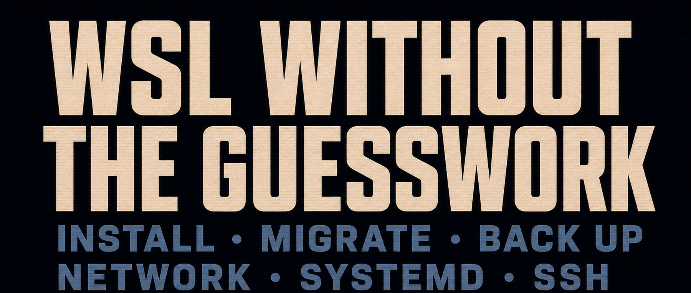

> This guide focuses on installing WSL manually, backing up and restoring instances, migrating them, and handling common use cases. If you would rather manage one instance through one command, see [SWAW Kit WSL](/p/swaw-kit-wsl-release/).

> WSL stands for Windows Subsystem for Linux. It lets you run a Linux environment directly on Windows 10/11. Its benefits include:
>
> 1. **File interoperability**: use Linux software to process Windows files, or the other way around. For example, edit a Windows log with awk, or debug a Linux project in VS Code or Cursor.
> 2. **systemd service management**: after enabling systemd, you can manage services much like you would on a conventional Linux system while the WSL instance is running. A systemd service does not, however, keep the instance alive by itself.
> 3. **Linux GUI applications**: run Linux GUI applications directly on Windows through WSLg.
> 4. **Linux containers**: Docker on Windows also relies on WSL2, making it easy to manage containers.
> 5. **Multiple Linux systems side by side**: run Ubuntu, Debian, Arch, and other distributions at the same time.
> 6. **GPU support**: use hardware acceleration such as [NVIDIA CUDA](https://learn.microsoft.com/windows/ai/directml/gpu-cuda-in-wsl).
> 7. **Open-source code**: WSL is open source at [microsoft/WSL](https://github.com/microsoft/WSL).

The sections below collect practical techniques from installation through advanced use, so you can get more out of WSL.

---



## Contents

1. [Prerequisites and basic concepts](#1-prerequisites-and-basic-concepts)
2. [Installation and first use](#2-installation-and-first-use)
3. [WSL versions and feature configuration](#3-wsl-versions-and-feature-configuration)
4. [Managing instances: start, use, stop, and uninstall](#4-managing-instances-start-use-stop-and-uninstall)
5. [Data management: backup, restore, and migration](#5-data-management-backup-restore-and-migration)
6. [How WSL2 works and network configuration](#6-how-wsl2-works-and-network-configuration)
7. [Offline installation](#7-offline-installation)
8. [Common tips and advanced usage](#8-common-tips-and-advanced-usage)

---

## 1. Prerequisites and basic concepts

### 1.1. Prerequisites

- **Windows version**: Windows 10 version 2004 / build 19041 or later, or Windows 11, is recommended. The [official one-command installation](https://learn.microsoft.com/windows/wsl/install) starts with these versions. Older Windows 10 releases require the [manual installation process](https://learn.microsoft.com/windows/wsl/install-manual); WSL2 requires at least x64 Windows 10 version 1903 / build 18362.1049, or ARM64 Windows 10 version 2004 / build 19041.
- **CPU virtualization enabled in BIOS / UEFI**: WSL2 depends on virtualization and `VirtualMachinePlatform`. If virtualization is disabled, installation or conversion to WSL2 will usually report a virtualization-related error. WSL1 does not use a lightweight VM, but WSL2 is the better default for most modern development work.
- **Prefer `wsl --install` to enable the required components automatically**: on Windows 10 version 2004+ and Windows 11, `wsl --install` enables the required Windows features and installs the default distribution. Use the DISM commands below only on an older system, in an offline environment, on Windows Server Core, or when the installation command is unavailable:

~~~
# Run as administrator
dism.exe /online /enable-feature /featurename:Microsoft-Windows-Subsystem-Linux /all /norestart
dism.exe /online /enable-feature /featurename:VirtualMachinePlatform /all /norestart

  # Corresponding uninstall commands:
  # dism.exe /online /disable-feature /featurename:Microsoft-Windows-Subsystem-Linux /norestart
  # dism.exe /online /disable-feature /featurename:VirtualMachinePlatform /norestart
~~~

If you run into trouble, execute `winver` first to confirm the Windows version and build number. Then compare it with the [official documentation](https://learn.microsoft.com/windows/wsl/install-manual) and ask an AI assistant, such as [Tencent Yuanbao](https://yuanbao.tencent.com), to help diagnose the issue.

### 1.2. Common terms

- **WSL**: short for Windows Subsystem for Linux.
- **The WSL platform**: the Windows component that runs Linux environments. Today it is normally installed and updated with `wsl --install` and `wsl --update`. It is separate from a particular Ubuntu, Debian, Fedora, or other Linux system.
- **WSL distribution**: the name of an installable Linux system image, such as `Ubuntu-24.04`, `Debian`, `FedoraLinux-42`, or `archlinux`.
- **WSL instance**: a Linux environment already installed on the machine and available to start and manage. Installing a distribution usually creates an instance with the same name. You can also use `wsl --import` to create multiple instances with different names from the same image.

### 1.3. Configuration file quick reference

| Configuration file | Location | Scope | Common uses | How changes take effect |
|---|---|---|---|---|
| `/etc/wsl.conf` | Inside a WSL instance | The current Linux instance | Default user, systemd, automount, Windows interoperability | Restart the current instance, or run `wsl --shutdown` |
| `%UserProfile%\.wslconfig` | Windows host user profile | All WSL2 instances for the current Windows user | Network mode, DNS, memory/CPU, default VHD size, idle timeout | Run `wsl --shutdown` |

> Rule of thumb: put behavior specific to one Linux instance in `/etc/wsl.conf`; put settings for the WSL2 VM or all instances in `.wslconfig`.
> Recent WSL versions also provide a graphical settings entry. Search for `WSL Settings` in the Start menu. It can change some global WSL settings; configuration inside an instance still belongs in `/etc/wsl.conf`:
> 

---

## 2. Installation and first use

> Run the commands below in **Windows Terminal**, **Command Prompt**, or **PowerShell**. For the first installation, run the terminal as administrator if Windows features need to be enabled.
> If [Windows Terminal](https://learn.microsoft.com/windows/terminal/) is not installed, search for it in Microsoft Store:
> 

### 2.1. One-command installation

~~~
# Install the WSL platform and the default Ubuntu distribution
wsl --install
  # Corresponding uninstall command:
  # wsl --unregister Ubuntu  # Be careful: this deletes the WSL instance named Ubuntu
~~~

The first time you launch a newly installed distribution, WSL extracts and initializes it, then asks you to create a Linux username and password.


> If `wsl --install` only displays help, the WSL platform is usually already installed. Run `wsl -l -o` to list online distributions, then install one with `wsl --install -d <distribution name>`. If installation stalls at `0.0%` or the online list cannot be retrieved, try `wsl --install --web-download -d <distribution name>`. If network access is still restricted, search Microsoft Store for the distribution or see [7. Offline installation](#7-offline-installation). The screenshot above shows one possible error in a restricted network environment.

### 2.2. Install another distribution

~~~
# List available distributions
wsl -l -o

# Install a distribution. Use the name shown by wsl -l -o
wsl --install -d Ubuntu-24.04

# Choose the install location for a new instance to avoid a later move
wsl --install -d Ubuntu-24.04 --location D:\wsl\Ubuntu-24.04

# Other examples:
# wsl --install -d Ubuntu-26.04
# wsl --install -d Debian
# wsl --install -d FedoraLinux-44
# wsl --install -d archlinux
  # Corresponding uninstall command
  # wsl --unregister Ubuntu-24.04
~~~

> Distribution names change over time, so do not memorize version numbers. Treat the output of `wsl -l -o` as the single source of truth. `--location` is useful for choosing a data-drive location when installing a new instance. For an existing instance, see [5.4. Move to a new location](#54-move-to-a-new-location). If online installation fails, try `--web-download`, Microsoft Store, or offline installation. The current official online catalog comes from [DistributionInfo.json](https://raw.githubusercontent.com/microsoft/WSL/master/distributions/DistributionInfo.json), which includes download URLs for Ubuntu, Debian, Fedora, Arch, openSUSE, SUSE, Kali, AlmaLinux, and other distributions.

---

## 3. WSL versions and feature configuration

WSL distributions can run in either **WSL1** or **WSL2** mode, and the two can coexist. Newly installed distributions normally default to WSL2. It runs a real Linux kernel and has better compatibility with systemd, Docker, and similar workloads, so it is the recommended default. WSL1 mainly offers faster access across the Windows file system boundary and can suit the narrower case where a project must live on the Windows file system. See the [comparison of WSL1 and WSL2](https://learn.microsoft.com/windows/wsl/compare-versions).

### 3.1. Check and switch versions

~~~
# List installed instances and versions (instances owned by other Windows users are not shown)
wsl -l -v

# Show the WSL platform, kernel, WSLg, and other component versions
wsl --version

# Show the default distribution, default WSL version, kernel, and other status
wsl --status
~~~


> In `wsl -l -v`, `*` marks the default instance. The `NAME` column is the instance name; `VERSION` shows whether that instance runs under WSL1 or WSL2. `wsl --version` reports the WSL platform and component versions, not the Ubuntu or Debian version inside a Linux distribution.

~~~
# Make WSL2 the default for new instances
wsl --set-default-version 2

# Convert an existing instance to WSL2
wsl --set-version <instance-name> 2
# Example:
wsl --set-version Ubuntu-24.04 2
~~~

> Converting between WSL1 and WSL2 can take a long time. A large instance may also fail because of available disk space or files in use. Before converting an important instance, export a snapshot as described in [5.2. Back up](#52-back-up).

### 3.2. Update the WSL platform

~~~
# Show current version details
wsl --version

# Show the current WSL defaults and kernel status
wsl --status

# Update the WSL platform, kernel, WSLg, and other components
wsl --update

# Download the update from GitHub if the Microsoft Store source is unavailable
wsl --update --web-download

# Try preview features (not recommended by default for production or primary environments)
wsl --update --pre-release
~~~


> For everyday troubleshooting, prefer the stable `wsl --update`. Use `--pre-release` only when you explicitly need to test a new feature or fix. If the underlying WSL2 VM must be restarted completely after an update, run `wsl --shutdown` and then enter an instance again.

---

## 4. Managing instances: start, use, stop, and uninstall

### 4.1. Start or switch instances

~~~
# Start and enter the default instance
wsl

# Start the default instance in the Linux user's home directory
wsl ~

# Start and enter a specific instance
wsl -d Ubuntu-24.04

# Enter an instance as a specific user
wsl -d Ubuntu-24.04 -u root
~~~


### 4.2. Run Linux commands from Windows

~~~
# Query the instance IP, commonly used to troubleshoot port forwarding in NAT mode
wsl -d Ubuntu-24.04 hostname -I

# Run a Linux command in the default instance
wsl uname -a

# Specify the working directory
wsl -d Ubuntu-24.04 --cd "C:\" pwd

# Use the Linux home directory as the working directory
wsl -d Ubuntu-24.04 --cd ~ pwd
~~~

### 4.3. Run Linux GUI applications

For example, install Chromium inside the default instance and run it directly:

~~~
wsl
# Use the appropriate install command for distributions other than Ubuntu
sudo apt update
sudo apt install chromium-browser -y
chromium-browser
~~~


> This requires [Windows 10 build 19044+](https://learn.microsoft.com/zh-cn/windows/wsl/tutorials/gui-apps) or [Windows 11](https://learn.microsoft.com/zh-cn/windows/wsl/tutorials/gui-apps), and only works with WSL2 instances. If WSL is already installed but GUI applications do not launch, run `wsl --update` in an administrator terminal, then run `wsl --shutdown` and enter the instance again. WSLg integrates individual Linux GUI applications into the Windows desktop; it is not a full Linux desktop environment. If `chromium-browser` is unavailable in the current distribution's package repository, test with the official Google Chrome, Edge, or another GUI application instead.

### 4.4. Set the default instance

~~~
wsl --set-default <instance-name>
# Short form:
wsl -s <instance-name>
~~~

### 4.5. Stop and uninstall

~~~
# Stop a specific instance
wsl --terminate <instance-name>
# Short form:
wsl -t <instance-name>

# Stop all WSL instances for the current Windows user and the underlying WSL2 VM
wsl --shutdown

# Unregister an instance (permanently deletes its data)
wsl --unregister <instance-name>
~~~

> `wsl --terminate` stops one instance. `wsl --shutdown` is useful after changing `.wslconfig`, updating WSL, or whenever the underlying VM must restart. `wsl --unregister` permanently deletes the instance and its data, so confirm that you have a backup first.

---

## 5. Data management: backup, restore, and migration

> Run these operations from **Windows Terminal** or **PowerShell** as well.

### 5.1. Find the installation location of every instance

```
# PowerShell
Get-ItemProperty "HKCU:\SOFTWARE\Microsoft\Windows\CurrentVersion\Lxss\*" | Select-Object @{Name='DistributionName';Expression={$_.DistributionName}}, @{Name='BasePath';Expression={$_.BasePath}} | Format-Table -AutoSize
```


> When at least one instance exists, this command displays WSL registration information for the current Windows user. Use the location to confirm where an instance lives; do not manually move or edit the `ext4.vhdx` inside it.

### 5.2. Back up

~~~
# Stop the instance first to avoid an inconsistent snapshot while data is being written:
wsl --terminate <instance-name>

# Back up
wsl --export <instance-name> <backup-file-path>
# Example:
wsl --export Ubuntu-24.04 D:\backup\ubuntu2404.tar

# WSL2 can also export VHDX to preserve the whole virtual-disk form
wsl --export Ubuntu-24.04 D:\backup\ubuntu2404.vhdx --vhd
~~~

> The default export format is tar. Tar is more convenient for managing backups across machines and distributions. VHDX more closely resembles a whole-disk snapshot, is supported only for WSL2, and is usually larger.

### 5.3. Restore or create another instance

> You can create multiple instances from the same tar backup:

~~~
wsl --import <instance-name> <install-location> <backup-file-path> --version 2
:: Example: create two instances from one backup
wsl --import Ubuntu-01 D:\wsl\ubuntu-01 D:\wsl_backup\ubuntu_backup.tar --version 2
wsl --import Ubuntu-02 D:\wsl\ubuntu-02 D:\wsl_backup\ubuntu_backup.tar --version 2

:: For a VHDX backup:
wsl --import Ubuntu-vhd D:\wsl\ubuntu-vhd D:\wsl_backup\ubuntu_backup.vhdx --vhd

:: Register an existing ext4.vhdx in place as a new instance:
wsl --import-in-place Ubuntu-restored D:\wsl\ubuntu-restored\ext4.vhdx
~~~

> `--import-in-place` requires an `.vhdx` formatted with the ext4 file system. An instance created with `--import` may log in as `root` by default. To restore a normal user as the default, write the setting to `/etc/wsl.conf` as described in [8.1. Change the default login user](#81-change-the-default-login-user).

### 5.4. Move to a new location

~~~
wsl --manage <instance-name> --move <new-location>
# Example:
wsl --manage Ubuntu-24.04 --move D:\myWSL\ubuntu2404
~~~

> `--move` is the newer primary path for migration. If `wsl --help` does not list `wsl --manage`, or if the move fails, use the more broadly compatible fallback: export with `wsl --export`, import into the new location with `wsl --import`, verify that the new instance starts, and only then remove the old instance with `wsl --unregister`. Prefer an ordinary directory on a local NTFS drive; avoid OneDrive, network drives, or locations with complex permissions.

### 5.5. Expand a WSL2 virtual disk

The Linux file system of a WSL2 instance is stored in a virtual disk. Recent WSL versions normally give it a maximum capacity of 1 TB. Expand it manually only when Linux reports insufficient disk space.

~~~
# Show available space inside Linux
wsl -d Ubuntu-24.04 df -h /

# WSL 2.5+ can resize directly. Stop every WSL instance first
wsl --shutdown
wsl --manage Ubuntu-24.04 --resize 2TB
~~~

> `--resize` applies only to WSL2 and does not accept a decimal capacity. Use values such as `512GB`, `1TB`, or `2TB`, not `1.5TB`. Shrinking a virtual disk is far more complex than expanding one and is not recommended as a routine operation.

---

## 6. How WSL2 works and network configuration

Unlike WSL1, which implements Linux system calls on the Windows kernel, WSL2 runs a real Linux kernel in a lightweight Hyper-V virtual machine. For one Windows user, multiple WSL2 instances are effectively separate root file systems mounted on the same Linux kernel. Different Windows users start separate WSL2 VMs, so they see different running states and network environments.

WSL2 uses NAT networking by default. From the Windows host, you can normally reach a web or API service inside WSL2 directly through `localhost:<port>`. Traditionally, access from another device on the LAN requires port forwarding. On Windows 11 version 22H2 and later, recent WSL versions recommend trying [mirrored networking](https://learn.microsoft.com/windows/wsl/networking#mirrored-mode-networking) first. It mirrors the Windows network interfaces into Linux and improves VPN, IPv6, multicast, and LAN access. The `bridged` mode is deprecated and should not be the primary path for new configurations.

> Start all commands below from a Windows command line, such as Windows Terminal.

### 6.1. Port forwarding in NAT mode

> With the default NAT mode, the local Windows host normally does not need port forwarding to reach a WSL service. Consider port forwarding only when another device on the LAN needs to reach a WSL2 service; mirrored mode usually avoids this step.

```
:: Query the WSL2 NAT IP:
wsl -d Ubuntu-24.04 hostname -I

:: Show existing mappings on the Windows host:
netsh interface portproxy show all

:: Forward a Windows-host port to a WSL2 port:
netsh interface portproxy add v4tov4 listenport=[Windows-host-port] listenaddress=0.0.0.0 connectport=[WSL-service-port] connectaddress=[WSL2-NAT-IP]
:: Example:
netsh interface portproxy add v4tov4 listenport=8080 listenaddress=0.0.0.0 connectport=80 connectaddress=172.29.41.233
:: Afterward, use [Windows-host-IP:8080] to reach port 80 in WSL2

:: Delete the mapping for a host port:
netsh interface portproxy delete v4tov4 listenport=8080 listenaddress=0.0.0.0
```

> A WSL2 NAT address can change after `wsl --shutdown`, a system restart, or a network change. If forwarding suddenly stops working, run `wsl -d Ubuntu-24.04 hostname -I` again and check the address. The Linux service must also listen on `0.0.0.0` or the appropriate interface; a service bound only to `127.0.0.1` is normally unreachable from the LAN.

After creating the mapping, allow the listening port through the Windows host firewall:

```
:: Allow TCP port 8080:
netsh advfirewall firewall add rule name="WSL_TCP_8080" protocol=TCP dir=in localport=8080 action=allow
:: Allow UDP port 8080:
netsh advfirewall firewall add rule name="WSL_UDP_8080" protocol=UDP dir=in localport=8080 action=allow

:: List all firewall rules
netsh advfirewall firewall show rule name=all
:: Filter by rule name
netsh advfirewall firewall show rule name="WSL_TCP_8080"
:: Filter by port
netsh advfirewall firewall show rule name=all | findstr /R /C:"LocalPort: 8080"

:: Delete the TCP 8080 rule
netsh advfirewall firewall delete rule name=all protocol=TCP dir=in localport=8080
:: Delete the UDP 8080 rule
netsh advfirewall firewall delete rule name=all protocol=UDP dir=in localport=8080
```

### 6.2. Enable mirrored networking

Mirrored networking requires Windows 11 version 22H2 or later. On the Windows host, create or edit `%userprofile%\.wslconfig`:

```
[wsl2]
networkingMode=mirrored
dnsTunneling=true
firewall=true
autoProxy=true

[experimental]
hostAddressLoopback=true
```

Then restart the underlying WSL2 VM. This stops every WSL2 instance for the current user:

```
wsl --shutdown && wsl
```

The change applies only to WSL2 instances owned by the current Windows user and does not affect other users. `networkingMode`, `dnsTunneling`, `firewall`, and `autoProxy` now belong under `[wsl2]`; `hostAddressLoopback` remains under `[experimental]`.

> Parameter reference: https://learn.microsoft.com/windows/wsl/wsl-config

What the settings mean:

- `networkingMode=mirrored`: enables mirrored networking. Linux can use the Windows network interfaces directly, and WSL services are generally easier to reach from the LAN.
- `dnsTunneling=true`: sends DNS requests through Windows, improving compatibility with VPNs and complex DNS environments. It is normally enabled by default on Windows 11 version 22H2 and later.
- `firewall=true`: includes Windows Firewall and Hyper-V firewall rules when filtering WSL network traffic.
- `autoProxy=true`: makes WSL use HTTP proxy information from Windows.
- `hostAddressLoopback=true`: an optional experimental setting. `127.0.0.1` loopback already works in mirrored mode; this option also permits host-to-WSL communication over additional IPv4 addresses assigned to the host.

Do not reduce mirrored mode to “the WSL2 instance now has the Windows host IP.” A more accurate model is that Windows network interfaces are mirrored into Linux. Windows and WSL can reach each other over `127.0.0.1`, and LAN devices can reach WSL services more easily. For LAN access, the service must still listen on `0.0.0.0` or the appropriate address, and the host firewall must allow the traffic.

On Windows 11 version 22H2 and later with WSL 2.0.9+, WSL traffic is also subject to the [Hyper-V firewall](https://learn.microsoft.com/windows/security/operating-system-security/network-security/windows-firewall/hyper-v-firewall). The official [WSL networking documentation](https://learn.microsoft.com/windows/wsl/networking#wsl-and-firewall) says the same. If a LAN device still cannot connect in mirrored mode, inspect or add a WSL-specific Hyper-V firewall rule in an administrator PowerShell:

```
Get-NetFirewallHyperVVMCreator
Get-NetFirewallHyperVVMSetting -PolicyStore ActiveStore -Name "{40E0AC32-46A5-438A-A0B2-2B479E8F2E90}"

# Example: allow only inbound TCP 8080 for WSL
New-NetFirewallHyperVRule -Name "WSL_TCP_8080" -DisplayName "WSL TCP 8080" -Direction Inbound -VMCreatorId "{40E0AC32-46A5-438A-A0B2-2B479E8F2E90}" -Protocol TCP -LocalPorts 8080

# If you explicitly accept broader exposure, set the default WSL inbound policy to Allow
Set-NetFirewallHyperVVMSetting -Name "{40E0AC32-46A5-438A-A0B2-2B479E8F2E90}" -DefaultInboundAction Allow
```

> `Set-NetFirewallHyperVVMSetting ... -DefaultInboundAction Allow` is a broad permission. It can be useful for temporary testing on a personal machine, but long-term use should favor per-port rules. In mirrored mode, the network still relies on virtualization, so `netstat -aon` on the Windows host does not necessarily show ports in use inside a WSL2 instance.

---

## 7. Offline installation

### 7.1. Install an official distribution offline

This file contains the download URLs for all official distributions: 


Start with the `.wsl` download URLs under `ModernDistributions`. Most x64 / AMD64 computers need `Amd64Url`; ARM64 computers need `Arm64Url`. After downloading the file, install it with:

```powershell
# PowerShell. Replace the filename with the downloaded file
wsl --install --from-file D:\wsl_images\ubuntu-24.04.4-wsl-amd64.wsl

# Confirm the instance name and WSL version after installation
wsl -l -v
```

> A `.wsl` file is the newer WSL distribution package format: essentially a tar distribution package with WSL metadata. If `--from-file` is not supported, run `wsl --version` and `wsl --update` to check the WSL platform version. On a fully offline machine, first download the latest WSL MSI from [WSL GitHub Releases](https://github.com/microsoft/WSL/releases), then follow the official [offline installation](https://learn.microsoft.com/windows/wsl/install#offline-install) steps for the WSL platform.

You can also double-click a `.wsl` file to install it, but the command line is easier to troubleshoot:


`DistributionInfo.json` may also contain older `Distributions`, `.Appx`, or `.AppxBundle` entries. Double-click these packages to install them, or use PowerShell:

```powershell
Add-AppxPackage .\app_name.Appx
```


> `.Appx` and `.AppxBundle` are older compatibility paths. On Windows Server Core, older Windows 10 releases, or environments where the package cannot be opened directly, follow the manual download and `Add-AppxPackage` instructions in [install-manual](https://learn.microsoft.com/windows/wsl/install-manual).

### 7.2. Unofficial distributions

Import an unofficial distribution, or a root file system absent from the official catalog, from a tar file. The tar can come from the distribution provider or be exported from a container image:

```
wsl --import <custom-instance-name> <wsl-install-location> <tar-file-path> --version 2
:: Example:
wsl --import MyDistro E:\wslDistroStorage\MyDistro D:\mywsl\rootfs.tar --version 2
```

> You can also [convert a container image into a `.tar` file](https://learn.microsoft.com/windows/wsl/use-custom-distro). A root file system imported with `wsl --import` normally does not create a non-root user or provide the full first-run experience. To make a distributable `.wsl` file that users can install by double-clicking, follow [Build a Custom Linux Distro for WSL](https://learn.microsoft.com/windows/wsl/build-custom-distro) and provide metadata such as `/etc/wsl-distribution.conf`.

---

## 8. Common tips and advanced usage

> This section collects several practical techniques.

### 8.1. Change the default login user

Edit `/etc/wsl.conf` inside the instance and make sure it contains:

```
[user]
default=user1
```

Then restart the instance from a Windows terminal:

```powershell
wsl --terminate <instance-name>
wsl -d <instance-name>
```

> This is especially useful when an instance imported with `wsl --import` logs in as `root` by default. `/etc/wsl.conf` is distribution-level Linux configuration and affects only the current instance. `%UserProfile%\.wslconfig` is global configuration for the current Windows host user; do not mix the two.

### 8.2. Enable systemd

Recent default Ubuntu distributions may already have systemd enabled. Check first:

```bash
ps -p 1 -o comm=
systemctl status --no-pager
```

If PID 1 is not `systemd`, edit `/etc/wsl.conf` inside the instance and make sure it contains:

```
[boot]
systemd=true
```

Then run this from a Windows terminal:

```powershell
wsl --shutdown
```

Enter the instance again and confirm with `systemctl status`. systemd [requires WSL 0.67.6+](https://learn.microsoft.com/windows/wsl/systemd). If `wsl --version` is unavailable or reports an older version, run `wsl --update` first.

### 8.3. Keep WSL running in the background

Start by separating the lifecycles: **systemd manages services; it does not keep an instance alive**. `systemctl enable --now ssh` only tells systemd to start SSH after the WSL instance starts. Once every WSL terminal is closed, the distribution can still be considered idle and quickly enter the `Stopped` state even while `ssh.service` reports active. Do not expose SSH, Docker, a database, or another service merely to keep WSL alive.

- **Control idle termination of the distribution first**: WSL 2.5.4 introduced `general.instanceIdleTimeout`, which controls how long an idle distribution remains alive. If the goal is to keep a WSL instance running after its terminal closes, configure `%UserProfile%\.wslconfig` on the Windows host first:

```ini
[general]
# Milliseconds. -1 disables automatic termination when an instance is idle
instanceIdleTimeout=-1

[wsl2]
# How long the WSL2 VM remains after every WSL2 instance exits
vmIdleTimeout=-1
```

Apply the change with:

```powershell
wsl --version
wsl --shutdown
```

> `instanceIdleTimeout` controls when a distribution instance stops. `vmIdleTimeout` controls when the underlying WSL2 VM stops after all WSL2 instances have exited. Changing only `vmIdleTimeout` can leave the VM alive while a specific distribution is already `Stopped`. `instanceIdleTimeout` is a global `.wslconfig` setting and applies to WSL2 instances for the current Windows user. There is currently no official per-instance equivalent. To keep only one instance alive, use a script, Scheduled Task, or the legacy compatibility workaround below for that instance. If you do not want an unlimited timeout, replace `-1` with an explicit value in milliseconds, such as `86400000` for 24 hours. This instance-level setting comes from the [WSL 2.5.4 release notes](https://github.com/microsoft/WSL/releases/tag/2.5.4). If `wsl --version` reports a release earlier than 2.5.4, run `wsl --update` first.

- **Start real services with the instance**: if you genuinely need SSH, Docker, a database, or another background service, enable systemd and then run `sudo systemctl enable --now <service name>` for the service. For example:

```bash
sudo systemctl enable --now ssh
```

> This makes the service start when the instance starts; it does not prevent the instance from being reclaimed. The source of truth for staying alive remains `instanceIdleTimeout` in `.wslconfig`.

- **Legacy compatibility workaround**: if the current WSL release is older than 2.5.4, or `instanceIdleTimeout` is temporarily unavailable in your environment, consider the older `dbus-launch` workaround:

```bash
sudo apt install -y dbus-x11
pgrep -u "$(whoami)" -x dbus-daemon >/dev/null || dbus-launch true >/dev/null 2>&1
```

> This is a workaround, not the clean primary path. Give it an explicit removal condition: after upgrading to a WSL release that supports `instanceIdleTimeout` and confirming with `wsl -l -v` that the instance no longer becomes `Stopped` automatically, remove the artificial keep-alive process so nobody later has to rediscover why it exists.

### 8.4. Start a WSL instance when Windows starts

First, let any real Linux services start through systemd. For example, enable SSH with:

```bash
sudo systemctl enable --now ssh
```

If you also want to start an instance when the Windows user signs in, configure `instanceIdleTimeout` as described in [8.3. Keep WSL running in the background](#83-keep-wsl-running-in-the-background). Then save the following as `start_wsl_ubuntu.cmd` in `%userprofile%\AppData\Roaming\Microsoft\Windows\Start Menu\Programs\Startup`:

```batch
@echo off
timeout /t 20 /nobreak >nul
wsl.exe -d Ubuntu-24.04 --cd ~ --exec /bin/bash -lc "systemctl is-system-running --wait >/dev/null 2>&1 || true"
```

> This only starts the instance after sign-in. Without `instanceIdleTimeout`, the instance can still exit again as soon as the command finishes and WSL considers it idle. It is also not a system startup service. If it must run without an interactive sign-in, use Windows Task Scheduler or a dedicated service-management approach. On a personal development machine, do not introduce a heavy background service merely to keep WSL alive.

### 8.5. Enable and configure SSH

```bash
# Enable SSH (Ubuntu example)
sudo apt update
sudo apt install -y openssh-server

# Prefer systemd for service management
sudo systemctl enable --now ssh
sudo systemctl status ssh --no-pager

# SSH service configuration
sudoedit /etc/ssh/sshd_config
```

Adjust `/etc/ssh/sshd_config` as needed:

```text
Port 2222
# Key authentication is preferred. Consider yes only for temporary local testing
PasswordAuthentication no
```

```bash
# Apply the change
sudo systemctl restart ssh
```

If systemd is not enabled, use `sudo service ssh restart`. Connect from the Windows host with:

```powershell
ssh -p 2222 <Linux-username>@localhost
```

> To reach SSH inside WSL from another device on the LAN, also configure the required port and firewall access as described in [6. How WSL2 works and network configuration](#6-how-wsl2-works-and-network-configuration).

### 8.6. Access the Windows host file system

WSL automatically mounts drives from the Windows host, including C: and D::

```
ls -l  /mnt/c
ls -l  /mnt/d
```

You can also launch Windows applications from WSL:

```bash
explorer.exe .
notepad.exe /mnt/c/Temp/test.txt
```

> `/mnt/c` and `/mnt/d` are convenient for occasional access to Windows files, but they are not ideal for projects with heavy small-file I/O from a Linux toolchain. See [8.9. File-system performance](#89-file-system-performance).

### 8.7. Read Windows host environment variables

```bash
# Read the Windows %USERPROFILE% environment variable once
MY_ENV_VAR=$(cmd.exe /c echo %USERPROFILE% | tr -d '\r')
echo "MY_ENV_VAR in WSL: $MY_ENV_VAR"
```

For long-term environment-variable sharing between Windows and WSL, start with [`WSLENV`](https://learn.microsoft.com/windows/wsl/filesystems#share-environment-variables-between-windows-and-wsl-with-wslenv). It declares which variables cross the boundary and can handle path-format conversion.

### 8.8. Access a WSL file system from Windows

```
:: Open directly in File Explorer:
\\wsl.localhost\
:: The older form usually works too:
\\wsl$\
:: Create a shortcut on the desktop:
mklink /D "%userprofile%\Desktop\wsl_home" "\\wsl.localhost\"
:: Map as local drive H:
net use H: \\wsl.localhost\Ubuntu-24.04\home /persistent:yes
:: Remove the mapping:
net use H: /delete

:: Or run inside a WSL instance:
:: Open the current directory in Windows File Explorer
explorer.exe  .
:: Open the current directory in Windows VS Code or Cursor
code .
```

### 8.9. File-system performance

Accessing Windows host files from a WSL2 instance is convenient, but frequent small-file I/O is normally slower than working inside the Linux file system. A simple rule:

- Keep projects mainly processed by Linux toolchains under `/home/<user>/...`.
- Keep projects mainly processed by Windows toolchains under `C:\...` or `D:\...`.
- If Linux must perform frequent file I/O against the Windows file system for the long term, evaluate whether WSL1 better fits that specific workload.

References: [Working across Windows and Linux file systems](https://learn.microsoft.com/windows/wsl/filesystems), [Comparing WSL1 and WSL2](https://learn.microsoft.com/windows/wsl/compare-versions#exceptions-for-using-wsl-1-rather-than-wsl-2), [GitHub issue](https://github.com/microsoft/WSL/issues/9555)

### 8.10. Install multiple instances

See [5.2. Back up](#52-back-up) and [5.3. Restore or create another instance](#53-restore-or-create-another-instance).
Use `wsl --import` to create any number of instances from the same `.tar` backup. For an official `.wsl` distribution package, follow [7.1. Install an official distribution offline](#71-install-an-official-distribution-offline) and use `wsl --install --from-file`.

### 8.11. Passwordless sudo

On a personal development machine, you can enable passwordless sudo for the current Linux user if you explicitly prefer less password friction. Start from a Windows terminal and enter the target instance:

```powershell
wsl -d <instance-name> -u <Linux-user-needing-sudo>
```

Then run inside WSL:

```bash
printf '%s ALL=(ALL) NOPASSWD:ALL\n' "$USER" | sudo tee "/etc/sudoers.d/$USER" >/dev/null
sudo chmod 0440 "/etc/sudoers.d/$USER"
sudo visudo -cf "/etc/sudoers.d/$USER" && sudo -l
```

> Passwordless sudo lowers the barrier to accidental privileged operations. It is most appropriate for a personal, local development environment.

> That covers WSL installation, backup, migration, networking, and common techniques. If you want to put background keep-alive, backup and restore, migration, SSH, systemd, and port exposure behind one instance command, see [SWAW Kit WSL](/p/swaw-kit-wsl-release/).

> WeChat technical group:
> 
