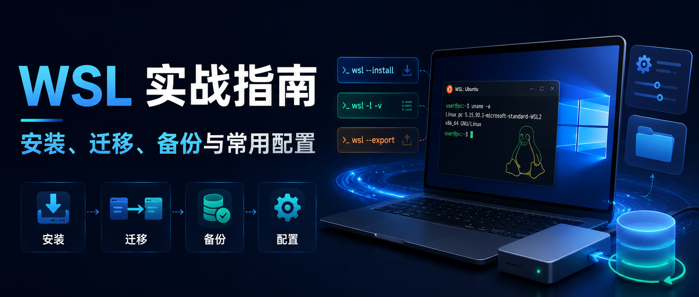
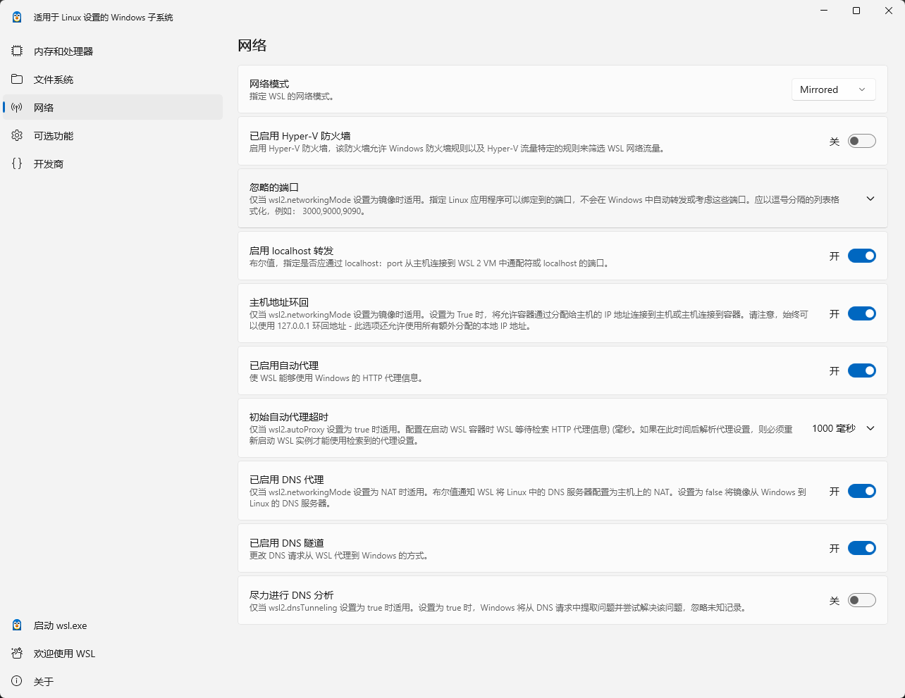
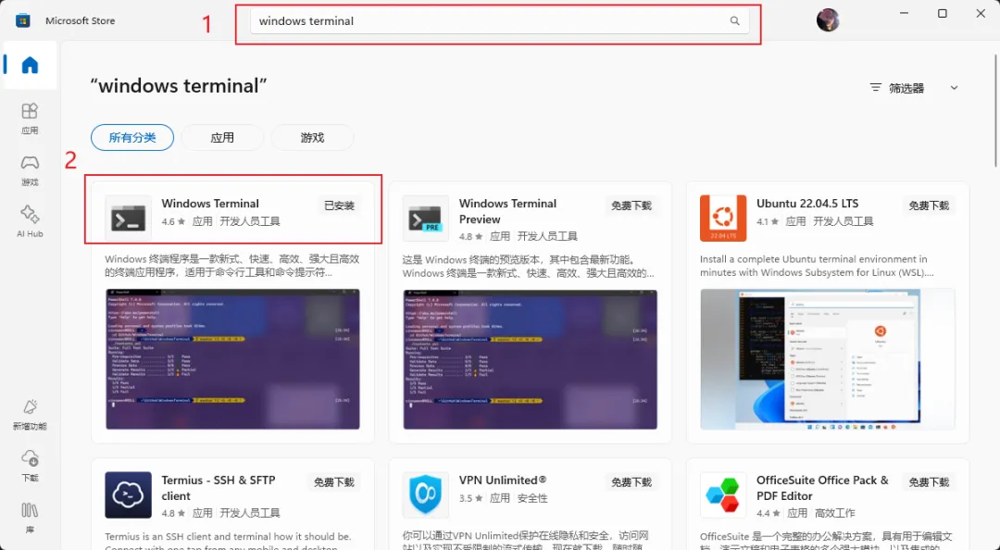
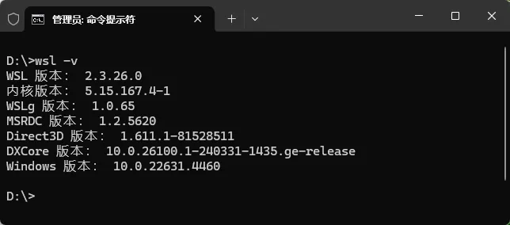
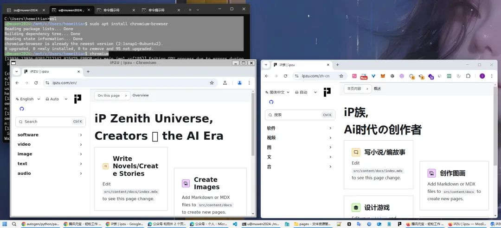
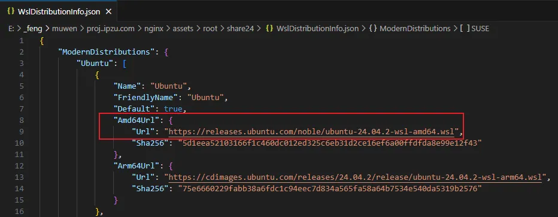
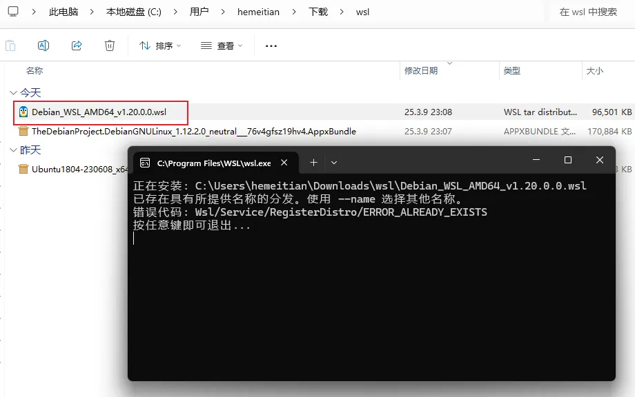

> 本文是 [WSL 自动化管理脚本](/zh/p/wsl-automng/) 的姐妹篇, 聚焦 WSL 手动安装、备份/还原、迁移及常用场景的使用技巧。

> WSL(Windows Subsystem for Linux) 可以让我们在 Windows 10/11 上直接运行 Linux 环境。它带来的好处包括:
>
> 1. **文件互操作**: 使用 Linux 软件处理 Windows 文件, 或反之。例如, 用 awk 编辑 Windows 的日志文件, 或者在 VS Code/Cursor 上调试 Linux 环境下的项目。
> 2. **systemd 服务管理**: 开启 systemd 后, WSL 实例运行期间可以像传统 Linux 一样管理服务；但 systemd 服务本身不等于实例保活。
> 3. **显示 GUI 程序**: 直接在 Windows 上运行 Linux GUI (WSLg)。
> 4. **运行 Linux 容器**: Windows 上的 Docker 也基于 WSL2；可轻松管理各种容器。
> 5. **多个 Linux 系统并存**: 同时拥有 Ubuntu、Debian、Arch 等发行版。
> 6. **支持 GPU**: 如 [NVIDIA CUDA](https://learn.microsoft.com/windows/ai/directml/gpu-cuda-in-wsl) 等硬件加速。
> 7. **代码已开源**: WSL 已在 [microsoft/WSL](https://github.com/microsoft/WSL) 开源。

以下整理了从安装到进阶使用的一系列技巧, 让你充分发挥 WSL 的威力。


---



## 目录

1. [准备工作与基本概念](#1-准备工作与基本概念)  
2. [安装与初体验](#2-安装与初体验)  
3. [WSL 版本与功能配置](#3-wsl-版本与功能配置)
4. [实例管理: 启动、使用、关闭与卸载](#4-实例管理启动使用关闭与卸载)  
5. [数据管理: 备份、还原与迁移](#5-数据管理备份还原与迁移)  
6. [WSL2 底层原理与网络配置](#6-wsl2-底层原理与网络设置)  
7. [离线安装方式](#7-离线安装方式)  
8. [常用技巧与进阶](#8-常用技巧与进阶)  

---


## 1. 准备工作与基本概念

### 1.1. 前提条件

- **Windows 版本**: 建议 Win10 2004 / Build 19041 及以上, 或 Win11。[官方一键安装命令](https://learn.microsoft.com/windows/wsl/install)要求这个版本起步；更旧的 Win10 版本需走[手动安装流程](https://learn.microsoft.com/windows/wsl/install-manual), 且 WSL2 至少需要 x64 Win10 1903 / Build 18362.1049, 或 ARM64 Win10 2004 / Build 19041。  
- **BIOS / UEFI 中的 CPU 虚拟化已开启**: WSL2 依赖虚拟化能力与 `VirtualMachinePlatform`；若未开启, 通常会在安装或转换到 WSL2 时提示虚拟化相关错误。WSL1 不依赖轻量虚拟机, 但现代开发场景一般优先 WSL2。  
- **优先使用 `wsl --install` 自动启用组件**: 在 Win10 2004+ / Win11 上, `wsl --install` 会启用所需 Windows 功能并安装默认发行版；只有在旧系统、离线环境、Windows Server Core 或安装命令不可用时, 才建议手动执行下列 DISM 命令: 
~~~
# 以管理员模式
dism.exe /online /enable-feature /featurename:Microsoft-Windows-Subsystem-Linux /all /norestart
dism.exe /online /enable-feature /featurename:VirtualMachinePlatform /all /norestart

  # 对应的卸载命令:
  # dism.exe /online /disable-feature /featurename:Microsoft-Windows-Subsystem-Linux /norestart
  # dism.exe /online /disable-feature /featurename:VirtualMachinePlatform /norestart
~~~
若有问题, 先执行 `winver` 确认系统版本与 Build 号, 再对照[官方文档](https://learn.microsoft.com/windows/wsl/install-manual) 让 AI 协助排查, 比如[腾讯元宝](https://yuanbao.tencent.com)。


### 1.2. 常用术语

- **WSL**: Windows Subsystem for Linux 的简称。  
- **WSL 本体**: Windows 上负责运行 Linux 环境的组件, 现在通常通过 `wsl --install` / `wsl --update` 安装与更新；它和具体 Ubuntu、Debian、Fedora 等 Linux 系统不是一回事。  
- **WSL 发行版**: 可安装的 Linux 系统镜像名称(如 `Ubuntu-24.04`, `Debian`, `FedoraLinux-42`, `archlinux` 等)。  
- **WSL 实例**: 已经安装到本机、可以启动和管理的 Linux 环境。大多数时候, 发行版安装后会生成同名实例；通过 `wsl --import` 也可以基于同一个镜像创建多个不同名称的实例。  

### 1.3. 配置文件速查

| 配置文件 | 位置 | 作用范围 | 常见用途 | 生效方式 |
|---|---|---|---|---|
| `/etc/wsl.conf` | WSL 实例内部 | 当前 Linux 实例 | 默认用户、systemd、自动挂载、Windows 互操作 | 重启当前实例, 或执行 `wsl --shutdown` |
| `%UserProfile%\.wslconfig` | Windows 宿主用户目录 | 当前 Windows 用户下的 WSL2 全局配置 | 网络模式、DNS、内存/CPU、默认 VHD 大小、空闲退出时间 | 执行 `wsl --shutdown` |

> 判断原则: Linux 实例自己的行为放 `/etc/wsl.conf`；WSL2 底层虚拟机或所有实例共享的行为放 `.wslconfig`。
> 新版 WSL 也提供图形配置入口: 在开始菜单搜索 `WSL Settings`。它适合修改部分 WSL 全局设置；实例内部配置仍以 `/etc/wsl.conf` 为准：
> 

---


## 2. 安装与初体验

> 下列命令可在 **Windows Terminal** 或 **CMD/PowerShell** 中执行。首次安装若需要启用 Windows 功能, 建议以管理员身份运行终端。  
> 若未安装 [Windows Terminal](https://learn.microsoft.com/windows/terminal/), 可从应用商店搜索:   
> 


### 2.1. 一键安装
~~~
# 安装 WSL 本体与默认的 Ubuntu 发行版
wsl --install
  # 对应的卸载命令:
  # wsl --unregister Ubuntu  #这行要小心, 会删除名为Ubuntu的wsl实例
~~~
首次启动新安装的发行版时, 会等待解压初始化, 然后提示创建 Linux 用户名和密码。


> 若 `wsl --install` 直接显示帮助信息, 通常表示 WSL 本体已安装, 可改用 `wsl -l -o` 查看在线发行版, 再用 `wsl --install -d <发行版名称>` 安装指定发行版。若安装过程卡在 `0.0%` 或在线列表拉取失败, 可尝试 `wsl --install --web-download -d <发行版名称>`；如果网络仍受限, 再去`微软应用商店`搜索对应发行版, 或参考 [7. 离线安装方式](#7-离线安装方式)。上图是网络受限时可能出现的报错。


### 2.2. 其它发行版安装

~~~
# 列出可用发行版
wsl -l -o

# 安装指定发行版。名称以 wsl -l -o 实际输出为准
wsl --install -d Ubuntu-24.04

# 新装实例时也可直接指定安装位置, 减少后续迁移
wsl --install -d Ubuntu-24.04 --location D:\wsl\Ubuntu-24.04

# 也可以是:
# wsl --install -d Ubuntu-26.04
# wsl --install -d Debian
# wsl --install -d FedoraLinux-44
# wsl --install -d archlinux
  # 对应的卸载命令
  # wsl --unregister Ubuntu-24.04
~~~
> 发行版名称会随时间更新, 不要死记版本号；以 `wsl -l -o` 输出为单一事实源。`--location` 适合新装实例时规划数据盘位置；若已经安装完成, 再参考 [5.4. 迁移到新位置](#54-迁移到新位置)。若在线安装失败, 同样可尝试 `--web-download`、微软应用商店或离线安装。当前官方在线列表来自 [DistributionInfo.json](https://raw.githubusercontent.com/microsoft/WSL/master/distributions/DistributionInfo.json), 其中已包含 Ubuntu、Debian、Fedora、Arch、openSUSE、SUSE、Kali、AlmaLinux 等发行版的下载地址。

---


## 3. WSL 版本与功能配置
WSL 有 **WSL1** 与 **WSL2** 两种发行版运行模式, 可以并行存在。新安装的发行版默认通常是 WSL2；它运行真正的 Linux 内核, systemd、Docker 等场景兼容性更好, 推荐优先使用。WSL1 的优势主要是跨 Windows 文件系统访问性能更好, 适合必须把项目放在 Windows 文件系统里的少数场景。[`两者对比`](https://learn.microsoft.com/windows/wsl/compare-versions)

### 3.1. 查询与切换版本

~~~
# 查看已安装实例及其版本(其它win用户安装的不会列出)
wsl -l -v

# 查看 WSL 本体、内核、WSLg 等组件版本
wsl --version

# 查看默认发行版、默认 WSL 版本、内核等状态
wsl --status
~~~

> `wsl -l -v` 中带 `*` 号的为`默认`实例；`NAME`列为`实例名`, `VERSION` 列表示该实例运行在 WSL1 或 WSL2。`wsl --version` 查询的是 WSL 本体及组件版本, 不等同于某个 Linux 发行版的 Ubuntu / Debian 版本号。

~~~
# 将新安装实例默认设置为 WSL2
wsl --set-default-version 2

# 将现有实例转换为 WSL2
wsl --set-version <实例名> 2
# 示例:
wsl --set-version Ubuntu-24.04 2
~~~
> WSL1/WSL2 互转可能耗时较长, 大型实例也可能因为磁盘空间、文件占用等原因失败；重要实例建议先参考 [5.2. 备份](#52-备份) 导出一份快照。

### 3.2. 更新 WSL 底层组件

~~~
# 查看当前版本详情
wsl --version

# 查看当前 WSL 默认配置与内核状态
wsl --status

# 升级 WSL 本体、内核、WSLg 等组件
wsl --update

# 若微软商店更新源不可用, 可改从 GitHub 下载更新
wsl --update --web-download

# 尝鲜预览版功能(不建议生产/主力环境默认使用)
wsl --update --pre-release
~~~

> 日常排障优先使用稳定版 `wsl --update`；只有明确需要验证新特性或修复时, 再考虑 `--pre-release`。更新后如需让底层 WSL2 虚拟机完全重启, 可执行 `wsl --shutdown` 后重新进入实例。

---


## 4. 实例管理: 启动、使用、关闭与卸载

### 4.1. 启动/切换

~~~
# 启动并进入默认实例
wsl

# 启动默认实例并进入 Linux 用户 home 目录
wsl ~

# 启动并进入指定实例
wsl -d Ubuntu-24.04

# 使用指定用户进入实例
wsl -d Ubuntu-24.04 -u root
~~~


### 4.2. 在 Win 下执行 Linux 命令

~~~
# 查询实例 IP。默认 NAT 模式下常用于端口映射排查
wsl -d Ubuntu-24.04 hostname -I

# 在默认实例里执行 Linux 命令
wsl uname -a

# 指定工作目录
wsl -d Ubuntu-24.04 --cd "C:\" pwd

# 指定 Linux home 目录作为工作目录
wsl -d Ubuntu-24.04 --cd ~ pwd
~~~

### 4.3. 运行 Linux GUI

例如, 在默认实例内安装 Chromium 浏览器后直接运行: 
~~~
wsl
# 若不是Ubuntu 请替换安装命令
sudo apt update
sudo apt install chromium-browser -y
chromium-browser
~~~

> 需要[`win10 19044+`](https://learn.microsoft.com/zh-cn/windows/wsl/tutorials/gui-apps) 或 [`win11`](https://learn.microsoft.com/zh-cn/windows/wsl/tutorials/gui-apps), 且只支持 WSL2 实例。若已有 WSL 但 GUI 无法启动, 先在管理员终端执行 `wsl --update`, 再执行 `wsl --shutdown` 后重新进入实例。WSLg 支持单个 Linux GUI 应用融入 Windows 桌面, 但不等于完整 Linux 桌面环境；若当前发行版包源中没有 `chromium-browser`, 可改用官方 Google Chrome / Edge 或其它 GUI 程序验证。

### 4.4. 设置缺省实例

~~~
wsl --set-default <实例名>
# 简写:
wsl -s <实例名>
~~~

### 4.5. 关闭与卸载

~~~
# 关闭指定实例
wsl --terminate <实例名>
# 简写:
wsl -t <实例名>

# 关闭当前 Windows 用户下的所有 WSL 实例, 并停止 WSL2 底层轻量虚拟机
wsl --shutdown

# 卸载某实例(数据彻底删除)
wsl --unregister <实例名>
~~~
> `wsl --terminate` 是停止某个实例；`wsl --shutdown` 常用于修改 `.wslconfig`、更新 WSL 或需要重启底层 VM 后生效的场景；`wsl --unregister` 会永久删除该实例的数据, 操作前应确认已有备份。

---


## 5. 数据管理: 备份、还原与迁移

> 以下操作同样在 **Windows 终端/PowerShell** 中执行。


### 5.1. 查看所有实例的安装位置
```
# PowerShell
Get-ItemProperty "HKCU:\SOFTWARE\Microsoft\Windows\CurrentVersion\Lxss\*" | Select-Object @{Name='DistributionName';Expression={$_.DistributionName}}, @{Name='BasePath';Expression={$_.BasePath}} | Format-Table -AutoSize
```

> 有至少一个实例时, 此命令会正确显示当前 Windows 用户下的 WSL 实例注册信息。这个位置适合用来确认实例路径, 不建议手动搬动或编辑里面的 `ext4.vhdx`。

### 5.2. 备份

~~~
# 先停止要备份的实例, 避免正在写入的数据造成快照不一致:
wsl --terminate <实例名>

# 备份
wsl --export <实例名> <备份文件路径>
# 示例:
wsl --export Ubuntu-24.04 D:\backup\ubuntu2404.tar

# WSL2 也支持导出为 vhdx, 适合保留整块虚拟磁盘形态
wsl --export Ubuntu-24.04 D:\backup\ubuntu2404.vhdx --vhd
~~~
> 默认导出格式是 tar。tar 更适合跨机器、跨发行版管理；vhdx 更接近“整盘快照”, 只支持 WSL2, 文件通常也更大。

### 5.3. 还原 / 新增实例

>可以基于同一备份 tar 文件创建多个新实例: 

~~~
wsl --import <实例名称> <安装位置> <备份文件的位置> --version 2
::示例(基于备份创建两个实例):
wsl --import Ubuntu-01 D:\wsl\ubuntu-01 D:\wsl_backup\ubuntu_backup.tar --version 2
wsl --import Ubuntu-02 D:\wsl\ubuntu-02 D:\wsl_backup\ubuntu_backup.tar --version 2

::若备份文件是 vhdx:
wsl --import Ubuntu-vhd D:\wsl\ubuntu-vhd D:\wsl_backup\ubuntu_backup.vhdx --vhd

::若已有 ext4.vhdx 且只想原地注册为新实例:
wsl --import-in-place Ubuntu-restored D:\wsl\ubuntu-restored\ext4.vhdx
~~~
> `--import-in-place` 要求目标是 ext4 文件系统的 `.vhdx`。通过 `--import` 创建的实例, 默认登录用户可能会变成 `root`；如果需要恢复普通用户作为默认用户, 可参考 [8.1. 修改默认登录用户](#81-修改默认登录用户) 写入 `/etc/wsl.conf`。

### 5.4. 迁移到新位置

~~~
wsl --manage <实例名> --move <新目录位置>
# 示例:
wsl --manage Ubuntu-24.04 --move D:\myWSL\ubuntu2404
~~~
> `--move` 是较新的迁移主路径。若你的 `wsl --help` 中没有 `wsl --manage` 或移动失败, 退回到更通用的方案: 先 `wsl --export` 备份, 再 `wsl --import` 到新位置, 确认可启动后再 `wsl --unregister` 删除旧实例。目标目录建议使用本机 NTFS 盘上的普通目录, 避免放在 OneDrive、网络盘或权限复杂的位置。

### 5.5. 扩容 WSL2 虚拟磁盘

WSL2 的 Linux 文件系统存放在虚拟磁盘中, 新版 WSL 默认最大可用空间通常是 1TB；只有遇到 Linux 内部提示磁盘空间不足时, 才需要手动扩容。

~~~
# 查看 Linux 内部可用空间
wsl -d Ubuntu-24.04 df -h /

# WSL 2.5+ 可直接扩容。扩容前先关闭所有 WSL 实例
wsl --shutdown
wsl --manage Ubuntu-24.04 --resize 2TB
~~~
> `--resize` 只适用于 WSL2, 且扩容值不支持小数, 例如可写 `512GB`、`1TB`、`2TB`, 不要写 `1.5TB`。缩小虚拟磁盘比扩容复杂得多, 不建议作为日常操作。

---


## 6. WSL2 底层原理与网络设置
与 WSL1 是在 Windows 内核上实现 Linux 系统调用不同, WSL2 是在 Hyper-V 轻量级虚拟机中运行真正的 Linux 内核。对同一 Windows 用户, 多个 WSL2 实例本质上是挂载在同一个 Linux 内核上的不同 rootfs；不同 Windows 用户会分别启动各自的 WSL2 虚拟机, 因而会看到不一样的运行状态和网络环境。  
WSL2 默认使用 NAT 网络。Windows 本机访问 WSL2 里的 Web / API 服务, 多数情况下直接用 `localhost:<端口>` 即可；如果需要局域网其它设备访问 WSL2 服务, 传统做法是端口映射。Windows 11 22H2+ 的新版 WSL 推荐优先尝试[镜像网络模式](https://learn.microsoft.com/windows/wsl/networking#mirrored-mode-networking), 它会把 Windows 网络接口镜像到 Linux, 改善 VPN、IPv6、组播和局域网访问体验。`bridged` 模式已被标记为 deprecated, 不建议作为新配置主路径。
> 下列命令, 均从 Win 命令行提示符(如 Windows Terminal)中开始。


### 6.1. NAT 模式下的端口映射
> 默认 NAT 模式下, 本机 Windows 访问 WSL 服务通常不需要端口映射；只有需要从局域网其它设备访问 WSL2 服务时, 才考虑端口映射，且镜像网络模式通常不需要这一步。
```
::查询 WSL2 NAT IP:
wsl -d Ubuntu-24.04 hostname -I

::查看 Win 宿主机已有映射:
netsh interface portproxy show all

::宿主机到 WSL2 子系统端口映射:
netsh interface portproxy add v4tov4 listenport=[Win宿主机端口] listenaddress=0.0.0.0 connectport=[WSL服务端口] connectaddress=[WSL2子系统NAT IP]
::示例:
netsh interface portproxy add v4tov4 listenport=8080 listenaddress=0.0.0.0 connectport=80 connectaddress=172.29.41.233
::映射后, 可以通过【Win宿主机IP:8080】访问 WSL2 中的 80 端口

::删除宿主机上指定端口的映射:
netsh interface portproxy delete v4tov4 listenport=8080 listenaddress=0.0.0.0
```
> WSL2 的 NAT IP 可能在 `wsl --shutdown`、系统重启或网络变化后改变；如果端口映射突然失效, 先重新执行 `wsl -d Ubuntu-24.04 hostname -I` 检查 IP。Linux 服务本身也要监听 `0.0.0.0` 或对应地址, 只监听 `127.0.0.1` 时局域网访问通常不会通。

映射后, 还需要设置 Win 宿主机防火墙放行监听端口: 
```
::放行 TCP 8080 端口:
netsh advfirewall firewall add rule name="WSL_TCP_8080" protocol=TCP dir=in localport=8080 action=allow
::放行 UDP 8080 端口:
netsh advfirewall firewall add rule name="WSL_UDP_8080" protocol=UDP dir=in localport=8080 action=allow

::列出所有防火墙规则
netsh advfirewall firewall show rule name=all
::按规则名过滤
netsh advfirewall firewall show rule name="WSL_TCP_8080"
::按端口过滤
netsh advfirewall firewall show rule name=all | findstr /R /C:"LocalPort: 8080"

::删除TCP 8080 的规则
netsh advfirewall firewall delete rule name=all protocol=TCP dir=in localport=8080
::删除UDP 8080 的规则
netsh advfirewall firewall delete rule name=all protocol=UDP dir=in localport=8080
```


### 6.2. 设置镜像网络模式
镜像网络模式要求 Windows 11 22H2+。在 Windows 宿主机上, 新建或修改文件 `%userprofile%\.wslconfig` 写入: 
```
[wsl2]
networkingMode=mirrored
dnsTunneling=true
firewall=true
autoProxy=true

[experimental]
hostAddressLoopback=true
```
配置后, 需要重启 WSL2 底层虚拟机(会注销当前用户的所有 WSL2 实例): 
```
wsl --shutdown && wsl
```
这个修改只会针对当前 Win 用户下的 WSL2 实例生效, 不会影响其它用户。`networkingMode`、`dnsTunneling`、`firewall`、`autoProxy` 现在属于 `[wsl2]`；`hostAddressLoopback` 仍属于 `[experimental]`。  
> 参数说明: https://learn.microsoft.com/windows/wsl/wsl-config  

常用配置含义:

- `networkingMode=mirrored`: 启用镜像网络, Linux 可直接使用 Windows 网络接口, 通常也能从局域网直接访问 WSL 服务。
- `dnsTunneling=true`: 让 DNS 请求通过 Windows 解析, 对 VPN 和复杂 DNS 环境更友好；Windows 11 22H2+ 上通常已默认开启。
- `firewall=true`: 让 Windows 防火墙规则和 Hyper-V 防火墙规则参与过滤 WSL 网络流量。
- `autoProxy=true`: 让 WSL 使用 Windows 的 HTTP 代理信息。
- `hostAddressLoopback=true`: 可选实验项。`127.0.0.1` loopback 在镜像模式下本来就可用；此项允许使用宿主机上额外分配的 IPv4 地址做 Host <-> WSL 互访。

配置镜像模式后, 不要简单理解为“WSL2 实例 IP 变成 Windows 宿主机 IP”。更准确的模型是: Windows 的网络接口被镜像到 Linux, Windows 与 WSL 可以通过 `127.0.0.1` 互访, 局域网设备也更容易直接访问 WSL 服务。要让局域网电脑访问, 服务本身仍应监听 `0.0.0.0` 或对应地址, 并且宿主机防火墙需要放行。

在 Windows 11 22H2+ 且 WSL 2.0.9+ 上, WSL 流量还会受 [Hyper-V 防火墙](https://learn.microsoft.com/windows/security/operating-system-security/network-security/windows-firewall/hyper-v-firewall)影响；官方 [WSL 网络文档](https://learn.microsoft.com/windows/wsl/networking#wsl-and-firewall)也说明了这一点。若镜像模式下局域网仍无法访问, 可在管理员 PowerShell 中检查或添加面向 WSL 的 Hyper-V 防火墙规则:
```
Get-NetFirewallHyperVVMCreator
Get-NetFirewallHyperVVMSetting -PolicyStore ActiveStore -Name "{40E0AC32-46A5-438A-A0B2-2B479E8F2E90}"

# 示例: 只放行 WSL 的 TCP 8080 入站
New-NetFirewallHyperVRule -Name "WSL_TCP_8080" -DisplayName "WSL TCP 8080" -Direction Inbound -VMCreatorId "{40E0AC32-46A5-438A-A0B2-2B479E8F2E90}" -Protocol TCP -LocalPorts 8080

# 如果你明确接受更宽的暴露面, 也可以把 WSL 默认入站策略改为 Allow
Set-NetFirewallHyperVVMSetting -Name "{40E0AC32-46A5-438A-A0B2-2B479E8F2E90}" -DefaultInboundAction Allow
```
> `Set-NetFirewallHyperVVMSetting ... -DefaultInboundAction Allow` 是粗粒度放行, 个人本机临时调试可以用, 长期使用更建议按端口创建规则。在“镜像网络”模式下, 网络仍然更像是基于虚拟技术的映射, 在 Windows 宿主机上执行 `netstat -aon` 不一定能看到由 WSL2 实例内占用的端口。


---


## 7. 离线安装方式

### 7.1. 离线安装官方发行版
此文件含有所有官方的发行版下载地址: 


现在优先看 `ModernDistributions` 下的 `.wsl` 下载地址。一般 x64 / AMD64 电脑下载 `Amd64Url`, ARM64 电脑下载 `Arm64Url`；下载后安装命令:
```powershell
# PowerShell。文件名按实际下载结果修改
wsl --install --from-file D:\wsl_images\ubuntu-24.04.4-wsl-amd64.wsl

# 安装后确认实例名称与 WSL 版本
wsl -l -v
```
> `.wsl` 是新版 WSL 发行版包格式, 本质上是带 WSL 元数据的 tar 发行包。若命令提示不支持 `--from-file`, 先执行 `wsl --version` / `wsl --update` 确认 WSL 本体版本；完全离线机器可先从 [WSL GitHub Releases](https://github.com/microsoft/WSL/releases) 下载最新 WSL MSI, 再按官方 [Offline install](https://learn.microsoft.com/windows/wsl/install#offline-install) 步骤安装 WSL 本体。

`.wsl` 文件也可以双击安装, 但命令行方式更适合排错:


`DistributionInfo.json` 中也可能包含旧式 `Distributions` / `.Appx` / `.AppxBundle` 下载项。对于这类文件, 可双击安装, 或使用 PowerShell:
```powershell
Add-AppxPackage .\app_name.Appx
```

> `.Appx` / `.AppxBundle` 更偏旧兼容路径。若是 Windows Server Core、旧 Win10 或无法双击安装的环境, 参考 [install-manual](https://learn.microsoft.com/windows/wsl/install-manual) 中的手动下载与 `Add-AppxPackage` 说明。


### 7.2. 非官方发行版
非官方发行版或官方列表中没有的 rootfs, 可以通过 tar 文件导入。tar 可以来自发行版提供的 rootfs, 也可以来自容器镜像导出:
```
wsl --import <自定义实例名称> <wsl实例被安装的位置> <tar文件路径> --version 2
::示例:
wsl --import MyDistro E:\wslDistroStorage\MyDistro D:\mywsl\rootfs.tar --version 2
```
> [也可以将容器镜像转化为 `.tar` 文件](https://learn.microsoft.com/windows/wsl/use-custom-distro)。通过 `wsl --import` 导入的 rootfs 通常不会自动创建普通用户和完整的首次启动体验；如果想做成可双击安装、可分发的 `.wsl` 文件, 需要参考官方 [Build a Custom Linux Distro for WSL](https://learn.microsoft.com/windows/wsl/build-custom-distro), 补齐 `/etc/wsl-distribution.conf` 等元数据。


---


## 8. 常用技巧与进阶
>本小节, 记录一些实用技巧。
### 8.1. 修改默认登录用户
编辑实例内的 `/etc/wsl.conf` 确保存在:
```
[user]
default=user1
```
修改后在 Windows 终端执行下列命令重启该实例:
```powershell
wsl --terminate <实例名>
wsl -d <实例名>
```
> 这对 `wsl --import` 导入后默认进入 `root` 的实例尤其有用。`/etc/wsl.conf` 是发行版（Linux）内配置, 只影响当前实例；`%UserProfile%\.wslconfig` 是 Windows 宿主用户级全局配置, 不要混在一起。

### 8.2. 启用systemd
当前默认 Ubuntu 发行版可能已经默认启用 systemd, 先检查:
```bash
ps -p 1 -o comm=
systemctl status --no-pager
```
若 PID 1 不是 `systemd`, 再编辑实例内的 `/etc/wsl.conf` 确保存在:
```
[boot]
systemd=true
```
然后在 Windows 终端执行:
```powershell
wsl --shutdown
```
重新进入实例后, 用 `systemctl status` 确认。systemd [需 WSL 0.67.6+](https://learn.microsoft.com/windows/wsl/systemd)；若 `wsl --version` 不可用或版本过旧, 先执行 `wsl --update`。

### 8.3. 保持后台运行
先把生命周期分清楚: **systemd 管服务, 不管保活**。`systemctl enable --now ssh` 只是让 SSH 在 WSL 实例启动后由 systemd 拉起；关闭所有 WSL 终端后, 即使 `ssh.service` 仍显示 active, 发行版实例也可能很快被 WSL 判定为空闲并变成 `Stopped`。所以不要为了保活去暴露 SSH、Docker、数据库等服务。

- **优先控制发行版实例的空闲回收**: WSL 2.5.4+ 新增了 `general.instanceIdleTimeout`, 用来控制发行版实例空闲后多久被终止。若目标是“关闭终端后 WSL 实例仍留在后台”, 优先在 Windows 宿主机的 `%UserProfile%\.wslconfig` 中配置:

```ini
[general]
# 单位是毫秒。-1 表示不因实例空闲而自动终止
instanceIdleTimeout=-1

[wsl2]
# 控制所有 WSL2 实例退出后, 底层 WSL2 VM 保留多久
vmIdleTimeout=-1
```
修改后执行:
```powershell
wsl --version
wsl --shutdown
```

> `instanceIdleTimeout` 控制“发行版实例”何时停止；`vmIdleTimeout` 控制“承载 WSL2 的底层 VM”何时停止。只改 `vmIdleTimeout` 可能让 VM 还在, 但具体发行版已经 `Stopped`。`instanceIdleTimeout` 是 `.wslconfig` 中的全局配置, 对当前 Windows 用户下的 WSL2 实例生效；目前没有按某个实例单独设置的官方写法。如果只想让某一个实例保活, 只能针对该实例使用启动脚本、任务计划或下文的旧版兼容保活方案。如果不想永久保留, 可把 `-1` 改成明确的大毫秒值, 如 `86400000`(24 小时)。该实例级配置来自 [WSL 2.5.4 发布说明](https://github.com/microsoft/WSL/releases/tag/2.5.4)；如果 `wsl --version` 低于 2.5.4, 先 `wsl --update`。

- **让真实服务随实例启动**: 如果你本来就需要 SSH、Docker、数据库等后台服务, 仍然应该启用 systemd, 然后对具体服务执行 `sudo systemctl enable --now <服务名>`。例如:

```bash
sudo systemctl enable --now ssh
```

> 这一步解决的是“实例启动后服务自动起来”, 不是“实例永远不被回收”。保活的事实源仍然应该是 `.wslconfig` 中的 `instanceIdleTimeout`。

- **旧版兼容保活**: 如果当前 WSL 版本低于 2.5.4, 或 `instanceIdleTimeout` 在你的环境中暂时不可用, 再考虑旧版文章里的 `dbus-launch` 方案:

```bash
sudo apt install -y dbus-x11
pgrep -u "$(whoami)" -x dbus-daemon >/dev/null || dbus-launch true >/dev/null 2>&1
```

> 这是 workaround, 不是清晰主路径。它的删除条件也要明确: 升级到支持 `instanceIdleTimeout` 的 WSL 版本并验证 `wsl -l -v` 不再自动变 `Stopped` 后, 就应删除这类“假进程保活”脚本, 避免以后忘记它为什么存在。


### 8.4. 开机自启某 WSL 实例
优先让真正需要的 Linux 服务自己随 systemd 启动, 例如 SSH:
```bash
sudo systemctl enable --now ssh
```
如果还希望 Windows 用户登录时主动拉起某个 WSL 实例, 先按 [8.3. 保持后台运行](#83-保持后台运行) 配好 `instanceIdleTimeout`, 再将下列内容存为 `start_wsl_ubuntu.cmd`, 放入 `%userprofile%\AppData\Roaming\Microsoft\Windows\Start Menu\Programs\Startup` 目录:
```batch
@echo off
timeout /t 20 /nobreak >nul
wsl.exe -d Ubuntu-24.04 --cd ~ --exec /bin/bash -lc "systemctl is-system-running --wait >/dev/null 2>&1 || true"
```
> 这只负责“登录后拉起实例”。如果没有配置 `instanceIdleTimeout`, 该命令执行结束后实例仍可能很快空闲退出。它也不等同于系统开机服务；若要无人登录也启动, 应使用 Windows 任务计划程序或专门的服务管理方案。个人开发机不要为了“保活”引入太重的后台服务复杂度。


### 8.5. 开启与设置ssh服务
```bash
# 开启 ssh 服务(以 Ubuntu 为例)
sudo apt update
sudo apt install -y openssh-server

# 推荐 systemd 管理
sudo systemctl enable --now ssh
sudo systemctl status ssh --no-pager

# ssh 服务配置文件
sudoedit /etc/ssh/sshd_config
```

在 `/etc/ssh/sshd_config` 中按需调整:
```text
Port 2222
# 更推荐密钥登录。只有在本机临时测试时才考虑改成 yes
PasswordAuthentication no
```

```bash
# 应用修改
sudo systemctl restart ssh
```
如果没有启用 systemd, 可用 `sudo service ssh restart`。Windows 本机连接可用:
```powershell
ssh -p 2222 <Linux用户名>@localhost
```
> 如果要从局域网其它设备访问 WSL 中的 SSH, 还需要结合 [6. WSL2 底层原理与网络设置](#6-wsl2-底层原理与网络设置) 放行端口与防火墙。

### 8.6. 访问 Windows 宿主机文件系统
WSL 实例会自动挂载 Windows 宿主机的驱动器(C 盘、D 盘等):
```
ls -l  /mnt/c
ls -l  /mnt/d
```
也可以从 WSL 中调用 Windows 程序:
```bash
explorer.exe .
notepad.exe /mnt/c/Temp/test.txt
```
> `/mnt/c`、`/mnt/d` 很适合偶尔读写 Windows 文件, 但不适合放 Linux 工具链高频读写的项目目录；性能提醒见 [8.9. 文件系统性能提醒](#89-文件系统性能提醒)。


### 8.7. 获取 Windows 宿主机的环境变量
```bash
# 一次性读取 Win 中环境变量 %USERPROFILE%
MY_ENV_VAR=$(cmd.exe /c echo %USERPROFILE% | tr -d '\r')
echo "MY_ENV_VAR in WSL: $MY_ENV_VAR"
```
需要长期在 Windows 与 WSL 之间共享变量时, 优先了解 [`WSLENV`](https://learn.microsoft.com/windows/wsl/filesystems#share-environment-variables-between-windows-and-wsl-with-wslenv)。它可以声明哪些变量要在两边互通, 并处理路径格式转换。

### 8.8. Windows 宿主机访问 WSL 实例的文件系统
```
::资源管理器中直接访问:
\\wsl.localhost\
::旧写法通常也可用:
\\wsl$\
::在桌面创建快捷方式:
mklink /D "%userprofile%\Desktop\wsl_home" "\\wsl.localhost\"
::映射为本地驱动器H盘:
net use H: \\wsl.localhost\Ubuntu-24.04\home /persistent:yes
::取消映射:
net use H: /delete

::或者在wsl实例中执行:
::用win宿主机资源管理器 打开当前目录
explorer.exe  .
::用win宿主机 VS Code 或 Cursor 打开当前目录
code .
```

### 8.9. 文件系统性能提醒
在 WSL2 实例中访问 Windows 宿主机文件系统虽然方便, 但高频小文件读写性能通常不如 Linux 文件系统内路径。一个简单判断:

- 主要用 Linux 工具链处理的项目, 放在 `/home/<user>/...`。
- 主要用 Windows 工具链处理的项目, 放在 `C:\...` / `D:\...`。
- 如果你必须长期从 Linux 中高频访问 Windows 文件系统, 可以评估 WSL1 是否更适合这个特定场景。

`参考: `[`Working across Windows and Linux file systems`](https://learn.microsoft.com/windows/wsl/filesystems), [`WSL 1 和 2 区别`](https://learn.microsoft.com/windows/wsl/compare-versions#exceptions-for-using-wsl-1-rather-than-wsl-2), [`GitHub issue`](https://github.com/microsoft/WSL/issues/9555)

### 8.10. 安装多个实例
参见 [5.2. 备份](#52-备份) 与 [5.3. 还原 / 新增实例](#53-还原--新增实例)。  
通过 `wsl --import` 命令, 可基于同一个 `.tar` 备份镜像创建任意多个实例；如果是官方 `.wsl` 发行包, 也可参考 [7.1. 离线安装官方发行版](#71-离线安装官方发行版) 使用 `wsl --install --from-file` 安装。

### 8.11. 免密 sudo

如果这是个人本机开发环境, 且你明确希望减少反复输入密码, 可为当前 Linux 用户开启免密 sudo。先从 Windows 终端进入目标实例:
```powershell
wsl -d <实例名称> -u <实例中需要sudo的用户>
```

然后在 WSL 内执行:
```bash
printf '%s ALL=(ALL) NOPASSWD:ALL\n' "$USER" | sudo tee "/etc/sudoers.d/$USER" >/dev/null
sudo chmod 0440 "/etc/sudoers.d/$USER"
sudo visudo -cf "/etc/sudoers.d/$USER" && sudo -l
```
> 免密 sudo 会降低误操作门槛, 适合个人本机开发环境。

> 以上就是对 WSL 从安装、备份、迁移、网络到常见技巧的整理。若还需更自动化的批量部署和离线管理, 可参考我的另一篇 [WSL 自动化管理脚本](/zh/p/wsl-automng/) ，希望对你有所帮助！

> 微信交流群：
> 

