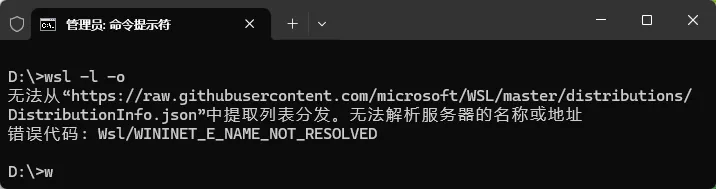
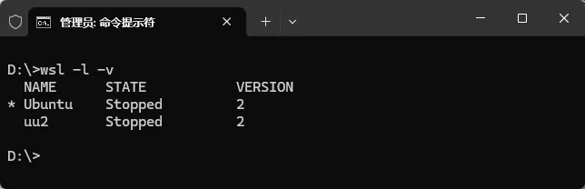
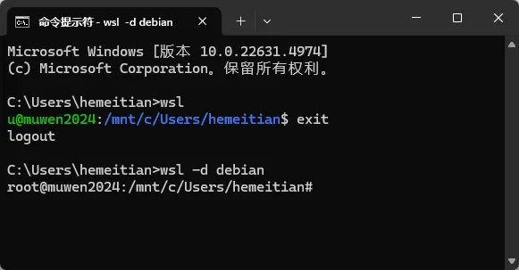
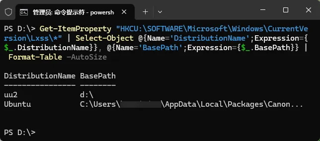
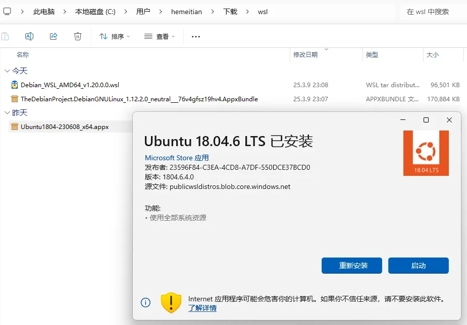

# WSL 实用笔记：安装、迁移、备份与常用配置

> 本文是 [WSL 自动化管理脚本](/zh/p/wsl-automng/) 的姐妹篇, 聚焦 WSL 手动安装、备份/还原、迁移及常用场景的使用技巧。
>
> WSL(Windows Subsystem for Linux) 可以让我们在 Windows 10/11 上直接运行 Linux 环境。它带来的好处包括:
>
> - **文件互操作**: 使用 Linux 软件处理 Windows 文件, 或反之。例如, 用 awk 编辑 Windows 的日志文件, 或者在 VS Code/Cursor 上调试 Linux 环境下的项目。
> - **后台 systemd 服务**: 开启 systemd, 几乎可以像传统 Linux 一样运行后台服务。
> - **显示 GUI 程序**: 直接在 Windows 上运行 Linux GUI (WSLg)。
> - **运行 Linux 容器**: Windows 上的 Docker 也基于 WSL2；可轻松管理各种容器。
> - **多个 Linux 系统并存**: 同时拥有 Ubuntu、Debian、Arch 等发行版。
> - **支持 GPU**: 如 [NVIDIA CUDA](https://learn.microsoft.com/windows/ai/directml/gpu-cuda-in-wsl) 等硬件加速。
>
> 以下整理了从安装到进阶使用的一系列技巧, 让你充分发挥 WSL 的威力。


---


## 目录

1. [准备工作与基本概念](#1-准备工作与基本概念)  
2. [安装与初体验](#2-安装与初体验)  
3. [WSL 版本与功能配置](#3-wsl-版本与功能配置)
4. [实例管理: 启动、使用、关闭与卸载](#4-实例管理启动使用关闭与卸载)  
5. [数据管理: 备份、还原与迁移](#5-数据管理备份还原与迁移)  
6. [WSL2 底层原理与网络配置](#6-wsl2-底层原理与网络设置)  
7. [离线安装方式](#7-离线安装方式)  
8. [常用技巧与进阶](#8-常用技巧与进阶)  

---


## 1. 准备工作与基本概念

### 1.1. 前提条件

- **Windows 版本**: Win10 (2004 及以上) 或 Win11。  
- **BIOS 中的 CPU 虚拟化已开启**: 否则无法启用 WSL2, 会提示未开启虚拟化。  
- **WSL 功能已开启**: win11 或 win10 2004 以上[**无需手动开启**](https://learn.microsoft.com/zh-cn/windows/wsl/install), 否则[需执行](https://learn.microsoft.com/zh-cn/windows/wsl/install-manual): 
~~~
# 以管理员模式
dism.exe /online /enable-feature /featurename:Microsoft-Windows-Subsystem-Linux /all /norestart
dism.exe /online /enable-feature /featurename:VirtualMachinePlatform /all /norestart

  # 对应的卸载命令:
  # dism.exe /online /disable-feature /featurename:Microsoft-Windows-Subsystem-Linux /norestart
  # dism.exe /online /disable-feature /featurename:VirtualMachinePlatform /norestart
~~~
若有问题, 可对照[官方文档](https://learn.microsoft.com/windows/wsl/install-manual) 让 AI 协助排查, 比如[腾讯元宝](https://yuanbao.tencent.com)(可流畅使用 DeepSeek)


### 1.2. 常用术语

- **WSL**: Windows Subsystem for Linux 的简称。  
- **WSL 实例**: 具体已安装且可以运行的 Linux 环境(可能基于 Ubuntu、Debian 等)。  
- **WSL 发行版**: 对应可安装的系统镜像名称(如 `Ubuntu-22.04`, `Debian` 等)。  

---


## 2. 安装与初体验

> 下列命令可在 **Windows Terminal** 或 **CMD/PowerShell** 中执行。  
> 若未安装 [Windows Terminal](https://learn.microsoft.com/windows/terminal/), 可从应用商店搜索:   
> 


### 2.1. 一键安装
~~~
# 这行安装默认的Ubuntu 发行版
wsl --install
  # 对应的卸载命令:
  # wsl --unregister Ubuntu  #这行要小心, 会删除名为Ubuntu的wsl实例
~~~

>请确保能访问 [GitHub raw 内容](https://raw.githubusercontent.com/microsoft/WSL/master/distributions/DistributionInfo.json)；如果网络受限, 请在`微软应用商店`中搜索`WSL Ubuntu`进行手动安装, 或参考 [7. 离线安装方式](#7-离线安装方式)。网络受限的报错: 


### 2.2. 其它发行版安装

~~~
# 列出可用发行版
wsl -l -o

# 安装指定发行版
wsl --install Ubuntu-22.04
  # 对应的卸载命令
  # wsl --unregister Ubuntu-22.04
~~~
>同样, 需确保能访问 [GitHub raw 内容](https://raw.githubusercontent.com/microsoft/WSL/master/distributions/DistributionInfo.json)。

---


## 3. WSL 版本与功能配置
WSL 有 **WSL1** 与 **WSL2** 两种版本, 并行存在。WSL2 提供更完整的 Linux 内核, 性能更佳, 推荐优先使用。[`两者对比`](https://learn.microsoft.com/windows/wsl/compare-versions)

### 3.1. 查询与切换版本

~~~
# 查看已安装实例及其版本(其它win用户安装的不会列出)
wsl -l -v
~~~

> 带 `*` 号的为`默认`实例；`NAME`列为`实例名`, `VERSION` 列即表示版本为`1`或`2`。

~~~
# 将新安装实例默认设置为 WSL2
wsl --set-default-version 2

# 将现有实例转换为 WSL2
wsl --set-version <实例名> 2
# 示例:
wsl --set-version  Ubuntu-22.04  2
~~~

### 3.2. 更新 WSL 底层组件

~~~
# 查看当前版本详情
wsl -v
# 执行升级(对 wsl 1/2 都有用)
wsl --update
~~~


---


## 4. 实例管理: 启动、使用、关闭与卸载

### 4.1. 启动/切换

~~~
# 启动并进入默认实例
wsl

# 启动并进入指定实例
wsl -d Ubuntu-22.04
~~~


### 4.2. 在 Win 下执行 Linux 命令

~~~
# 查询实例 IP
wsl -d Ubuntu-22.04 -e ip addr

# 在缺省实例里执行
wsl ip addr

# 指定工作目录
wsl -d Ubuntu-22.04 --cd "C:\" pwd
~~~

### 4.3. 运行 Linux GUI

例如, 在默认实例内安装Chromium浏览器后直接运行: 
~~~
wsl
# 若不是Ubuntu 请替换安装命令
sudo apt update
sudo apt install chromium-browser -y
chromium
~~~

>需要[`win10 19044+`](https://learn.microsoft.com/zh-cn/windows/wsl/tutorials/gui-apps) 或 [`win11`](https://learn.microsoft.com/zh-cn/windows/wsl/tutorials/gui-apps)

### 4.4. 设置缺省实例

~~~
wsl -s <实例名>
~~~

### 4.5. 关闭与卸载

~~~
# 关闭指定实例
wsl -t <实例名>

# 关闭所有 WSL (底层VM), 不影响其它win用户
wsl --shutdown

# 卸载某实例(数据彻底删除)
wsl --unregister <实例名>
~~~

---


## 5. 数据管理: 备份、还原与迁移

> 以下操作同样在 **Windows 终端/PowerShell** 中执行。


### 5.1. 查看所有实例的安装位置
```
# PowerShell
Get-ItemProperty "HKCU:\SOFTWARE\Microsoft\Windows\CurrentVersion\Lxss\*" | Select-Object @{Name='DistributionName';Expression={$_.DistributionName}}, @{Name='BasePath';Expression={$_.BasePath}} | Format-Table -AutoSize
```

>有至少一个实例时, 此命令会正确显示

### 5.2. 备份

~~~
wsl --export <实例名> <备份文件路径>
# 示例:
wsl --export Ubuntu-22.04  D:\backup\ubuntu2204.tar
~~~

### 5.3. 还原 / 新增实例

>可以基于同一备份 tar 文件创建多个新实例: 

~~~
wsl --import <实例名称> <安装位置> <备份文件的位置>
::示例(基于备份创建两个实例):
wsl --import Ubuntu-01  d:\wsl\ubuntu-01  d:\wsl_backup\ubuntu_backup.tar
wsl --import Ubuntu-02  d:\wsl\ubuntu-02  d:\wsl_backup\ubuntu_backup.tar
~~~

### 5.4. 迁移到新位置

~~~
wsl --manage <实例名> --move <新目录位置>
# 示例:
wsl --manage Ubuntu-22.04 --move D:\myWSL\ubuntu2204
~~~

### 5.5. 免密 sudo

在 WSL 内执行: 

```
#登入实例
wsl -d <实例名称> -u <实例中需要sudo的用户>
#然后执行:
echo "${USER} ALL=(ALL) NOPASSWD:ALL" |sudo tee /etc/sudoers.d/${USER} && sudo -l
```

---


## 6. WSL2 底层原理与网络设置
与 WSL1是在 Windows 内核上实现Linux 系统调用不同, WSL2 是在Hyper-V 轻量级虚拟机中运行真正的Linux 内核。对同一Windows 用户, 多个WSL2 实例本质上是挂载在同一个Linux 内核上的不同rootfs, 网络层也使用同一个内部IP；而不同Windows 用户会分别启动各自的WSL2 虚拟机, 因而也会看到不一样的IP。  
WSL2新版增加了[镜像网络模式](https://learn.microsoft.com/windows/wsl/compare-versions)(对应默认的NAT模式, 另外还有个bridged模式已被禁用), 可共享win宿主机IP, 减少了端口转发的麻烦.
>下列命令, 均从Win命令行提示符(如Windows Terminal)中开始。


### 6.1. 端口映射
>针对默认的NAT模式, 镜像网络模式不需要映射
```
::查看win宿主机已有映射:
netsh interface portproxy show all

::宿主机到子系统端口映射:
netsh interface portproxy add v4tov4 listenport=[win宿主机上端口] listenaddress=0.0.0.0 connectport=[子系统中端口] connectaddress=[子系统ip]
::示例:
netsh interface portproxy add v4tov4 listenport=8080  listenaddress=0.0.0.0 connectport=80  connectaddress=172.29.41.233
::映射后, 可以通过【宿主机ip:listenport】 访问子系统的 connectport

::删除宿主机上指定端口的映射:
netsh interface portproxy delete v4tov4 listenport=55011 listenaddress=0.0.0.0
```
映射后, 设置Win宿主机防火墙放行: 
```
::放行tcp 8080端口(规则名为Allow_TCP_8080):
netsh advfirewall firewall add rule name="_Allow_syslog_TCP_8080" protocol=TCP dir=in localport=8080 action=allow
::放行udp 8080端口(规则名为Allow_TDP_8080):
netsh advfirewall firewall add rule name="_Allow_syslog_UDP_8080" protocol=UDP dir=in localport=8080 action=allow

::列出所有防火墙规则
netsh advfirewall firewall show rule name=all
::按规则名过滤
netsh advfirewall firewall show rule name="Allow_TCP_8080"
::按端口过滤
netsh advfirewall firewall show rule name=all | findstr /R /C:"LocalPort: 8080"

::删除TCP 8080 的规则
netsh advfirewall firewall delete rule name=all protocol=TCP dir=in  localport=8080
::删除UDP 8080 的规则
netsh advfirewall firewall delete rule name=all protocol=UDP dir=in  localport=8080
```


### 6.2. 设置镜像网络模式
在 Windows 宿主机上, 新建或修改文件 `%userprofile%\.wslconfig` 写入: 
```
[experimental]
networkingMode=mirrored
dnsTunneling=true
firewall=true
autoProxy=true
hostAddressLoopback=true
```
配置后, 需要重启 WSL2 底层虚拟机(会注销当前用户的所有 WSL2 实例): 
```
wsl --shutdown && wsl
```
这个修改, 只会针对当前的win用户下的wsl实例生效, 不会影响其它用户的。如果不添加 hostAddressLoopback=true  则windows 宿主机上只能通过[127.0.0.1 + wsl2实例中的端口]来访问 wsl2中服务  
>参数说明: https://learn.microsoft.com/windows/wsl/wsl-config  

配置镜像模式后, WSL2 实例中的 IP 变为与 Windows 宿主机一致, 且可通过 Windows 宿主机 IP 直接访问 WSL2 中的服务端口。要局域网中电脑也可访问, 宿主机上防火墙放行即可。  
>在“镜像网络”模式下, 网络仍然更像是基于虚拟技术的映射, 在 Windows 宿主机上执行 netstat -aon 不会看到由 WSL2 实例内占用的端口。


---


## 7. 离线安装方式

### 7.1. 离线安装官方发行版
此文件含有所有官方的发行版下载地址: 


注意, 一般你应该下载 amd64版本, 除非你的电脑是arm cpu: 下载后, 会获得 .Appx 或.AppxBundle 或.wsl 后缀的文件, 对于.Appx 或.AppxBundle 双击会弹出GUI安装界面: 


.wsl文件双击后是命令行安装界面: 


Win10 可能无法双击进行安装: [install-manual](https://learn.microsoft.com/windows/wsl/install-manual)


### 7.2. 非官方发行版
非官方发行版, 需要自己找到可下载地址(解压后可得到.tar 文件), 例如官方列表中没有的 [Ubuntu16](http://cdimage.ubuntu.com/ubuntu-base/releases/16.04/release/), 安装方法: 
```
wsl --import <自定义实例名称> <wsl实例被安装的位置>  <tar文件路径>
::示例:
wsl --import CentOS E:\wslDistroStorage\CentOS d:\mywsl\centos.tar
```
> [也可以将容器镜像转化为 `.tar` 文件](https://learn.microsoft.com/windows/wsl/use-custom-distro)。


## 8. 常用技巧与进阶
>本小节, 记录一些实用技巧。
### 8.1. 修改默认登录用户
编辑实例内的 `/etc/wsl.conf` 确保存在:
```
[user]
default=user1
```

### 8.2. 启用systemd
编辑实例内的 `/etc/wsl.conf` 确保存在:
```
[boot]
systemd=true
```
>[需wsl版本>0.67.6](https://learn.microsoft.com/windows/wsl/systemd)

### 8.3. 配置后台保活
WSL实例的前端窗口全部退出后, 会在8秒后自动关机。可以在WSL实例中执行下列命令避免关机: 
```
pgrep -u "$(whoami)" -x "dbus-daemon" >/dev/null || dbus-launch true &>/dev/null
```
也可将其加入到~/.bashrc , 这样, 每次登入wsl实例时会自动执行。  
参考: https://github.com/microsoft/WSL/issues/10138#issuecomment-2121449781


### 8.4. 开机自启某 WSL 实例
将下列内容存为一个 `.vbs` 文件(例如 `auto_start_ubuntu.vbs`), 然后放入 `%userprofile%\AppData\Roaming\Microsoft\Windows\Start Menu\Programs\Startup` 目录:
```VBScript
' 延时 21 秒:
WScript.Sleep 21000
' 指定 WSL 实例, 请按需修改:
Dim wsl_name : wsl_name = "Ubuntu"
' 保持后台运行(只因wsl没有任何前端进程时, 会自动关机):
CreateObject("Shell.Application").ShellExecute "wsl.exe", "-d " & wsl_name & " -e bash -c ""pgrep -u $(whoami) -x dbus-daemon ||dbus-launch true &>/dev/null""", "", "open", 0
' 弹出wsl会话窗口:
WScript.CreateObject("WScript.Shell").Run "wsl.exe -d " & wsl_name , 1, True
```
>这会在 Windows 宿主机用户登录时启动, 若要以系统服务自启动可借助[nssm](https://nssm.cc/)


### 8.5. 开启与设置ssh服务
```
#开启ssh服务(以Ubuntu为例)
sudo apt install openssh-server
#ssh 服务配置文件
/etc/ssh/sshd_config

#修改配置文件自定义ssh服务端口
Port 2222
#配置文件中允许密码登陆
PasswordAuthentication yes

#应用修改
sudo service ssh restart
```

### 8.6. 访问 Windows 宿主机文件系统
WSL 实例会自动挂载 Windows 宿主机的驱动器(C 盘、D 盘等):
```
ls -l  /mnt/c
ls -l  /mnt/d
```


### 8.7. 获取 Windows 宿主机的环境变量
```
#获取win中环境变量%userprofile% :
MY_ENV_VAR=$(cmd.exe /c echo %userprofile% |tr -d '\r')
echo "MY_ENV_VAR in WSL: $MY_ENV_VAR"
```

### 8.8. Windows 宿主机访问 WSL 实例的文件系统
```
::资源管理器中直接访问:
\\wsl.localhost\
::在桌面创建快捷方式:
mklink /D "%userprofile%\Desktop\wsl_home" "\\wsl.localhost\"
::映射为本地驱动器H盘:
net use H: \\wsl.localhost\Ubuntu\home /persistent:yes
::取消映射:
net use H: /delete

::或者在wsl实例中执行:
::用win宿主机资源管理器 打开当前目录
explorer.exe  .
::用win宿主机 VS Code 或 Cursor 打开当前目录
code .
```
### 8.9. 文件系统性能提醒
目前(2025.3.21), 在 WSL2 实例中访问 Windows 宿主机的文件系统, 虽然方便, 但性能不佳。如果是需要日常访问和处理的文件、文件夹, 请把它们移动到 WSL2 自身的 Linux 文件系统中, 即不要是以 /mnt/c  /mnt/d  /mnt/e ……这样开头的路径, 可以是 /home 这样开头的。两者的性能差距目前可能有几十倍, 这是很多 WSL 新手会掉的坑。如果必须放在 Windows 宿主机的文件系统中, 则应该使用 WSL1 而不是 WSL2  
 `参考: `[`WSL 1 和 2 区别`](https://learn.microsoft.com/windows/wsl/compare-versions#exceptions-for-using-wsl-1-rather-than-wsl-2), [`GitHub issue`](https://github.com/microsoft/WSL/issues/9555)

### 8.10. 安装多个实例
参见 [5.2. 备份](#52-备份) 与 [5.3. 还原 / 新增实例](#53-还原--新增实例)。  
通过 `wsl --import` 命令, 可基于同一个 `.tar` 备份镜像创建任意多个实例。

> 以上就是对 WSL 从安装、备份、迁移、网络到常见技巧的整理。若还需更自动化的批量部署和离线管理, 可参考我的另一篇 [WSL 自动化管理脚本](/zh/p/wsl-automng/), 希望对你有所帮助！
