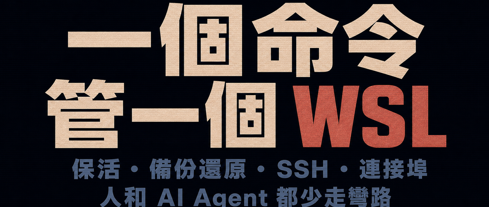

Windows 上的 WSL 已越來越成熟。但若把它當成日常 Linux 環境，你多半仍會遇到：

1. WSL 2 沒有活動中的工作時會自動關機。我原以為啟用 systemd 代管 `sshd` 就夠了，結果執行個體還是會停掉。
2. 服務已在 WSL 裡啟動，手機或另一台電腦卻連不上。原來還得處理連接埠對應與防火牆放行。
3. 想啟用 SSH？得跑完一整套組合：啟用 systemd、安裝 `sshd`、修改預設連接埠，甚至設定公開金鑰。
4. 用久了會累積重要資料，但備份、還原、移轉這些低頻操作的命令，誰都記不住。
5. 執行個體一多，同一套操作還會反覆出現。


現在我是這樣處理的：

```cmd
wsl02 .alive
wsl02 .sshd enable 2228
wsl02 .port expose 2228 2228 --uac
```

三條命令之後：

```
✅ WSL 閒置時也不關機
✅ SSH 服務與 systemd 一鍵就緒（必要時重新啟動一次 WSL 虛擬機器，後面會詳細說明）
✅ 連接埠已對應、防火牆已放行，可從區域網路存取
```

備份與還原也只需要：

```
wsl02 .backup
wsl02 .install D:\backup\xxx.tar --yes
```

還不錯吧？


## 一、工具已開源，三步就能用

1. 複製儲存庫：

```cmd
git clone https://github.com/swawai/swaw-kit
```

2. 複製範本：

```
cd swaw-kit
copy .\Favorites\template.wsl01.cmd .\wsl02.cmd
```

複製後，以文字編輯器開啟 `wsl02.cmd`，設定其中的執行個體名稱、使用者名稱與安裝映像來源，例如 Ubuntu 或 Debian。

3. 安裝執行個體：

```cmd
wsl02 .install
```

如果安裝時遇到問題，可以執行診斷，再把結果交給 AI 分析：

```cmd
wsl02 .doctor
```

安裝完成後，執行 `wsl02` 就能進入綁定的執行個體：


4. 就這樣。

到這裡，各種「一鍵」功能都已經向你開放。例如背景保活：

```cmd
:: 保活 3600 秒：
wsl02 .alive 3600
:: 關閉保活策略：
wsl02 .alive off
```

備份、還原、移轉與重新安裝也能一鍵管理，相關位置已定義在 `wsl02.cmd`：

```cmd
:: 備份：
wsl02 .backup
:: 列出現有備份檔案：
wsl02 .backup list
:: 還原（使用現有備份檔案重新安裝）。目前 WSL 執行個體的所有資料都會遺失！
:: 必須加上 --yes 確認覆寫：
wsl02 .install D:\backup\xxx.tar --yes
:: ...
```

一鍵管理 systemd：

```cmd
:: 啟用 systemd：
wsl02 .systemd enable
:: systemd 設定變更不會立即生效，需要重新啟動 WSL 2 底層虛擬機器。
:: 請注意：目前使用者的所有 WSL 執行個體都會短暫關機：
wsl02 .vm -s
:: 停用 systemd：
wsl02 .systemd disable
```

工具也能一鍵管理 SSH 服務、連接埠開放，以及其他未逐一列出的功能。

只要記得執行 `--help`，一封寫給 WSL 的情書就會在你眼前展開：

```cmd
wsl02 --help
```

輸出內容會依模組分組，版面一目瞭然。


## 二、實際效果


備份：

```cmd
wsl02 .backup
```


還原（以指定備份重新安裝執行個體）：

```cmd
wsl02 .install D:\backup\Backup_wsl02_20260617083000.tar --yes
```


查看連接埠策略：

```cmd
wsl02 .port status
```


透過 SSH 登入：


## 三、多執行個體管理與 AI Agent 支援

如果你只有一個 WSL，這套工具帶來的是「方便」；但如果有三個以上，它會是「救命」。

你可以照著 `wsl02` 建立 `wsl03`、`wsl04`、`wsl05`，分別綁定各個 WSL 執行個體。接著就像把油門直接焊死：

```cmd
:: 安裝：
wsl03 .install
wsl04 .install
wsl05 .install
:: 備份：
wsl03 .backup
:: 重新安裝：
wsl04 .install --yes
:: 保活：
wsl04 .alive
:: 以 VS Code 開啟 WSL 中的目錄：
wsl05 .code ~/myproj/
:: 啟用 SSH：
wsl05 .sshd enable 2228
:: ...

:: 命令太多記不住？執行 --help：
wsl03 --help
wsl04 --help
wsl05 --help
```

即使你真的有一大堆 WSL，只要在命名上多花一點心思，依然能井井有條：

```cmd
:: 依群組與編號命名：
group1-wsl1.cmd
group1-wsl2.cmd

:: 依用途命名：
website-test.cmd
claude-code.cmd
openclaw.cmd
agent-lab.cmd
research-box.cmd
sandbox.cmd
```

可以說，WSL 越多，這種「一個執行個體、一個命令指令碼」的方式就越有優勢。對 AI Agent 而言，這個固定入口還有額外好處：

```text
- 命令名稱就是目標執行個體，邊界清楚
- 保活、備份、SSH 與連接埠管理都使用穩定的一鍵子命令
- 核心命令維持非互動式
- 危險操作明確要求 --yes
- 系統管理員操作明確要求 --uac
- .status 與 .doctor 支援 JSON 輸出
```


我請 Codex 實際試用，它的回饋是：這套設計能**顯著提升 Agent 操作的可靠性，可小幅節省命令輸入 token，並中度到顯著減少診斷與探索 token**。下圖是當時的回饋；其中提到的小建議與濫用風險，我都已經修正：


## 四、附錄：加入 PATH

想讓 `wsl02`、`wsl03` 這些命令能從任何終端機或 `Win + R` 直接執行？按兩下儲存庫裡的：

```cmd
PathHereAdd.cmd
```

就可以了。

按兩下後要怎麼復原？修改 PATH 是否安全、是否需要謹慎？可以閱讀：[讓 Win + R 執行自訂命令](/zh-tw/p/win-run-custom-command-path/)。


---


> 原始碼儲存庫，歡迎提交 Issue 或 PR：[https://github.com/swawai/swaw-kit](https://github.com/swawai/swaw-kit)
