# 把每个 WSL 实例变成一条命令｜SWAW Kit WSL

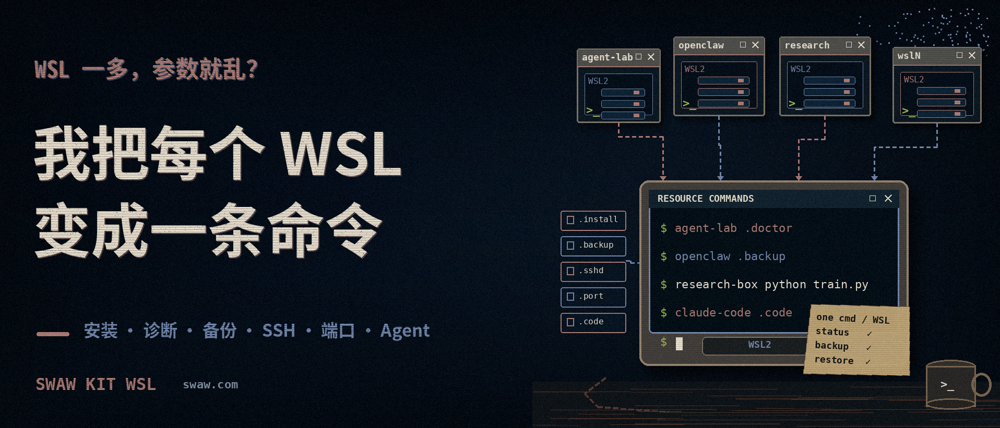

> 关联文章： [WSL 实战指南](/zh/p/wsl-practical/)

WSL 是 Windows 上最容易获得的 Linux 环境之一。它与 Windows 文件系统、终端以及 VS Code、Cursor 等编辑器集成良好，也很适合创建、删除和重建临时开发环境。

但当 WSL 实例逐渐增多，问题就不再是“怎样启动 Linux”，而是：

- 这次应该进入哪个实例？
- 应该使用哪个 Linux 用户？
- 默认从哪个项目目录开始？
- 这个实例从什么镜像或归档安装？
- 安装目录和备份目录在哪里？
- systemd、SSH 和端口规则是否已经配置？
- 环境出现问题后，怎样诊断、备份、重建和恢复？

直接使用 `wsl.exe` 时，这些上下文通常散落在命令参数、脚本、终端历史和人的记忆中：

```powershell
wsl.exe -d agent-lab -u john --cd /home/john/app -- npm test
```

这次，我把之前的 [《WSL 自动化管理脚本》](/zh/p/wsl-automng/) 重新整理为 **SWAW Kit WSL**，并继续沿用 [《把一台台 VPS 变成本地命令》](/zh/p/ssh-remote-kit-windows/) 中的思路：

> 给每个资源一个稳定的命令名，让命令名本身成为资源入口。

于是，上面的调用可以变成：

```powershell
agent-lab --cd app/ -- npm test
```

需要检查环境时：

```powershell
agent-lab .doctor
```

需要备份时：

```powershell
agent-lab .backup
```

这里的 `agent-lab` 不只是一个缩短命令的别名。它绑定了一个具体 WSL 实例的名称、默认用户、安装来源、存储位置、备份位置、默认工作目录和可选 .env，也统一暴露了这个实例的生命周期操作。

我把这种组织方式称为：

> **RaC：Resource as Command，资源即命令。**


>本文目录：  
>一、四步开始使用  
>二、一个入口覆盖哪些工作？  
>三、放进 PATH  
>四、四、资源即命令：命令名不只是别名  
>五、管理命令与原生命令透传  
>六、为什么这种入口特别适合 Agent？  
>七、先了解几个操作边界  
>八、运行示例  
>结语
---


## 一、四步开始使用

源码已经放到 GitHub：

```text
https://github.com/swawai/win-run-toolbox
```

### 第一步：克隆仓库

```powershell
git clone https://github.com/swawai/win-run-toolbox
cd win-run-toolbox
```

### 第二步：为实例复制一个入口

`wsl01.cmd` 可以作为入口模板。请复制成一个尚未存在、容易识别的名字：

```cmd
copy wsl01.cmd agent-lab.cmd
```

入口文件名就是以后使用的命令名。你可以简单按数字命名，例如 `wsl02.cmd`；也可以按项目、职责或 Agent 名称命名，通常更容易辨认。

### 第三步：修改实例配置

打开 `agent-lab.cmd`，至少确认实例名、Linux 用户和安装来源：

```bat
@echo off & chcp 65001 >nul & setlocal & set "WSL_KIT_PROTOCOL=1"
:::::::::::::::::::::::::::::::::::::::::::::::::::
:: 实例基本信息(必填)
:::::::::::::::::::::::::::::::::::::::::::::::::::
:: wsl -l 中显示的实例名称，也是本工具的安装/使用等命令会一直绑定的实例ID
set "WSL_name=agent-lab"
:: 安装时创建并默认使用的 Linux 用户
set "WSL_user=john"

:: 安装/重装的镜像源，可以是归档路径(优先检测),或在线发行版名 (wsl -l -o 可查看)
:: set "WSL_source=%~dp0wsl.automng\ubuntu-22.backup.tar"
set "WSL_source=Debian"

:::::::::::::::::::::::::::::::::::::::::::::::::::
:: 可选配置
:::::::::::::::::::::::::::::::::::::::::::::::::::
:: 此实例在 Windows 上的安装目录
set "WSL_install_dir=%~dp0\data\wsl\%WSL_name%"
:: 默认备份目录，后续 .backup / .backup <path> / .backup list 命令默认使用此目录
set "WSL_backup_dir=%~dp0\data\wsl.backup\%WSL_name%"
:: 默认 Linux 工作目录; 留空或 ~ 表示用户家目录。
set "WSL_default_workdir=~"
:: 备份格式,支持：.backup fixed format: tar / tar.gz / tar.xz / vhd 或留空
set "WSL_export_format=tar"
:: WSL 版本。通常使用 2; 留空时可由系统默认值决定。
set "WSL_version=2"
:: .sshd enable 时会顺便导入下面设置的公钥
:: set "WSL_SSH_public_key=%USERPROFILE%\.ssh\id_rsa.pub"
:: Optional env file loaded into this command process only.
:: set "WSL_env_file=%userprofile%\secrets\%WSL_name%.env"
```

为了减少认知负担，我通常让入口文件名和 `WSL_name` 保持一致。不过二者并不要求相同：

- 文件名决定 Windows 上调用什么命令；
- `WSL_name` 决定它绑定哪个已注册的 WSL 实例。

当前 `WSL_name` 只接受英文字母、数字、点号、下划线和连字符，即 `A-Z a-z 0-9 . _ -`。例如 `agent-lab`、`openclaw_1` 都是有效名称。

### 第四步：诊断、安装和进入

创建好 `agent-lab.cmd` 后，先查看帮助并检查本机环境：

```powershell
.\agent-lab --help
.\agent-lab .status
.\agent-lab .doctor
```

确认配置没有问题后安装实例：

```powershell
.\agent-lab .install
```

以及设置实例 Linux 用户的密码：

```powershell
agent-lab .user passwd
```

完成后，可以再次对比状态，然后执行入口命令即可进入：

```powershell
.\agent-lab .status
.\agent-lab
```

如果该名称对应的实例已经存在，工具不会直接覆盖，而会要求显式追加 `--yes`：

```powershell
.\agent-lab .install --yes
```

> `--yes` 表示同意注销并重建现有实例，其中的数据会丢失。执行前应先创建备份。

---

## 二、一个入口覆盖哪些工作？

一个入口大致覆盖以下几类操作：

| 能力范围 | 代表命令 |
|---|---|
| 状态与诊断 | `.status`、`.doctor` |
| 安装与生命周期 | `.install`、`.backup`、`.relocate`、`.delete` |
| 用户与密码 | `.user ensure`、`.user passwd`、`.user default` |
| Linux 服务 | `.systemd`、`.sshd` |
| 网络与端口 | `.port status`、`.port expose`、`.port sync` |
| 运行与保活 | `.t`、`.alive` |
| 目录与编辑器 | `.dir`、`.code`、`.cursor` |
| WSL 虚拟机级操作 | `.vm` |
| Linux 命令执行 | 自动补充实例、用户和工作目录后透传给 `wsl.exe` |

完整命令以当前版本的内置帮助为准：

```powershell
agent-lab --help
```

SWAW Kit WSL 并不替代 WSL。它建立在 `wsl.exe` 之上，把原本散落的管理操作整理为一个实例入口。

### 状态与诊断

```powershell
agent-lab .status
agent-lab .doctor
```

`.status` 用于查看当前实例状态，也会显示已配置的环境变量文件、SSH 公钥，以及运行中实例的用户密码状态；`.doctor` 会依次检查 WSL 本身、入口配置、安装来源、实例注册状态、存储、平台和网络，并检查入口与 Kit 的 `.cmd` 文件是否保持适合 `cmd.exe` 的 CRLF 换行。

### 安装、重建和恢复

```powershell
agent-lab .install
agent-lab .install --dry-run
agent-lab .install --yes
agent-lab .install D:\backup\agent-lab.tar --yes
```

安装来源可以是在线发行版，也可以是 `.tar`、`.tar.gz`、`.tar.xz`、`.vhd` 或 `.vhdx` 归档。

使用在线发行版时，工具会先调用原生 `wsl --install`；如果失败（常见原因是本机网络无法访问托管在 GitHub 上的发行版信息），会使用内置的发行版信息继续尝试下载镜像并完成安装。

### 备份、迁移和删除

```powershell
agent-lab .backup
agent-lab .backup list
agent-lab .relocate --dry-run
agent-lab .relocate
agent-lab .delete --yes
```

迁移不是简单移动目录，而是按顺序执行：

```text
停止实例 → 导出归档 → 注销旧实例 → 导入新位置 → 恢复配置用户
```

迁移过程中导出的归档会保留在 `WSL_backup_dir` 指定的默认备份目录中，不会自动删除。可以先使用 `--dry-run` 查看准备执行的底层命令。

### systemd、SSH、用户与密码

```powershell
agent-lab .systemd status
agent-lab .systemd enable
agent-lab .sshd enable 2222
agent-lab .user ensure
agent-lab .user passwd
agent-lab .user default
```

启用 SSH 时，工具可以检查端口、安装 OpenSSH Server、配置 systemd 服务，并按入口配置导入 Windows 上的 SSH 公钥。

Kit 安装时创建的 Linux 用户不会预设口令，其密码状态通常会显示为 `locked`，务必使用 Kit 提供的命令：

```powershell
agent-lab .user passwd
```

会交互式设置密码，如果不便进行交互，可以指定从环境变量读取密码来进行设置：

```powershell
agent-lab .user passwd --env AGENT_LAB_PASSWORD
```


### 入口级环境变量

入口文件可以通过 `WSL_env_file` 指定一个可选的环境变量文件：

```bat
set "WSL_env_file=%USERPROFILE%\secrets\%WSL_name%.env"
```

文件采用标准 .env 的 `KEY=value` 格式：

```dotenv
# agent-lab.env
AGENT_LAB_PASSWORD=change-this-password
PROJECT_CHANNEL=development
```

执行该资源命令时，Kit 会先把文件中的变量加载到**本次命令的 Windows 进程环境**，已经存在的环境变量，不会被覆盖。

若想要环境变量透传到 WSL 内，需使用 WSL 原生的 `WSLENV` 机制：

```
$env:MY_VAR = "hello"
$env:WSLENV = "MY_VAR/u"
agent-lab -- sh -lc 'echo "$MY_VAR"'
```

参考：[Microsoft：使用 WSLENV 在 Windows 和 WSL 之间共享环境变量](https://learn.microsoft.com/zh-cn/windows/wsl/filesystems)

### 端口暴露

```powershell
agent-lab .port status
agent-lab .port expose 8080
agent-lab .port expose 8080 --uac
agent-lab .port del 8080 --uac
agent-lab .port sync --uac
```

工具会根据 WSL 的网络模式选择处理方式：

- **NAT 模式**：建立端口代理和 Windows 防火墙规则，并可在 WSL IP 变化后重新同步；
- **mirrored 模式**：不做主机端口到来宾端口的改写，而是配置相同端口对应的 Hyper-V 防火墙规则。

### 保活和停止

```powershell
agent-lab .alive 600
agent-lab .alive
agent-lab .alive status
agent-lab .alive off
agent-lab .t
```

`.alive 600` 让实例保持运行 600 秒。

不带时长的 `.alive` 会为当前 Windows 用户建立登录计划任务，使该用户以后登录 Windows 时再次启动相应实例并保持后台运行。

较新的 WSL 还支持在 `%UserProfile%\.wslconfig` 中调整 `vmIdleTimeout`，但它作用于整个 WSL 2 虚拟机，不能针对某一个实例。`.alive` 的定位则是通过实例入口管理保活时长或登录任务。

### 目录和编辑器

```powershell
agent-lab .dir install
agent-lab .dir backup
agent-lab .dir config
agent-lab .code
agent-lab .code ~
agent-lab .cursor /etc
```

可以直接打开实例的安装目录、备份目录、Linux 配置目录，或者通过 VS Code、Cursor 打开指定的 WSL 工作目录。

完整命令以帮助信息为准：

```powershell
agent-lab --help
```

---

## 三、放进 PATH

如果希望在 `Win + R`、PowerShell、CMD 或其他终端中直接运行：

```powershell
agent-lab
```

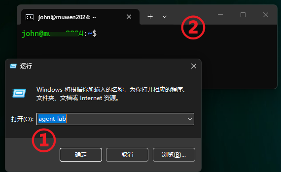

可以双击仓库目录里的：

```text
pathhereadd.cmd
```

它会把当前 `win-run-toolbox` 目录加入当前 Windows 用户的 `PATH`。

添加后，请重新打开终端窗口，使新的环境变量生效。

如果以后不再需要，可以执行：

```text
pathhereremove.cmd
```

它会从当前用户的 `PATH` 中移除该目录。

关于这一机制，也可以参考：[让 Win + R 运行自定义命令](/zh/p/win-run-custom-command-path/)。

---

## 四、资源即命令：命令名不只是别名

我没有把所有实例都放进一个巨大的中央管理命令中，例如：

```powershell
wsl-manager run --instance agent-lab --user john --workdir /home/john/app -- npm test
```

这种方式没有错，但每次调用都需要重新补充资源上下文。

SWAW Kit WSL 采取的是另一种组织方式：

```powershell
agent-lab --cd app/ -- npm test
openclaw .backup
claude-code .doctor
research-box python train.py
```

这些名称可以分别绑定不同的 WSL 实例。Kit 把频繁重复的上下文，从每一次命令调用中移到入口文件里：

```text
agent-lab
= WSL 实例 agent-lab
+ 默认用户 john
+ 默认目录 /home/john
+ 安装来源 Debian
+ 安装与备份位置
+ 可选的 .env 入口环境变量
+ 一组实例管理能力
```

```text
openclaw
= WSL 实例 openclaw
+ ...
```

因此，命令名同时承担了三种职责。

### 1. 它是资源地址

看到 `agent-lab` 或 `openclaw`，人和 Agent 都知道接下来操作的是哪个环境，而不必再次查询发行版名称。

### 2. 它是资源契约

入口文件明确声明了这个环境应当使用什么用户、从哪里安装、放在哪里、备份到哪里，以及默认从哪个目录执行命令。

入口配置可以进入版本控制，也可以在代码审查、迁移或故障排查时直接查看。

### 3. 它是能力入口

同一个名字既可以运行 Linux 命令：

```powershell
agent-lab npm test
```

也可以管理这个实例：

```powershell
agent-lab .status
agent-lab .doctor
agent-lab .backup
```

这不是单纯少输入几个字符，而是给一个运行环境建立了稳定、可调用的本地接口。

入口名可以按照自己的资源组织方式决定：

```text
# 按项目
billing-dev.cmd
website-test.cmd

# 按用途
agent-lab.cmd
research-box.cmd
sandbox.cmd

# 按 Agent 或工具
claude-code.cmd
openclaw.cmd

# 按分组和编号
group1-wsl1.cmd
group1-wsl2.cmd
```

一个好名字应当让使用者在执行命令之前，就知道自己将操作哪个环境。

---

## 五、管理命令与原生命令透传

Kit 自己的实例管理命令，除 --help 全以点号开头，例如：

```powershell
agent-lab .status
agent-lab .backup
agent-lab .systemd status
```

这样可以尽量避免与 Linux 命令重名。

非 Kit 定义的命令，则会在自动补充实例、用户和默认工作目录后交给 `wsl.exe`：

```powershell
agent-lab uname -a
agent-lab -- pwd
agent-lab --cd /tmp -- pwd
agent-lab -u root -- whoami
```

例如：

```powershell
agent-lab -- npm test
```

大致相当于：

```powershell
wsl.exe -d agent-lab -u john --cd ~ -- npm test
```

需要注意的是，这种透传适合执行**绑定实例内部的 Linux 命令**。

下面这些属于 WSL 的全局管理操作透传：

```powershell
agent-lab -l -v      # 对应 wsl.exe -l -v
agent-lab -l -o      # 对应 wsl.exe -l -o
agent-lab --update   # 对应 wsl.exe --update
```

这些操作和具体的实例无关，应直接使用 `wsl.exe`。

---

## 六、为什么这种入口特别适合 Agent？

对 Agent 来说，调用 Shell 本身通常并不困难。更容易出错的是：

- 找错环境；
- 使用错用户；
- 从错目录开始；
- 不知道环境当前是否完整；
- 在破坏性操作前没有检查；
- 环境损坏后找不到恢复路径。

资源即命令的价值，就是把这些隐含条件收进一个稳定入口。

### 1. 减少上下文重建

Agent 不必在每次任务开始前重新询问：

```text
应该用哪个发行版？
用户名是什么？
项目目录在哪里？
```

这些信息已经由入口绑定。

Agent 只需要关心本次任务：

```powershell
agent-lab -- npm test
```

### 2. 缩小操作歧义

不同项目和不同 Agent 可以绑定不同实例：

```text
agent-lab.cmd
openclaw.cmd
frontend-agent.cmd
backend-agent.cmd
security-lab.cmd
```

命令本身就表达了操作范围，比每次临时拼接 `-d`、`-u` 和 `--cd` 更不容易选错目标。

### 3. 先观察，再操作

Agent 可以先运行：

```powershell
agent-lab .status
agent-lab .doctor
```

确认实例是否安装、配置是否完整、存储和网络是否正常，再决定是否继续执行任务。

这比直接尝试命令、失败后再猜测环境问题更可控。

### 4. 对破坏性操作设置护栏

重建和删除，明确要求确认参数：

```powershell
agent-lab .install --yes
agent-lab .delete --yes
```

安装和迁移等副作用较大的操作，还可以先预览：

```powershell
agent-lab .install --dry-run
agent-lab .relocate --dry-run
```

需要管理员权限的端口操作，也可以通过显式的 `--uac` 请求交互式提权（更适合人类介入），而不是默认静默提升权限。

### 5. 环境可以恢复

环境损坏并不可怕，真正麻烦的是不知道怎样回到可用状态。

这个入口提供了一条明确路径：

```text
检查 → 备份 → 重建 → 还原 → 再次检查
```

例如：

```powershell
agent-lab .doctor
agent-lab .backup
agent-lab .install D:\backup\agent-lab.tar --yes
agent-lab .doctor
```

### 6. 人和 Agent 使用同一种接口

Agent 执行过的命令，人可以在同一终端中复现。

人排查过的步骤，也可以直接交给 Agent 继续执行。

两者面对的是同一个入口、同一套命令和同一个实例上下文，不需要再维护一套只供自动化使用的旁路脚本。

> 不过，这里所说的环境边界主要是项目文件、软件包、用户和运行状态之间的工程隔离，并不等于强安全隔离。WSL 2 本身机制：同一 Windows 账户下的多个 WSL 实例会共享同一台 Linux 内核虚拟机。需要处理不可信代码时，仍应采用与风险等级相匹配的隔离措施。

参考：[Microsoft：什么是 WSL](https://learn.microsoft.com/zh-cn/windows/wsl/about)

---

## 七、先了解几个操作边界

统一入口可以减少失误，但不能消除底层操作本身的影响范围。

### `.install --yes`

会注销并重建当前入口绑定的实例，原实例中的数据会丢失。

建议先执行：

```powershell
agent-lab .backup
```

### `.delete --yes`

会调用 WSL 注销功能，删除当前绑定实例。

工具也会尝试清理相应的保活任务和托管端口规则，但实例数据本身不会保留。

### `.vm -s`

会关闭当前 Windows 用户的整个 WSL 2 虚拟机，因此会影响该用户下正在运行的所有 WSL 实例，而不只是当前入口绑定的实例。

### `.port`

端口规则可能需要修改 Windows 防火墙或 Hyper-V 防火墙，因此通常需要管理员权限。

NAT 和 mirrored 两种网络模式的行为也不同。可先运行：

```powershell
agent-lab .port status
```

参考：[Microsoft：使用 WSL 访问网络应用程序](https://learn.microsoft.com/zh-cn/windows/wsl/networking)

---

## 八、运行示例

以下截图使用的是我本机名为 `wsl02` 的入口。你的入口如果叫 `agent-lab`、`openclaw` 或其他名字，只需替换命令名前缀。

### 1. 查看状态、重装并进入实例

先查看实例状态：

```powershell
wsl02 .status
```


需要重建实例时：

```powershell
wsl02 .install --yes
```

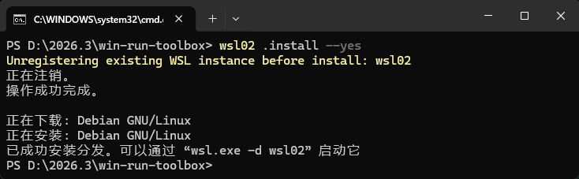

> 该操作会删除现有实例中的数据。请先确认已经备份。

安装完成后直接进入：

```powershell
wsl02
```

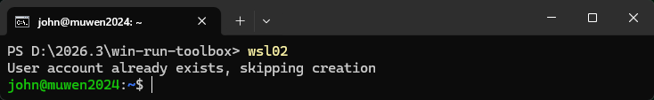

### 2. 启用 systemd 和 SSH

启用 systemd：

```powershell
wsl02 .systemd enable
```

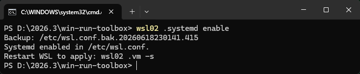

`systemd` 配置写入 `/etc/wsl.conf` 后，需要重启 WSL 2 虚拟机才能应用：

```powershell
wsl02 .vm -s
```

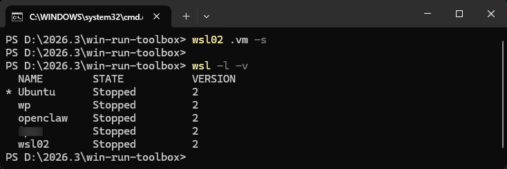

> 此操作会停止当前 Windows 用户下的全部 WSL 实例。之后再次访问任意 WSL 实例时，WSL 会自动启动。

重新启动实例后，可以检查 systemd (透传 Linux 原生命令)：

```powershell
wsl02 systemctl is-system-running
```

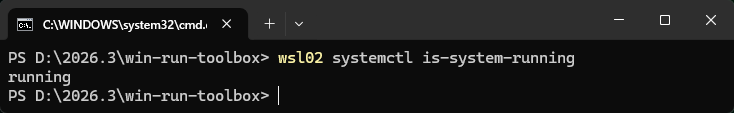

然后启用 SSH，并指定端口：

```powershell
wsl02 .sshd enable 2228
```

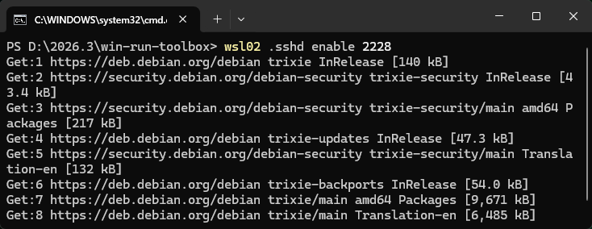

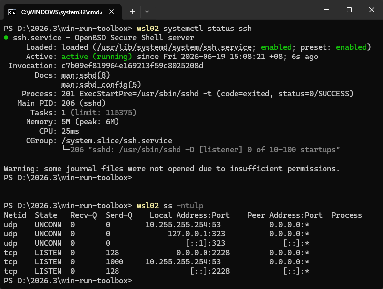

设置后台保活、设置用户密码、使用 SSH 登录：


如果在入口文件中配置了：

```bat
set "WSL_SSH_public_key=%USERPROFILE%\.ssh\id_ed25519.pub"
```

启用 SSH 时还会把该公钥加入配置用户的 `authorized_keys`。

### 3. 将服务端口暴露给局域网

先查看当前网络模式和托管端口：

```powershell
wsl02 .port status
```

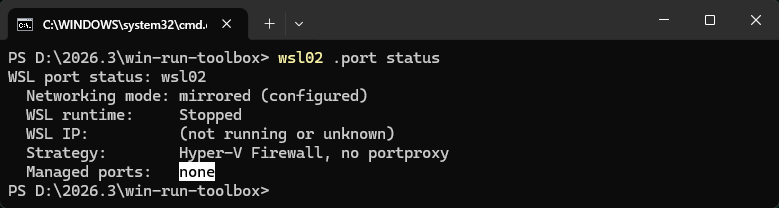

我的本机使用 mirrored 网络模式，因此 Windows 侧和 WSL 侧需要使用同一个端口：

```powershell
wsl02 .port expose 2228 2228 --uac
```

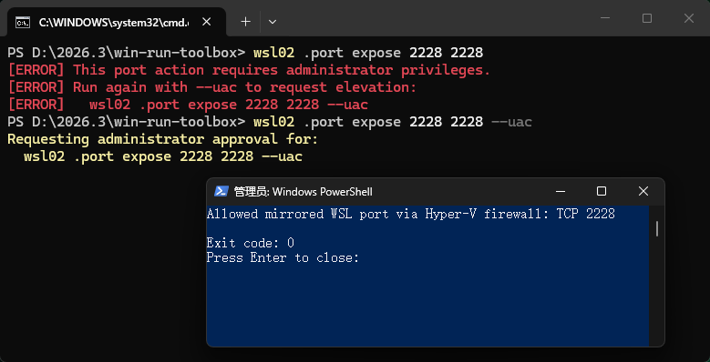


在 NAT 模式下，则可以使用不同的监听端口和目标端口：

```powershell
wsl02 .port expose 8080 80 --uac
```

如果 NAT 模式下 WSL IP 发生变化，可以刷新已托管的端口代理：

```powershell
wsl02 .port sync --uac
```

不再需要时移除规则：

```powershell
wsl02 .port del 2228 --uac
```

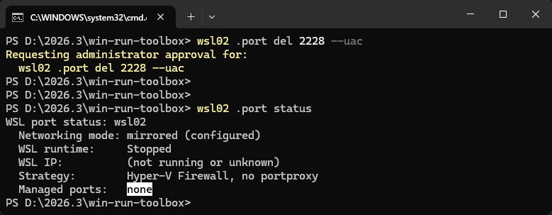

### 4. 备份与还原

创建备份：

```powershell
wsl02 .backup
```


列出默认备份目录中的归档：

```powershell
wsl02 .backup list
```

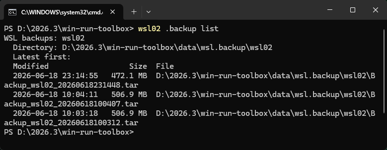

从指定归档重新安装实例，即可完成还原：

```powershell
wsl02 .install D:\backup\Backup_wsl02_20260617083000.tar --yes
```


备份格式由入口文件（例如 `wsl02.cmd`、`agent-lab.cmd`）中的 `WSL_export_format` 决定，可选 tar, tar.gz, tar.xz, vhd, vhdx。

---

## 结语

把一个 WSL 实例变成一条命令，并不是简单地给 `wsl.exe` 套一层短别名。

它真正做的是：

> 给一个 Linux 环境建立稳定的名字、明确的运行上下文和可执行的生命周期契约。

此后，无论是人、脚本还是 Agent，都不必在每次调用时重新拼装实例名称、用户、工作目录以及需要加载的 .env。

需要运行任务时：

```powershell
agent-lab -- npm test
```

需要检查环境时：

```powershell
agent-lab .doctor
```

需要恢复环境时：

```powershell
agent-lab .backup
agent-lab .install D:\backup\agent-lab.tar --yes
```

一个名字既是资源地址，也是操作入口。

最小的开始方式，就是复制一个入口文件，用项目或 Agent 的名字为它命名，修改配置，然后执行：

```powershell
agent-lab .doctor
agent-lab .install
```

源码仓库：

```text
https://github.com/swawai/win-run-toolbox
```

这套工具源于我长期管理多个 WSL 环境的实际需求，也会继续在日常使用中维护和改进。欢迎提交 Issue、改进建议和 PR。
