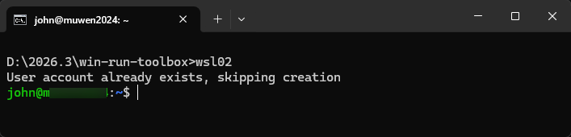
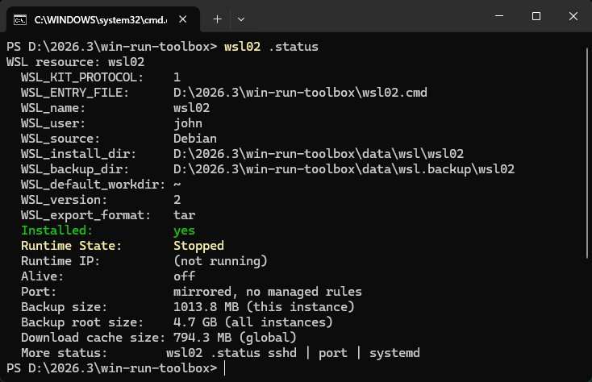
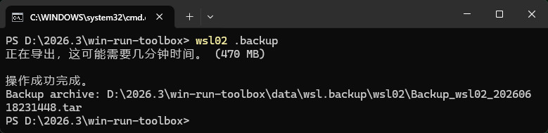
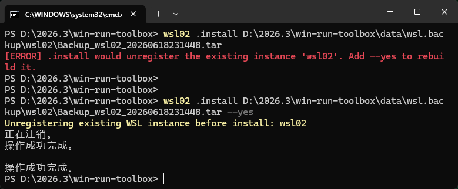
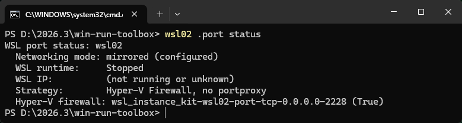
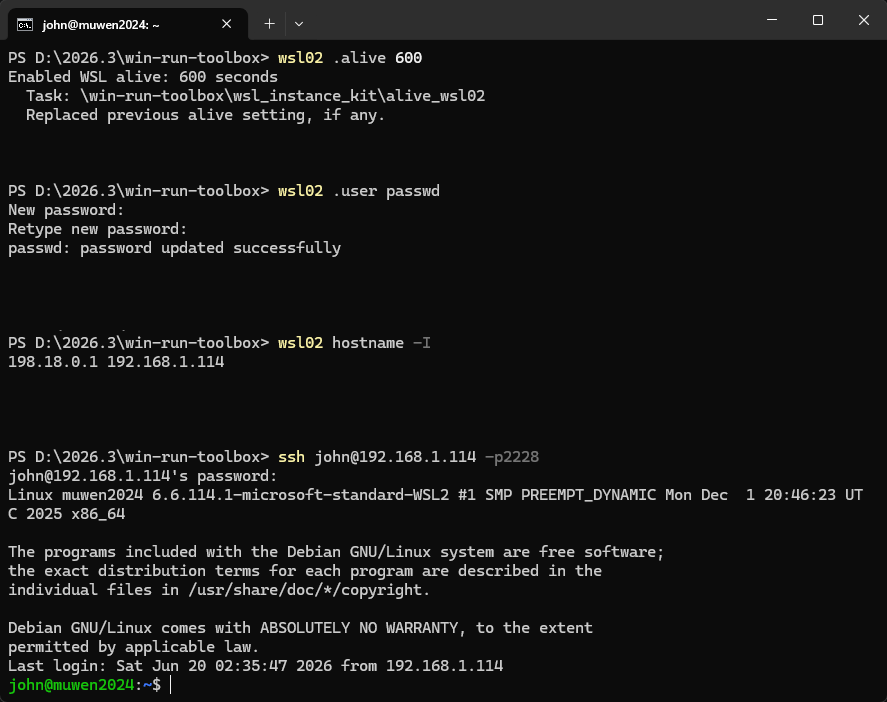
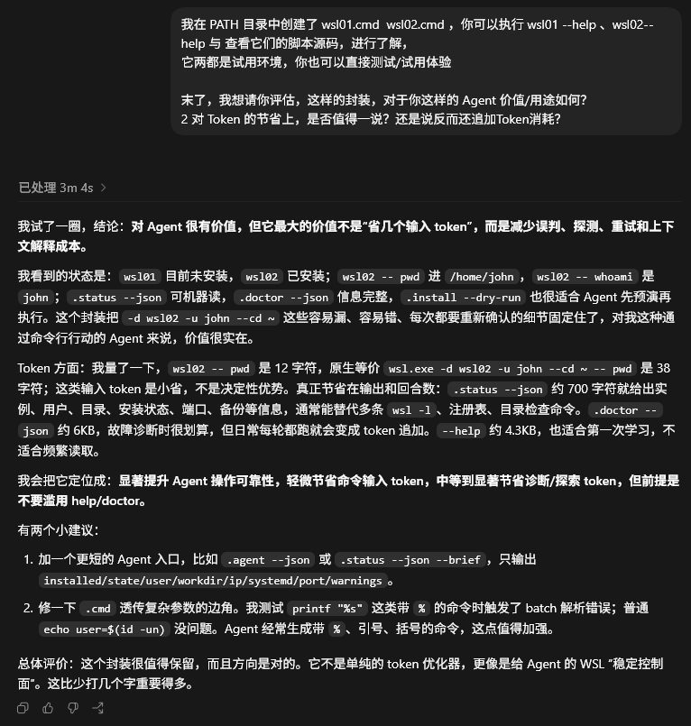

# WSL 工具：一键管理后台保活、备份还原、SSH、systemd 和端口暴露，Agent 也少走弯路

> 本文适合：Windows + WSL 2 日常开发 / 本地 Linux 服务 / Agent sandbox / 多 WSL 实例，等方面的关注者；  
> 不适合：​ 只用 WSL 1 或非 Windows 系统用户。


Windows 上，WSL 越来越成熟。但把它当日常 Linux，你大概率也会遇到：

1. WSL 2 没有活动任务时会自动停机（我原以为开了 systemd 托管 sshd 就够，结果还是会寄）
2. 服务在 WSL 里起了，手机或另一台电脑却访问不了，原来，还要处理端口映射和防火墙放行
3. 想启用 SSH？需一路 combo：开启 systemd、安装 sshd、修改默认端口、甚至配公钥
4. 用久了会沉淀重要数据，但备份/还原/迁移等低频操作命令，鬼都记不住
5. 实例一多，这些操作还会反复出现


现在，我是这么搞了：

```cmd
wsl02 .alive
wsl02 .sshd enable 2228
wsl02 .port expose 2228 2228 --uac
```

三条命令之后：

```
✅ WSL 空闲也不停机
✅ SSH 服务 + systemd 一键就绪（必要时重启一次 WSL 虚拟机，后面有具体说）
✅ 端口已映射、防火墙已放行（局域网可访问，注意安全）
```

备份/还原，也只需：

```
wsl02 .backup
wsl02 .install D:\backup\xxx.tar --yes
```

觉得还可以？下面具体说。


## 一、工具已开源、三步即用

1. 克隆

```cmd
git clone https://github.com/swawai/win-run-toolbox
```

2. copy

```
cd win-run-toolbox
copy .\wsl01.cmd .\wsl02.cmd
```
复制后，改其中实例名、用户名、安装镜像源。

3. 安装

```cmd
wsl02 .install
```

如安装遇到问题，可执行诊断，也可拿了结果问 AI：

```cmd
wsl02 .doctor
```

装完，跑 `wsl02` 就能用了：



4. 没了

到此，各种‘一键’功能，也就向你放开了！例如，开后台保活：

```cmd
:: 保活3600秒：
wsl02 .alive 3600
:: 关闭保活策略
wsl02 .alive off
```

一键管理备份/还原/迁移/重装（相关位置在 wsl02.cmd 里，自己定义）：

```cmd
:: 备份
wsl02 .backup
:: 列出已有的备份文件
wsl02 .backup list
:: 还原（使用已有备份文件重装），当前 WSL 实例的所有数据会丢失！（需加 --yes 以确认覆盖）：
wsl02 .install D:\backup\xxx.tar --yes
:: ...
```

一键管 systemd：
```cmd
:: 开启 systemd
wsl02 .systemd enable
:: 改动 systemd 配置不会立即生效，需重启 WSL 2 底层虚拟机，
:: 注意：当前用户的所有 WSL 实例会短暂关机:
wsl02 .vm -s
:: 关闭 systemd
wsl02 .systemd disable
```

一键管 SSH 服务、一键管端口暴露、及未提及的功能...不一一赘述。

只需记住/执行 `--help`，关于 WSL 的一封情书将为你展开：

```cmd
wsl02 --help
```

输出会根据系统语言自动选择中文/英文，并按模块分组：保活 / SSH / 端口 / 备份...排版一目了然。


## 二、效果截图


查看状态：

```cmd
wsl02 .status
```




备份：

```cmd
wsl02 .backup
```




还原（用指定备份重装实例）：

```cmd
wsl02 .install D:\backup\Backup_wsl02_20260617083000.tar --yes
```




查看端口策略：

```cmd
wsl02 .port status
```


SSH 登录：




## 三、多实例管理和 Agent 支持

如果你只有一个 WSL，这篇对你是“方便”；但如果是 3 个以上，这会是“救命”！

多个 WSL 可照搬 wsl02，创建如 wsl03、wsl04、wsl05...来绑定好你的各个 WSL，之后，就是油门焊死的感觉：

```cmd
:: 安装:
wsl03 .install
wsl04 .install
wsl05 .install
:: 备份:
wsl03 .backup
:: 重装:
wsl04 .install --yes
:: 保活:
wsl04 .alive
:: 用 VS Code 打开 WSL 中的目录:
wsl05 .code ~/myproj/
:: 开启 SSH:
wsl05 .sshd enable 2228
:: ...

:: 命令太多记不住？执行 --help:
wsl03 --help
wsl04 --help
wsl05 --help
```

哪怕你真有一堆 WSL，在命名上花点心思，便依然井井有条：

```cmd
:: 按分组和编号命名:
group1-wsl1.cmd
group1-wsl2.cmd

:: 按用途:
website-test.cmd
claude-code.cmd
openclaw.cmd
agent-lab.cmd
research-box.cmd
sandbox.cmd
```

可以说，WSL 越多，本工具这种“一个实例一个命令脚本”的方式，会越有优势：

```text
- 命令名即目标实例，边界清晰
- 保活、备份、SSH 端口管理...使用稳定的一键设置子命令
- 核心命令，保持非交互
- 危险操作显式要求 --yes
- 管理员操作显式要求 --uac
- .status 和 .doctor 支持 JSON 输出
```

对 Agent 来说，这种固定入口也额外友好。

我让 Codex 试用，它的反馈【**显著提升 Agent 操作可靠性...轻量节省命令输入 token，中等到显著节省诊断/探索 token**】，这是截图，其中给的小建议和滥用问题，我已做修补：




## 四、附：放进 PATH

想要让 `wsl02` `wsl03` 这些命令，在任意终端，及 `Win + R` 里直接跑？双击仓库里的：

```cmd
pathhereadd.cmd
```

就行了。

双击后如何回退？触碰 PATH 是否安全、谨慎？可看我的：[让 Win + R 运行自定义命令](/zh/p/win-run-custom-command-path/)。


---


> 源码仓库（欢迎提交 Issue、PR）：[https://github.com/swawai/win-run-toolbox](https://github.com/swawai/win-run-toolbox)


